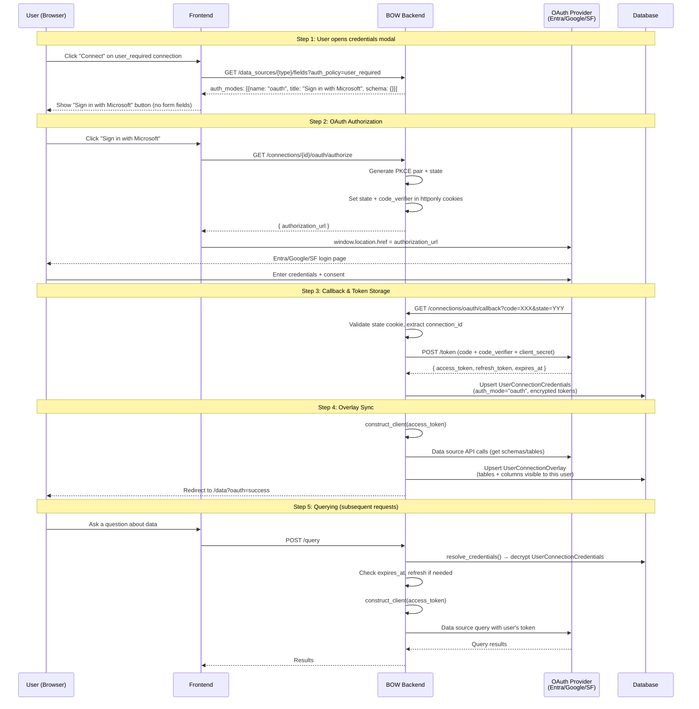
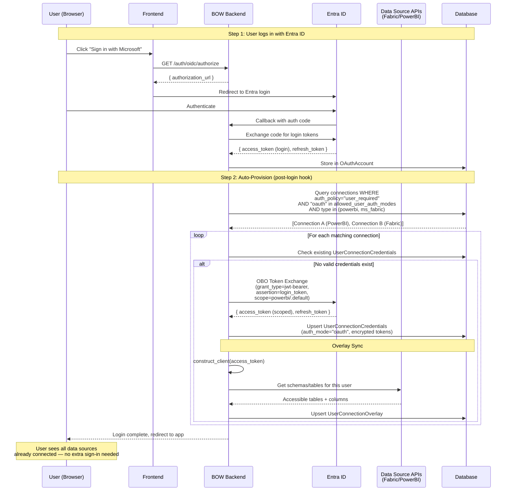

# OAuth Delegated Credentials — Implementation Plan

## Context

A customer deploying BOW with Entra ID for login also uses Entra ID for their Fabric/PowerBI data sources. They want user-level OAuth authentication to data sources instead of shared service principals. Currently, all data source clients only support static credentials (client_secret, service_account, userpass). There is no OAuth authorization code flow for per-user data source access.

**Goal**: Enable users to authenticate to data source connections using their own identity (OAuth), supporting multiple providers with a clean, generic design.

**Phase 1 scope**: BigQuery, MS Fabric, PowerBI. Adding more providers later is just a new entry in `get_oauth_params()` + `access_token` param on the client.

**Two flows, two phases**:
- **Phase 1 (Flow B — MVP)**: User explicitly clicks "Sign in with Microsoft/Google/etc" on a `user_required` connection → OAuth authorization code + PKCE → tokens stored in `UserConnectionCredentials`
- **Phase 2 (Flow A)**: User logs into BOW with Entra ID → system auto-provisions connection credentials for matching Entra-based connections via OBO (On-Behalf-Of) token exchange

---

## Flow Diagrams

### Phase 1: Flow B — Explicit Per-Connection OAuth Sign-In



### Phase 2: Flow A — Auto-Propagation from Login



---

## Phase 1: Flow B — Explicit Per-Connection OAuth Sign-In

### Step 1: Registry — Add OAuth auth variant to data sources

**Files to modify:**
- `backend/app/schemas/data_sources/configs.py`
- `backend/app/schemas/data_source_registry.py`

**Changes:**
1. Add `OAuthDelegatedCredentials` empty Pydantic model in `configs.py` (no fields — user provides nothing, OAuth flow populates tokens)
2. Add `"oauth"` AuthVariant to each provider's `AuthOptions.by_auth` dict with `scopes=["user"]`:
   - PowerBI (line ~437): `"oauth": AuthVariant(title="Sign in with Microsoft", schema=OAuthDelegatedCredentials, scopes=["user"])`
   - MS Fabric (line ~473): same
   - BigQuery (line ~223): `"oauth": AuthVariant(title="Sign in with Google", schema=OAuthDelegatedCredentials, scopes=["user"])`

### Step 1b: Add OAuth credential fields to connection credential schemas

Each provider needs `oauth_client_id` and `oauth_client_secret` added to its **credentials schema**. These are the OAuth app registration credentials that enable the authorization code flow. They are separate from the existing service principal fields because the OAuth app may differ from the service principal app.

**PowerBI / MS Fabric** — Add to `PowerBICredentials` and `MSFabricCredentials`:
```python
# Existing fields: tenant_id, client_id, client_secret (for service principal)
# New optional fields for OAuth delegated flow:
oauth_client_id: Optional[str] = Field(
    None,
    title="OAuth Client ID",
    description="App Registration Client ID for user sign-in (authorization code flow). If blank, falls back to Client ID above.",
    json_schema_extra={"ui:type": "string"}
)
oauth_client_secret: Optional[str] = Field(
    None,
    title="OAuth Client Secret",
    description="App Registration Secret for user sign-in. If blank, falls back to Client Secret above.",
    json_schema_extra={"ui:type": "password"}
)
```
Fallback logic: `get_oauth_params()` uses `oauth_client_id ?? client_id` and `oauth_client_secret ?? client_secret`. This way, if the admin uses the same Entra app for both grant types, they don't need to fill in anything extra.

**BigQuery** — Add to `BigQueryCredentials`:
```python
# Existing field: credentials_json (service account JSON — NOT usable for OAuth)
# New required fields for OAuth delegated flow (no fallback possible):
oauth_client_id: Optional[str] = Field(
    None,
    title="OAuth Client ID",
    description="Google OAuth 2.0 Client ID for user sign-in (from Google Cloud Console > Credentials > OAuth 2.0 Client IDs)",
    json_schema_extra={"ui:type": "string"}
)
oauth_client_secret: Optional[str] = Field(
    None,
    title="OAuth Client Secret",
    description="Google OAuth 2.0 Client Secret for user sign-in",
    json_schema_extra={"ui:type": "password"}
)
```
No fallback: BigQuery's existing `credentials_json` is a service account key — completely different from an OAuth client. These fields are required if admin enables `oauth` in `allowed_user_auth_modes`.

### Step 2: OAuth helper — `get_oauth_params(connection)`

**New file:** `backend/app/services/connection_oauth_service.py`

One pure function that maps connection type → OAuth provider config:

```python
def get_oauth_params(connection: Connection) -> dict:
    """Returns {authorize_url, token_url, client_id, client_secret, scopes, provider_name} based on connection type.

    Reads oauth_client_id/oauth_client_secret from connection credentials.
    For Entra-based sources, falls back to client_id/client_secret if oauth_ fields are blank.
    """
```

Fixed mapping:
| Connection type | OAuth provider | Scopes | client_id source |
|---|---|---|---|
| `powerbi` | Entra ID (tenant from creds) | `https://analysis.windows.net/powerbi/api/.default offline_access` | `oauth_client_id ?? client_id` |
| `ms_fabric` | Entra ID (tenant from creds) | `https://storage.azure.com/.default offline_access` | `oauth_client_id ?? client_id` |
| `bigquery` | Google | `https://www.googleapis.com/auth/bigquery.readonly offline_access` | `oauth_client_id` (required) |

**Adding new providers later**: Just add an entry to `get_oauth_params()` + `oauth_client_id`/`oauth_client_secret` fields to the credentials schema + `access_token` param on the client. Each provider authenticates via its own OAuth. If a customer uses Entra as IdP for that SaaS (e.g., NetSuite federated with Entra), the federation is transparent — NetSuite's OAuth page auto-redirects to Entra, the user is already logged in, and it completes without password entry. BOW doesn't need to know about federation; the button always says "Sign in with {provider}".

### Step 3: Backend OAuth routes

**New file:** `backend/app/routes/connection_oauth.py`

Two routes, reusing PKCE/state patterns from `auth_providers.py` (line 106-173):

#### `GET /api/connections/{connection_id}/oauth/authorize`
1. Verify user has access to connection (via RBAC)
2. Call `get_oauth_params(connection)` to get provider config
3. Generate PKCE pair (`_generate_pkce_pair()` from auth_providers.py — extract to shared util)
4. Generate state = `{connection_id}:{random_uuid}`
5. Store state + code_verifier in secure httponly cookies (same pattern as OIDC login)
6. Build authorization URL with `response_type=code`, `client_id`, `redirect_uri=/api/connections/oauth/callback`, `scope`, `code_challenge`, `state`
7. Return `{ authorization_url }` (frontend redirects)

#### `GET /api/connections/oauth/callback`
1. Validate state cookie, extract connection_id
2. Exchange authorization code for tokens (POST to token_url with code + code_verifier + client_secret)
3. Encrypt `{access_token, refresh_token, expires_at, token_type}` and upsert into `UserConnectionCredentials` with `auth_mode="oauth"`
4. Trigger overlay sync (reuse `_sync_user_overlays()` from `user_data_source_credentials_service.py`)
5. Clear state/verifier cookies
6. Redirect to frontend data page with success indicator (e.g., `/data?oauth=success&connection_id=X`)

**Register routes** in `backend/app/routes/__init__.py` or wherever routes are mounted.

### Step 4: Client changes — Accept `access_token` parameter

**Files to modify:**
- `backend/app/data_sources/clients/powerbi_client.py` (line 62)
- `backend/app/data_sources/clients/ms_fabric_client.py` (line 17)
- `backend/app/data_sources/clients/bigquery_client.py` (line 15)

**Pattern for each client:**
- Add optional `access_token: str = None` parameter to `__init__`
- If `access_token` is provided, skip the normal credential-based auth:
  - PowerBI: set `self._access_token = access_token`, skip `connect()` call
  - Fabric: store and return from `_get_access_token()` directly
  - BigQuery: use `google.oauth2.credentials.Credentials(token=access_token)` instead of `service_account.Credentials`

**No changes needed** to `construct_client()` in connection_service.py — it already narrows params via `inspect.signature`, so `access_token` flows through naturally when present in decrypted credentials.

### Step 5: Token refresh in `resolve_credentials()`

**File to modify:** `backend/app/services/connection_service.py` (line 649)

In `resolve_credentials()`, after fetching `UserConnectionCredentials` for `auth_mode=="oauth"`:
1. Check if `expires_at` is within 5 minutes of now
2. If expired/expiring, use `refresh_token` to get new tokens:
   - Call `get_oauth_params(connection)` for token_url
   - POST to token_url with `grant_type=refresh_token`
   - Update `UserConnectionCredentials` with new tokens
3. Return decrypted credentials (including fresh `access_token`)

### Step 6: Frontend — OAuth button in credentials modal

**File to modify:** `frontend/components/UserDataSourceCredentialsModal.vue`

**Changes:**
1. When user selects `oauth` auth mode (which has empty schema → no form fields):
   - Hide the credential form fields
   - Show a "Sign in with {provider}" button (title comes from AuthVariant.title)
2. On button click:
   - `GET /api/connections/{id}/oauth/authorize` → receive `authorization_url`
   - `window.location.href = authorization_url` (full page redirect, same pattern as login in `sign-in.vue` line 258-269)
3. On callback redirect back to `/data?oauth=success`:
   - Show success toast
   - Refresh connection status

---

## Phase 2: Flow A — Auto-Propagation from Login

**Important limitation**: OBO token exchange only works within the same OAuth ecosystem. Entra login → Entra-based resources (PowerBI, Fabric, Azure SQL). It does NOT work for Google, Salesforce, NetSuite, etc. Non-Microsoft data sources always require Flow B (explicit sign-in), though if they federate with Entra, the sign-in is near-instant (no password re-entry).

### Step 7: Post-login hook

**File to modify:** `backend/app/services/auth_providers.py` (after `oauth_callback()` ~line 320)

After successful Entra ID login:
1. Call `auto_provision_connection_credentials(user, oauth_account)`
2. This function:
   - Queries all connections where `auth_policy="user_required"` AND `"oauth" in allowed_user_auth_modes` AND type is Entra-based (powerbi, ms_fabric) — **only Microsoft resources**
   - For each, checks if user already has valid `UserConnectionCredentials` with `auth_mode="oauth"`
   - If not, performs OBO token exchange

### Step 8: OBO token exchange helper

**New function in:** `backend/app/services/connection_oauth_service.py`

```python
async def exchange_obo_token(login_access_token: str, connection: Connection) -> dict:
    """Exchange user's login token for a connection-scoped token via OBO flow."""
```

- POST to Entra token endpoint with `grant_type=urn:ietf:params:oauth:grant-type:jwt-bearer`, `assertion=login_access_token`, `scope=<connection scopes>`, `requested_token_use=on_behalf_of`
- Requires the Entra app registration to have API permissions for the target resource
- Returns `{access_token, refresh_token, expires_at}`

### Step 9: Broader login scopes

**File to modify:** `backend/app/services/auth_providers.py`

- Current login scopes: `openid profile email` (insufficient for OBO to data sources)
- Add configurable additional scopes per org/deployment
- Or: OBO may work without additional login scopes if the app registration has the right API permissions (Entra-specific — needs testing)

### Step 10: Read login token from OAuthAccount

**Existing model:** `backend/app/models/oauth_account.py`

- `OAuthAccount` already stores `access_token`, `refresh_token`, `expires_at` from login
- `auto_provision_connection_credentials()` reads the user's login token from here
- If login token expired, use login refresh_token to get fresh one first

---

## File Summary

| File | Action | Phase |
|------|--------|-------|
| `backend/app/schemas/data_sources/configs.py` | Add `OAuthDelegatedCredentials` | 1 |
| `backend/app/schemas/data_source_registry.py` | Add `oauth` AuthVariant to 3 providers (PowerBI, Fabric, BigQuery) | 1 |
| `backend/app/services/connection_oauth_service.py` | **New** — `get_oauth_params()`, token refresh, OBO exchange | 1+2 |
| `backend/app/routes/connection_oauth.py` | **New** — authorize + callback routes | 1 |
| `backend/app/routes/__init__.py` (or router mount) | Register new routes | 1 |
| `backend/app/data_sources/clients/powerbi_client.py` | Add `access_token` param | 1 |
| `backend/app/data_sources/clients/ms_fabric_client.py` | Add `access_token` param | 1 |
| `backend/app/data_sources/clients/bigquery_client.py` | Add `access_token` param | 1 |
| `backend/app/services/connection_service.py` | Token refresh in `resolve_credentials()` | 1 |
| `frontend/components/UserDataSourceCredentialsModal.vue` | OAuth button | 1 |
| `backend/app/services/auth_providers.py` | Post-login hook, PKCE extraction | 1+2 |

## Verification & Testing Strategy

**No real Entra ID/Google/SF accounts needed for automated tests.** Three testing layers:

### Layer 1: Unit Tests — Mock HTTP (httpx.MockTransport)

**File:** `backend/tests/unit/test_connection_oauth.py`

Uses the existing `httpx.MockTransport` pattern (same as `test_whatsapp_adapter.py`):

```python
def oauth_token_handler(request: httpx.Request) -> httpx.Response:
    """Mock OAuth token endpoint — returns fake tokens."""
    body = dict(urllib.parse.parse_qsl(request.content.decode()))
    assert body["grant_type"] == "authorization_code"
    assert "code_verifier" in body  # PKCE
    return httpx.Response(200, json={
        "access_token": "mock_access_token",
        "refresh_token": "mock_refresh_token",
        "expires_in": 3600, "token_type": "Bearer"
    })
```

**Tests:**
- `get_oauth_params()` returns correct config per connection type
- Token exchange sends correct params (grant_type, PKCE, scopes)
- Token refresh logic (expired → refresh_token grant → updated credentials)
- OBO exchange (Phase 2) sends correct jwt-bearer grant
- Error handling: provider returns error, invalid state, expired code

### Layer 2: E2E Route Tests — Fake OAuth Server fixture

**File:** `backend/tests/e2e/test_connection_oauth_flow.py`

Spin up a lightweight fake OAuth provider as a pytest fixture:

```python
@pytest.fixture
async def fake_oauth_server():
    """Tiny FastAPI app mimicking an OAuth provider."""
    app = FastAPI()
    issued_codes = {}

    @app.get("/authorize")
    async def authorize(client_id: str, redirect_uri: str, state: str, code_challenge: str):
        code = secrets.token_urlsafe(16)
        issued_codes[code] = {"code_challenge": code_challenge, "redirect_uri": redirect_uri}
        return RedirectResponse(f"{redirect_uri}?code={code}&state={state}")

    @app.post("/token")
    async def token(request: Request):
        body = await request.form()
        code = body["code"]
        assert code in issued_codes  # validate the code
        return {"access_token": "fake_token", "refresh_token": "fake_refresh", "expires_in": 3600}

    # Run on random port using uvicorn in background
    ...
```

Patch `get_oauth_params()` to return URLs pointing at the fake server.

**Test: Full OAuth sign-in flow**
1. Create connection with `auth_policy="user_required"`, `allowed_user_auth_modes=["oauth"]`
2. `GET /connections/{id}/oauth/authorize` → returns authorization_url pointing to fake server
3. Follow redirect → fake server issues code → redirects to callback
4. `GET /connections/oauth/callback?code=...&state=...` → tokens stored
5. Verify `UserConnectionCredentials` row exists: `auth_mode="oauth"`, encrypted tokens present, `expires_at` set
6. Verify `resolve_credentials()` returns decrypted `access_token`

**Test: Overlay sync after sign-in**
1. Complete OAuth sign-in flow (steps 1-4 above)
2. Verify `UserConnectionOverlay` (table-level) rows created for the user + connection
3. Verify `UserConnectionColumn` rows created with correct `is_accessible` / `is_masked` defaults
4. Verify overlay reflects the tables/columns accessible via the user's delegated token (mock the client's `get_schemas()` to return specific tables)
5. Verify a second user signing in to the same connection gets their own independent overlay

**Test: Sign-in with different providers**
1. Create 3 connections: PowerBI (Entra), Fabric (Entra), BigQuery (Google)
2. Run OAuth flow for each — verify `get_oauth_params()` routes to correct fake provider endpoints
3. Verify each stores separate `UserConnectionCredentials` with correct `auth_mode="oauth"`

**Test: Token refresh on expired credentials**
1. Complete sign-in, then set `expires_at` to past
2. Call `resolve_credentials()` → verify it hits token endpoint with `grant_type=refresh_token`
3. Verify `UserConnectionCredentials` updated with new tokens

**Test: Re-sign-in overwrites old credentials**
1. Complete sign-in flow
2. Complete sign-in flow again for same user + connection
3. Verify only one `UserConnectionCredentials` row (upserted, not duplicated)

**Test: Unauthorized user cannot start OAuth**
1. Create connection user doesn't have RBAC access to
2. `GET /connections/{id}/oauth/authorize` → 403

### Layer 3: Manual Integration Tests (optional, not in CI)

**File:** `backend/tests/integrations/test_oauth_real.py`

For testing with real Entra ID / Google / Salesforce when needed:
- Credentials in `integrations.json` (same pattern as existing `ds_clients.py`)
- Run manually: `pytest tests/integrations/test_oauth_real.py --provider=entra`
- Validates real token exchange, real data source queries with delegated tokens

### Phase 2 Additional Tests
- **OBO exchange**: Mock Entra token endpoint, verify jwt-bearer grant params
- **Post-login auto-provision**: Login via OIDC → verify `UserConnectionCredentials` auto-created for matching connections
- **Non-Entra login**: Login via password → verify no auto-provisioning happens
- **Partial failure**: OBO succeeds for PowerBI but fails for Fabric → verify partial provisioning (PowerBI credentials saved, Fabric skipped with warning)
