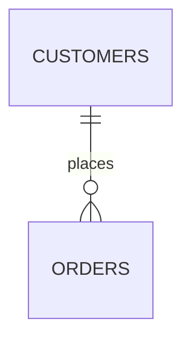

Two things go wrong with ERDs here. The diagram reflects naming conventions
rather than the actual data, and it arrives as a code block instead of a
picture. Both are avoidable.

## Deliver it as a rendered diagram — this is the part that usually fails

The diagram must go in a document created with `create_doc`, inside a fence
whose language is exactly **`mermaid`**, with `erDiagram` as the first line
*inside* the fence:

````

````

Docs render ```mermaid fences natively — no library, no image. Get this wrong
and the reader gets source code:

- A fence tagged ```erDiagram, ```mermaid-erd or left untagged renders as a
  plain code block. The tag is `mermaid`; `erDiagram` is the diagram's first
  line, not the fence language.
- Answering in the chat message instead of a doc leaves it unrendered. Put it
  in the doc; summarize in the message.

## 1. Scope it before drawing

A whole warehouse is not a diagram, it is a wall. Use `describe_tables` for the
tables in scope and read the real column names from it rather than guessing.
Keep to a subject area — a fact table plus its direct dimensions. Past roughly
15 entities, `clarify` and offer to split by subject area, or draw the core and
list the rest.

## 2. Recover relationships the schema does not declare

Analytical warehouses rarely have foreign keys, so a diagram built only from
declared constraints is nearly empty. Work in this order, treating each step as
a claim to verify:

1. **Declared foreign keys**, where the connection exposes them — highest
   confidence.
2. **Naming conventions** — `orders.customer_id` → `customers.id`; `_id`,
   `_key`, `_sk` suffixes. A strong hint, not a fact.
3. **Verify every inferred join with a query.** This is what separates a real
   ERD from a plausible one. For a candidate `child.fk → parent.pk`, count
   distinct `fk` values, how many match a parent row, and how many are NULL. A
   large unmatched share means it is not the relationship you assumed — it
   points elsewhere, needs a filter, or the grain differs.
4. **Measure cardinality, do not infer it.** Is the key unique in the child
   table (one-to-one) or repeated (one-to-many)? Count distinct against total.
   A junction table (two keys, unique together) is a many-to-many; draw it as
   the two one-to-many legs it really is.

If dbt or LookML metadata is synced, read it first — declared relationships
there beat anything you infer, and the diagram should agree with the semantic
layer rather than contradict it.

## 3. Rules that keep it renderable and readable

- **Cardinality is the content.** `||--o{` one to zero-or-many, `||--|{` one to
  one-or-many, `}o--o{` many to many, `||--||` one to one. Use what you
  measured, not what the naming implies.
- **Label every relationship** (the verb after `:`), quoted if it contains
  spaces. Unlabeled lines are a picture, not a diagram.
- **Names must be alphanumeric/underscore.** Quote or rename anything with a
  space, dot or hyphen, and give the real table name in the surrounding text.
- **Only the columns that matter**: keys, join columns, and the few fields that
  identify the entity. Mark `PK` and `FK` — that is most of the information
  content. A full column list goes in a table below, not inside the diagram.

## 4. Caption what the picture cannot say

Under the diagram, in prose: which relationships are **declared** versus
**inferred from data** and the match rate for each inferred one; the **grain**
of each fact table in one line; and anything you found but did not draw —
orphaned keys, a column that looks like an FK but joins to nothing, a table with
no discoverable relationship.

If the schema turned out to differ materially from what the naming suggested,
lead with that. It is usually the most valuable thing the exercise produced.
