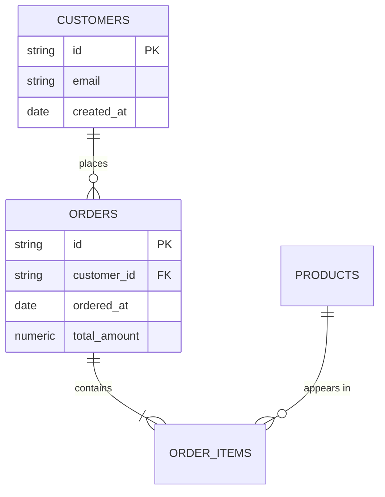

Produce a diagram that reflects the **actual** schema, including relationships
the database does not declare. Most analytical warehouses have few or no
foreign keys, so a diagram built only from declared constraints is nearly
empty and useless.

## 1. Establish scope before drawing

A whole warehouse is not a diagram; it is a wall. Ask what the diagram is for
and keep it to what fits:

- A named subject area ("the order pipeline", "billing") → the fact table plus
  its direct dimensions.
- More than ~15 entities → `clarify` and offer to split by subject area, or
  draw the core and list the rest. Never emit a 40-table diagram.

Use `describe_tables` for the tables in scope. Read the column names and types
from it — do not guess them.

## 2. Recover the relationships the schema does not declare

Work these in order and treat each as a claim to verify:

1. **Declared foreign keys**, when the connection exposes them. Highest
   confidence — use directly.
2. **Naming conventions.** `orders.customer_id` → `customers.id`;
   `<table>_id`, `<table>_key`, `<table>_sk`. Strong signal, still verify.
3. **Verify each inferred join with a query** before drawing it. This is the
   step that separates a real ERD from a plausible one. For a candidate
   `child.fk → parent.pk`, check: how many distinct `fk` values exist, how many
   match a parent row, and how many are NULL. A join with a large unmatched
   share is not the relationship you assumed — either it points elsewhere, or
   it needs a filter, or the grain is different. Report orphan rates above a
   percent or so on the diagram's notes; they are a data-quality finding worth
   surfacing on its own.
4. **Determine cardinality from the data, not the name.** Is the "foreign key"
   unique in the child table (one-to-one) or repeated (one-to-many)? Count
   distinct vs. total. A junction table (two FKs, unique together) is a
   many-to-many and should be drawn as the two one-to-many legs it really is.

If the org has dbt or LookML metadata synced, read it first — declared
relationships and join logic there beat anything you infer, and the diagram
should match the semantic layer rather than contradict it.

## 3. Emit the diagram

Deliver with `create_doc`, containing a fenced ```mermaid block. Mermaid
renders natively in docs — do not generate an image and do not load a library.



Rules that keep the diagram renderable and readable:

- Cardinality is the crux of the diagram, so get the notation right:
  `||--o{` = one to zero-or-many, `||--|{` = one to one-or-many,
  `}o--o{` = many to many, `||--||` = one to one. Use the cardinality you
  measured in step 2, not the one the naming implies.
- Every relationship needs a label (the verb after `:`). Quote it if it
  contains spaces. An unlabeled diagram is a picture of lines.
- Entity and attribute names must be alphanumeric/underscore. Quote or
  rename anything with a space, dot or hyphen, and say in the surrounding text
  what the real table name is.
- Include only the columns that matter: keys, the join columns, and the few
  fields that identify the entity. A full column dump belongs in a table
  below the diagram, not inside it.
- Mark `PK` and `FK` — that is most of the diagram's information content.

## 4. Caption what the picture cannot say

Under the diagram, in prose:

- Which relationships are **declared** vs. **inferred from the data**, and the
  match rate for each inferred one. Never present an inference as a constraint.
- The **grain** of each fact table in one line ("one row per order line item").
- Anything you found and did not draw: orphaned keys, a column that looks like
  an FK but joins to nothing, a table with no discoverable relationship.

If the schema turned out to be materially different from what the naming
suggested, say so in the summary — that is usually the most valuable thing the
exercise produced.
