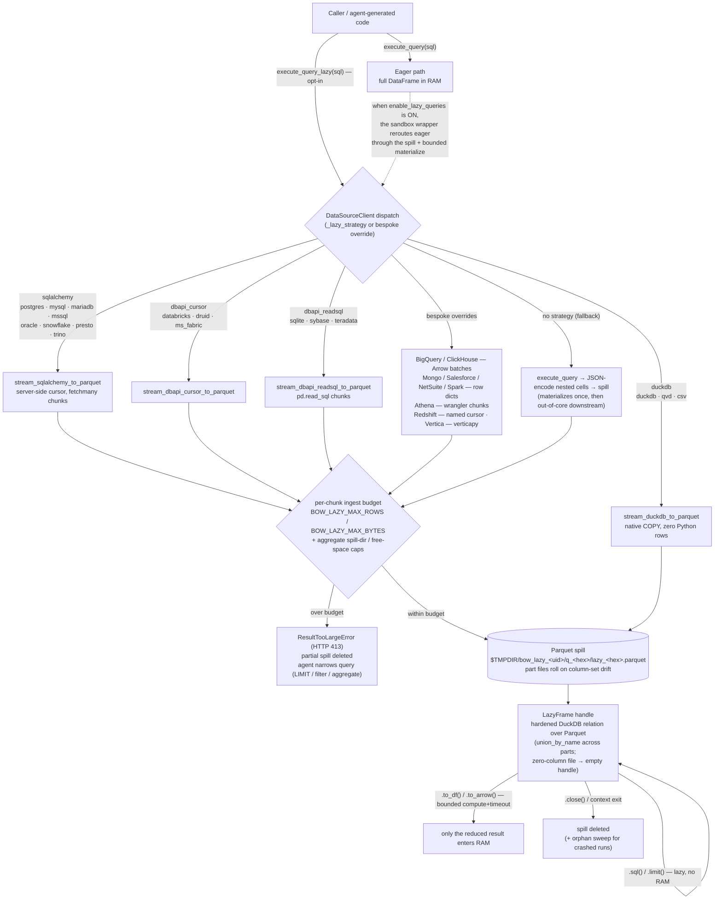

# Lazy (out-of-core) queries

Stream query results to a Parquet **spill** on local disk and expose them through a
`LazyFrame` — a DuckDB relation over that Parquet — instead of loading the whole result
set into RAM. Downstream transforms (`.sql()`, `.limit()`) stay lazy; **only the reduced
result is ever materialized into memory**.

The path is **opt-in per organization** via the `enable_lazy_queries` setting (off by
default). It is additive: eager `execute_query` behavior is unchanged when the setting is
off.

## Why

A large `SELECT` (full-table scan, no aggregation/`LIMIT`) materialized as a pandas
DataFrame can exhaust the worker's memory. The lazy path bounds ingest memory by streaming
the result to disk in chunks, then lets generated code aggregate/limit *before* pulling
anything back into RAM.

## Flow



## Components

| File | Responsibility |
|------|----------------|
| `config.py` | `StreamConfig` — ingest budgets, chunk size, capacity checks |
| `storage.py` | `SpillStorage` / `LocalSpillStorage` — spill-path allocation, secure 0700 root, orphan sweep |
| `streamers.py` | Per-driver `stream_*_to_parquet` writers + `lazy_query_via_*` / `lazy_from_dataframe` entry points |
| `ingest.py` | Chunk/Arrow/row-dict → Parquet writers shared by the streamers |
| `duckdb_session.py` | `_open_duckdb` — hardened, confined DuckDB connection over the spill |
| `frame.py` | `LazyFrame` — lazy transforms + bounded materialization + lifecycle |
| `errors.py` | `ResultTooLargeError`, `LazyComputeTimeoutError`, … |

Wiring lives outside the package:
- `data_sources/clients/base.py` — `execute_query_lazy` dispatch on `_lazy_strategy`.
- `ai/code_execution/code_execution.py` — `QueryCapturingClientWrapper` exposes
  `execute_query_lazy` to sandboxed code (gated on the org setting), meters from the spill,
  applies the per-query wall-clock timeout, and **materializes a returned `LazyFrame` back
  to a bounded DataFrame** (`_coerce_exec_result`). When the setting is on, an eager
  `execute_query` is also routed through the spill and returned as a *bounded* DataFrame
  (the memory net), raising an actionable, retryable error past the cap.

## Adding lazy support to a client

Set `_lazy_strategy` on the client class if its `connect()` matches one of the streamers:

```python
class MyClient(DataSourceClient):
    _lazy_strategy = "sqlalchemy"  # | "dbapi_cursor" | "dbapi_readsql" | "duckdb"
```

Clients with a native stream that fits no strategy (Arrow batches, cursors, paginated APIs)
override `execute_query_lazy` directly and feed a `consume_*_to_lazyframe` helper. Leaving
`_lazy_strategy = None` uses the generic **materialize-then-spill** fallback — correct, but
it loads the full result once (no ingest-memory benefit).

### Divergences from `execute_query`

The columnar spill can't hold arbitrary Python objects, so lazy results differ from eager:
- nested `dict`/`list` cells become JSON strings;
- exotic driver scalars are coerced (`Decimal128` → float, BSON `Timestamp`/`Regex`/`Code` → str);
- duplicate column names are renamed (`id`, `id_1`);
- a column's dtype may shift if it drifts between chunks (parts are unioned by name and
  promoted to a common type — values are preserved, never truncated).

## `LazyFrame` API

- Lazy (no materialization): `.sql(query, table_name="data")`, `.limit(n)`, `.columns`
- Materialize (bounded, timed, spends RAM): `.to_df()`, `.to_df_bounded(max_rows, max_bytes)`,
  `.to_arrow()`, `.to_arrow_bounded(...)`, `.row_count()`, `.head(n)`
- Lifecycle: `.close()` / use as a context manager; a GC finalizer is the safety net.

## Configuration (env)

| Var | Default | Purpose |
|-----|---------|---------|
| `BOW_LAZY_DIR` | `$TMPDIR/bow_lazy_<uid>` | Spill root (created 0700) |
| `BOW_LAZY_CHUNKSIZE` | `50_000` | Rows per ingest chunk |
| `BOW_LAZY_MAX_ROWS` | `50_000_000` | Ingest row budget → `ResultTooLargeError` |
| `BOW_LAZY_MAX_BYTES` | `8 GiB` | Ingest byte budget → `ResultTooLargeError` |
| `BOW_LAZY_DIR_MAX_BYTES` | `32 GiB` | Aggregate spill-dir cap |
| `BOW_LAZY_MIN_FREE_BYTES` | `1 GiB` | Free-space floor |
| `BOW_LAZY_DUCKDB_MEM` | `2GB` | DuckDB compute memory limit |
| `BOW_LAZY_COMPUTE_TIMEOUT_SECONDS` | `60` | Wall-clock cap on downstream compute |
| `BOW_LAZY_MAX_CONCURRENT_COMPUTES` | `8` | Concurrent DuckDB computes |
| `BOW_LAZY_RESULT_MATERIALIZE_CAP` | `1_000_000` | Max rows when a `LazyFrame` is materialized to a result DataFrame |
| `BOW_LAZY_RESULT_MATERIALIZE_MAX_BYTES` | `512 MiB` | Max bytes for the same |

## Safety

- **Sandbox confinement**: the DuckDB connection is exposed to LLM-generated `.sql()`, so it
  is opened with `allowed_directories` limited to the spill dir, `enable_external_access=false`,
  a memory limit, and `lock_configuration=true` (fail-closed if any knob can't be set).
  `LazyFrame.from_parquet` is internal-only and the sandbox forbids `from_parquet`.
- **Bounded compute**: materialization runs under a wall-clock timeout (interrupts DuckDB)
  and re-checks spill/free-space capacity before and after.
- **Cleanup**: a `LazyFrame` deletes its own spill on close; a periodic sweep reclaims
  orphaned `q_*` dirs from crashed runs.

## Tests

`backend/tests/unit/test_lazy_frame.py`, `backend/tests/unit/test_lazy_wiring_and_overrides.py`

```bash
cd backend && BOW_DATABASE_URL="sqlite:///db/test_manual.db" \
  .venv/bin/pytest tests/unit/test_lazy_frame.py tests/unit/test_lazy_wiring_and_overrides.py --db=sqlite -q
```
