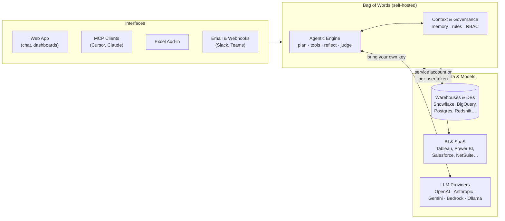
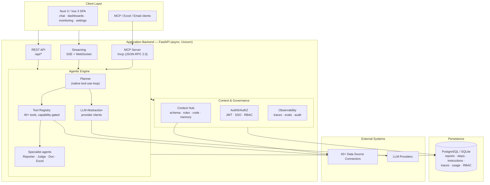
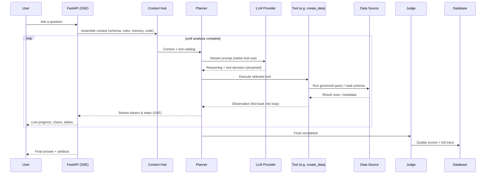
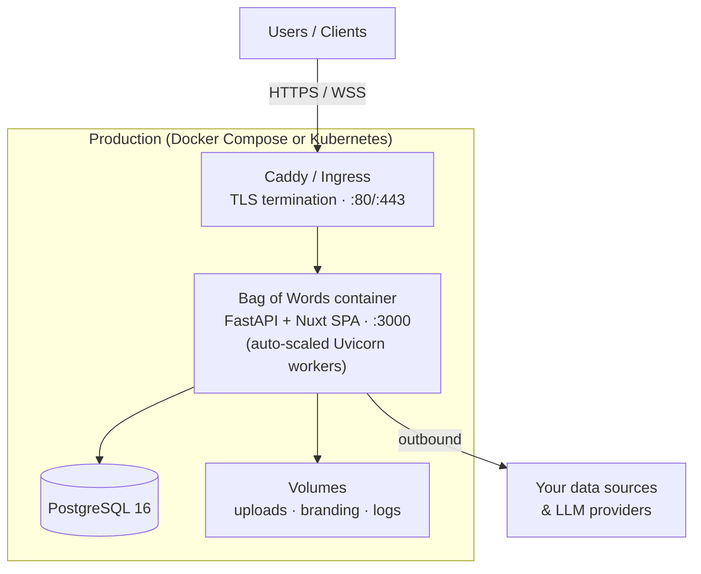

# Bag of Words — Architecture Overview

> **The open-source, agentic analytics platform.**
> Chat with your data, build dashboards, and run deep analysis — with memory,
> governance, and full observability built in.

This document is intended for technical and security stakeholders evaluating
Bag of Words. It describes what the system is, how it is built, how data flows
through it, and how it is deployed and secured.

| | |
|---|---|
| **Deployment model** | Self-hosted (your infrastructure, your data) |
| **Backend** | Python · FastAPI · async · SQLAlchemy 2.0 |
| **Frontend** | Nuxt 3 / Vue 3 single-page app |
| **Database** | PostgreSQL (recommended) · SQLite (default/eval) |
| **Packaging** | Single Docker image · Docker Compose · Kubernetes (Helm) |
| **LLMs** | Bring-your-own: OpenAI, Anthropic, Google, Azure, AWS Bedrock, Ollama / OpenAI-compatible |
| **Data sources** | 40+ warehouses, databases, BI tools, and SaaS services |
| **Interfaces** | Web app · MCP (Cursor / Claude Desktop / Claude Web) · Excel add-in · Email · Webhooks |

---

## 1. What it is

Bag of Words is a **context-aware analytics layer** that sits between your
people and your data. Users ask questions in natural language; an AI agent
plans the work, queries your existing data sources directly, and returns
governed answers — queries, visualizations, dashboards, and presentations.

Three principles shape the architecture:

- **Bring your own everything.** Any LLM ↔ any warehouse ↔ any interface.
  Nothing is locked in, and credentials/models can be swapped without
  rebuilding workflows.
- **Governed by design.** Memory, rules/instructions (versioned and
  review-gated), and role-based access control are first-class, not bolted on.
- **Fully observable.** Every agent run, plan, tool call, and LLM token is
  traced and scored so the loop can be debugged and improved.

---

## 2. System architecture

The platform is a single deployable application with a clear separation
between the SPA frontend, the API/agent backend, the persistence layer, and
the external systems it connects to.

### Layers at a glance

| Layer | Technology | Responsibility |
|---|---|---|
| **Client** | Nuxt 3, Vue 3, TypeScript, ECharts, AG Grid, Monaco | Chat UI, dashboard builder, monitoring, admin settings |
| **API & Streaming** | FastAPI, Uvicorn (async, multi-worker) | REST endpoints, Server-Sent Events, WebSockets, MCP server |
| **Agentic Engine** | Custom planner + tool registry | Plans and executes analysis as a stream of governed tool calls |
| **Governance** | Context Hub, RBAC, observability | Injects rules/memory/schema, enforces permissions, records traces |
| **Persistence** | SQLAlchemy 2.0 + Alembic | Reports, steps, instructions, traces, usage, RBAC, providers |
| **Connectors** | 40+ data-source clients, LLM provider clients | Direct, capability-scoped access to your data and models |

---

## 3. The agentic loop

A user request is not answered by a single LLM call. It is executed as an
**agentic loop**: the planner repeatedly decides on the next tool, the tool
runs against your real data, and the observation feeds back into the next
decision. The loop ends when the agent marks the analysis complete, and a
**Judge** scores the result for quality.

**Key elements**

- **Planner** — drives the loop using the LLM's native tool-use streaming;
  derives plan type and completion from the model's structured output.
- **Tool Registry (40+ tools)** — the agent's hands. Tools are **capability-gated**:
  only tools valid for the user's organization, connected sources, and
  permissions are exposed to the model. Representative tools:

  | Category | Tools |
  |---|---|
  | Data | `create_data`, `inspect_data`, `read_query`, `describe_tables` |
  | Artifacts & dashboards | `create_artifact`, `edit_artifact`, `create_dashboard`, `create_widget` |
  | Files | `list_files`, `read_file`, `search_files`, `write_csv` |
  | Instructions (rules) | `create_instruction`, `edit_instruction`, `search_instructions` |
  | MCP & web | `execute_mcp`, `search_mcps`, `read_mcp_resource`, `web_fetch` |
  | Excel | `read_excel_range`, `write_to_excel`, `write_officejs_code` |
  | Automation & evals | `create_scheduled_task`, `create_eval`, `run_eval`, `send_email` |

- **Specialist agents** — `Reporter` (multi-step reports), `Judge` (quality
  scoring), `DocAgent`, `DataSourceAgent`, `ExcelAgent`.
- **Context Hub** — lazily assembles schema, business rules/instructions,
  reusable code, and learned memory into the prompt, so answers respect your
  semantics and governance.
- **Streaming** — results stream to the UI over **Server-Sent Events** with a
  bounded event queue (back-pressure safe); **WebSockets** provide live
  updates with keep-alive.

---

## 4. Connectivity: data sources & LLMs

### Data sources (40+ connectors)

Connectors implement a common `DataSourceClient` interface with an explicit
**capabilities** model (`QUERY`, `LIST_FILES`, `READ_FILE`, `SEARCH_FILES`),
which is what drives tool gating in the agent.

- **Warehouses & databases** — Snowflake, BigQuery, Databricks, Redshift,
  Microsoft Fabric/Synapse, PostgreSQL, MySQL/MariaDB, SQL Server, Oracle,
  ClickHouse, Trino/Presto, Druid, Pinot, Vertica, Teradata, MongoDB, DuckDB,
  SQLite, Spark.
- **BI & semantic** — Tableau, Power BI (+ Report Server), Qlik Sense / QVD,
  Sisense, Oracle BI, Timbr.
- **SaaS & files** — Salesforce, NetSuite, PostHog, AWS Cost Explorer,
  Google Drive, OneDrive, SharePoint, MCP servers, custom APIs.

> Connections are made with **service-account credentials or per-user tokens**,
> and access is scoped per data source and per table through RBAC grants.
> Bag of Words queries your sources directly — it does not require copying your
> data into a separate store.

### LLM providers (bring your own key)

A provider abstraction lets you run any supported model, mix providers, or
self-host:

- **OpenAI** · **Anthropic** (native tool-use + extended thinking) ·
  **Google Gemini** · **Azure OpenAI** · **AWS Bedrock** (key or IAM auth) ·
  **OpenAI-compatible** endpoints (Ollama, vLLM, Groq, Together, LM Studio).
- API keys are **encrypted at rest** (Fernet) and per-run **token usage and
  cost are tracked** per organization.

---

## 5. Governance, memory & observability

| Capability | What it does |
|---|---|
| **Instructions / Rules registry** | Business rules, metric definitions, and guardrails — **versioned**, with **review/approval workflows** and Git sync (auto-indexes dbt, markdown, code). |
| **Memory** | Context, preferences, and usage patterns captured down to table/column level; the agent improves over time and surfaces semantic-layer updates (review-gated). |
| **Catalog** | Reusable saved queries and datasets, shareable across the team and discoverable by the agent. |
| **Observability** | Full traces of agent runs, plans, tool calls, guardrails, LLM-judge scores, evals, and user feedback — surfaced in the Monitoring UI. |
| **Evals** | Test cases to evaluate and regression-check agent behavior. |

These are backed by concrete persisted entities — completions, steps,
tool/agent executions, instructions and their versions, evals, and usage
records — so every answer is auditable end-to-end.

---

## 6. Security & access control

- **Authentication modes** — `hybrid` (local + SSO), `local_only`, or
  `sso_only`. Sessions use JWT (secure, httpOnly cookies); programmatic and
  MCP access use scoped API keys or OAuth 2.1 tokens.
- **SSO / directory** — Google Workspace, generic **OIDC** (Okta, Microsoft
  Entra, Auth0…) with PKCE and discovery, **LDAP / Active Directory** sync,
  and **SCIM 2.0** provisioning. Group claims can sync to roles.
- **RBAC** — Roles and role assignments map to users, groups, or memberships;
  **resource grants** scope permissions (`query`, `view_schema`, `manage`) to
  specific data sources and connections.
- **Encryption** — provider keys and source credentials are encrypted at rest;
  an organization-level encryption key is configured for stable installs.
- **Audit logging** — authentication events and tool executions are recorded
  (action, user, IP, timestamp, details) via a background audit worker.
- **Self-hosted & private** — runs entirely in your environment; telemetry is
  basic and **opt-out** (`telemetry.enabled: false`), and the in-app support
  chat can be disabled.

> SSO, RBAC, LDAP/SCIM, audit, and advanced governance are part of the
> Enterprise edition (license-gated). Core analytics and connectors are
> open-source.

---

## 7. Deployment topology

Bag of Words ships as a **single Docker image** (FastAPI backend + pre-built
Nuxt SPA served from the same process) and can be run three ways.

| Option | Best for | Components |
|---|---|---|
| **`docker run`** | Quick start / evaluation | Single container, SQLite (default) |
| **Docker Compose** | Servers / small teams | App + PostgreSQL 16 + Caddy (automatic HTTPS) |
| **Kubernetes (Helm)** | Production / scale | App Deployment + PostgreSQL (or **AWS Aurora** via IAM/IRSA), ConfigMap/Secret config, nginx Ingress + cert-manager TLS |

**Operational notes**

- The container runs database migrations (Alembic) on startup and exposes a
  `/health` check; Uvicorn worker count auto-scales to the container's CPU
  limits.
- A **leader-election** lock ensures scheduled work (LDAP sync, email polling,
  warmups) runs once across multiple workers/replicas.
- Configuration is a single `bow-config.yaml` (auth, SSO, SMTP, LLM providers,
  telemetry, encryption, OpenTelemetry) with secrets injected via environment
  variables.
- **OpenTelemetry** instrumentation (FastAPI, SQLAlchemy, httpx) can export
  traces to your collector.

---

## 8. Interfaces & extensibility

- **Web app** — primary chat, dashboard, catalog, instructions, and monitoring
  experience.
- **MCP server** — Bag of Words exposes itself over **MCP (JSON-RPC 2.0, HTTP
  streamable)** so tools like **Cursor**, **Claude Desktop**, and **Claude Web**
  can create reports and run governed, tracked analysis (`create_report`,
  `get_context`, `create_data`, `create_artifact`, `list_instructions`, …).
- **MCP client** — external MCP servers can also be registered as data sources
  and called from within agent runs.
- **Excel add-in** — read/write ranges and generate Office.js code in-place.
- **Email & webhooks** — inbound email triggers and outbound Slack / Teams /
  webhook integrations, plus scheduled/recurring prompts.

---

### Summary

Bag of Words is a self-hosted, async FastAPI + Nuxt application that turns
natural-language questions into governed analytics through an **agentic loop**
over your **own data sources** and **your choice of LLM**. Governance (versioned
rules, memory, RBAC), observability (traces, evals, judges), and enterprise
identity (SSO, LDAP, SCIM, audit) are built into the core, and it deploys
cleanly from a laptop `docker run` to a production Kubernetes cluster.

*Learn more: [bagofwords.com](https://bagofwords.com) · [docs.bagofwords.com](https://docs.bagofwords.com)*
