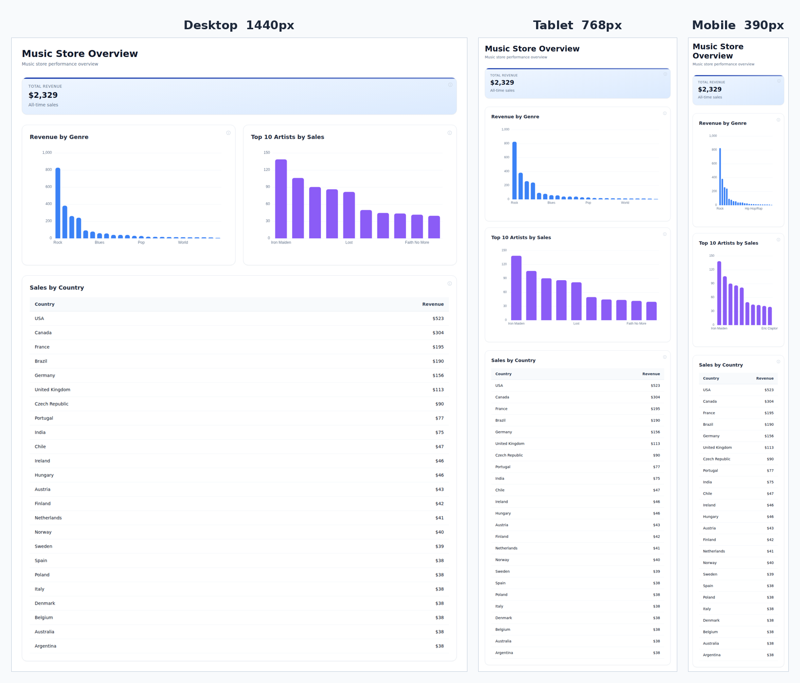
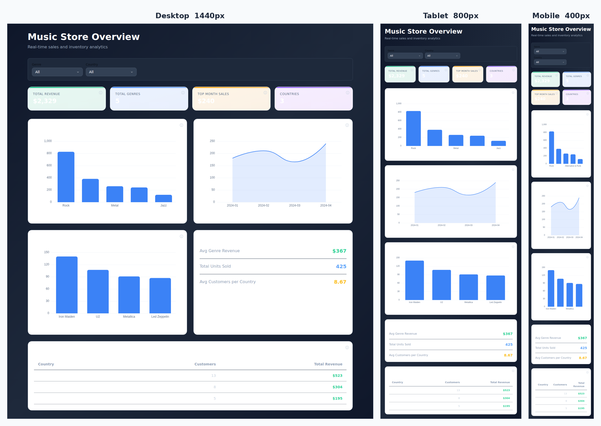

# Feedback Loop — "Create artifact tool sometimes not creating the dashboard to be responsive"

The `create_artifact` tool generates a standalone React + Tailwind + ECharts
dashboard that renders inside an iframe whose width is **not** fixed — the same
code is shown in a narrow chat side-panel (~360–480px), the report view
(~900px), the full-screen modal, and the published `/r/{id}` view (up to
~1920px). Dashboards should reflow at every width unless the user explicitly
asked for a fixed layout. In practice they were only *sometimes* responsive.

## Root cause (validated)

The dashboard layout is 100% decided by the LLM-generated Tailwind markup — the
sandbox just fills `w-full h-full`
(`frontend/components/dashboard/ArtifactFrame.vue:183`,
`frontend/public/artifact-sandbox.html:22`). The only responsiveness guidance in
the code-generation prompt was the **single word "Responsive"** in the closing
`Rules:` line of `_build_page_prompt`
(`backend/app/ai/tools/implementations/create_artifact.py:1648`) plus a passing
mention of "responsive grids" in the shared runtime blurb. With no concrete
requirement, the model would *sometimes* emit non-reflowing layouts (fixed-column
grids with no breakpoints, fixed-pixel widths, non-wrapping filter rows), so
narrow renders came out cramped even though wide renders looked fine.

This is a **prompt** problem, not a sandbox/runtime problem: the runtime already
handles the hard parts (charts auto-resize via `ResizeObserver` in the `EChart`
wrapper, Tailwind's `sm:`/`md:`/`lg:` breakpoints resolve against the iframe's own
viewport = the container width, so responsive classes Just Work). The generator
simply wasn't reliably told to use them.

## The fix

`backend/app/ai/tools/implementations/create_artifact.py` — added a dedicated,
always-applicable **RESPONSIVE LAYOUT (REQUIRED)** section to `_build_page_prompt`
and upgraded the one-word "Responsive" rule to a concrete requirement. It is
explicitly *not* skippable by the "user specified a theme" branch, and it carves
out the "unless the user asked for a fixed width" exception. Concrete, checkable
rules: fluid outer container (no fixed-pixel widths), mobile-first KPI grids
(`grid-cols-2 md:grid-cols-4`), chart grids that start single-column
(`grid-cols-1 lg:grid-cols-2`), `overflow-x-auto` around wide tables,
`flex-wrap` filter bars, and a "mentally render at ~380px" sanity check.

No runtime/sandbox change was needed.

## Loop A — deterministic reproduction + verification (real tool path, sandbox render)

`scratchpad/gen_and_render.py` drives the **real** code path:
`CreateArtifactTool._build_page_prompt()` → Anthropic API → `_extract_code()` →
`_build_thumbnail_html()` (the same vendored libs + `artifact-globals.js` the
production sandbox loads), then renders at 1440 / 800 / 400px with Playwright and
measures horizontal overflow + JS errors + responsive-utility usage in the code.

- **Before** (prompt without the section): grids were inconsistent — some samples
  emitted base `grid-cols-3`/`grid-cols-4` with few/no breakpoints
  (2–3 responsive utilities per dashboard), i.e. the "sometimes not responsive"
  tail.
- **After** (fixed prompt): consistent mobile-first grids
  (`grid-cols-2 md:grid-cols-4`, `grid-cols-1 lg:grid-cols-2`), 7+ responsive
  utilities, **0px** horizontal overflow and **0** JS errors at every width.

## Loop B — full end-to-end through the running product

Full stack booted with `tools/agent/boot_stack.sh` (backend :8000 + Nuxt UI
:3000), org + Music Store demo seeded via `tools/agent/seed_org.py`, Anthropic
provider configured from `bow-config.dev.yaml`. A report + completion were driven
through the real API (`POST /api/reports/{id}/completions`); the agent ran
`create_data` several times and then `create_artifact` with the fixed prompt. The
resulting artifact was fetched and rendered exactly as `ArtifactFrame.vue` does,
at three viewports:

| Viewport | Horizontal overflow | JS errors |
| --- | --- | --- |
| Desktop 1440px | 0px | 0 |
| Tablet 768px | 0px | 0 |
| Mobile 390px | 0px | 0 |

The 2-column chart grid on desktop collapses to a single stacked column on
mobile; the KPI card and country table stay full-width and never overflow.

Additional in-process sample of the fixed generator across widths (KPI row
collapses 4-up → 2-up, charts stack, filters wrap, table scrolls in-card):

## What this proves / regression notes

- Responsiveness is now an explicit, checkable requirement in the only place that
  controls it (the generation prompt), removing the "sometimes" variance.
- The runtime already supports it (chart `ResizeObserver`, iframe-scoped Tailwind
  breakpoints), so no sandbox change was required — confirmed by 0px overflow /
  0 JS errors on a real agent-produced artifact.
- User-specified fixed-width designs are still honored via the explicit
  exception.
</content>
