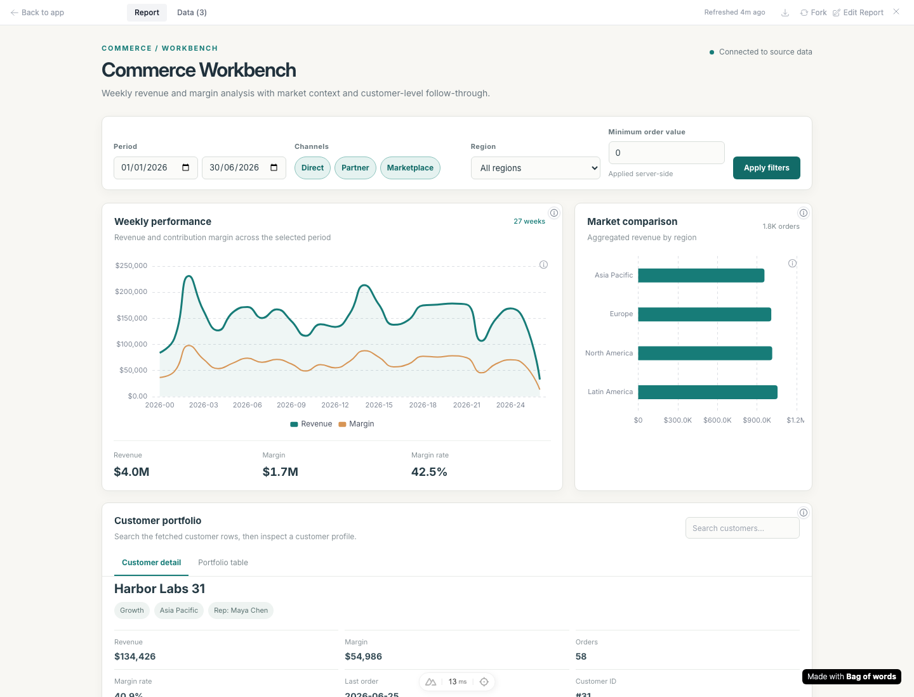
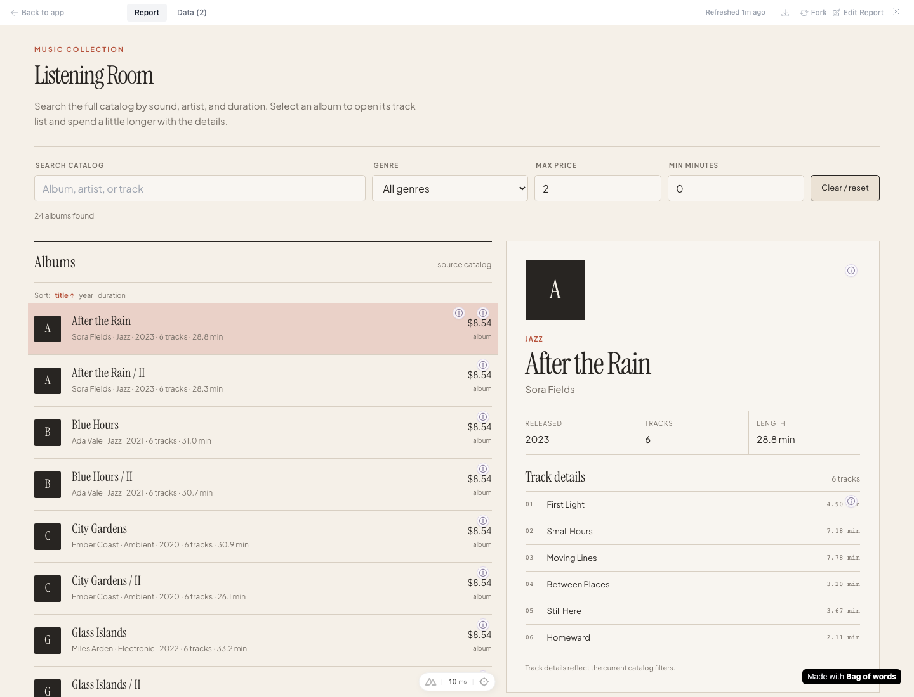
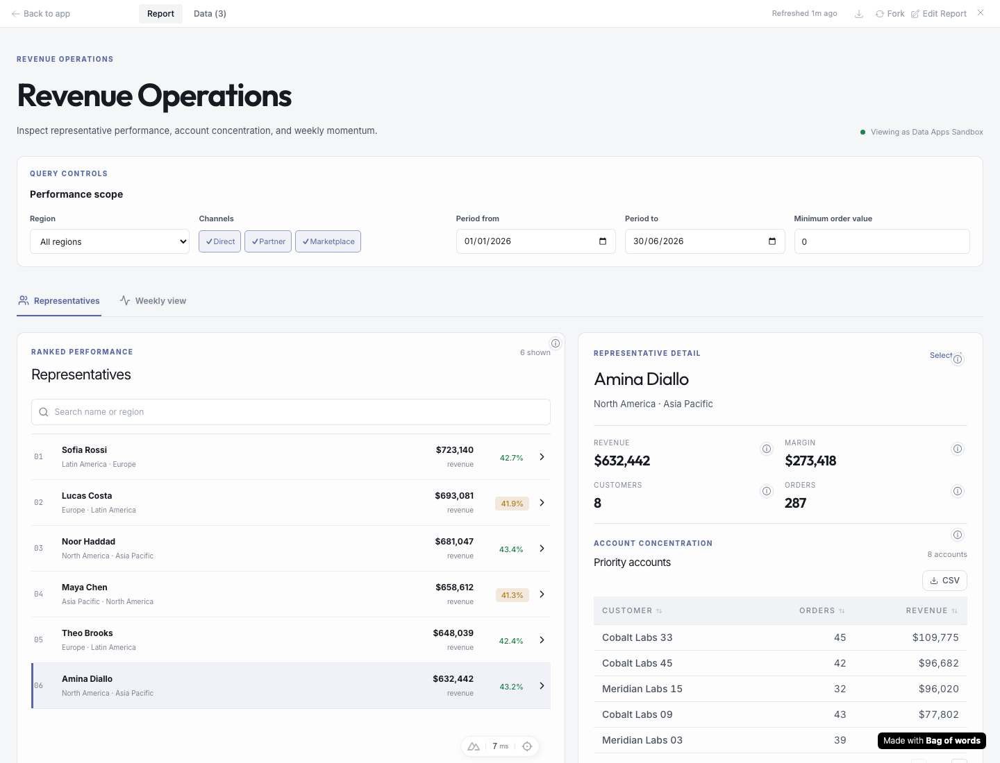

# Feedback loop — connected data apps, with legacy dashboard compatibility

Implemented locally on `codex/review-pr1129`, starting from PR #1129 commit
`3e32c09db2e88815bd2b9910db84ddd71d145d7f`. The requested outcome is a useful,
polished data app with real backend parameters, without a compulsory numeric
headline or KPI layout. Existing dashboards must keep working.

## Running examples

The current isolated sandbox is served at localhost:3000. Sign in as
`data-apps@example.com`, password `Password123!` (synthetic sandbox account).

| App | Working surface | Link |
| --- | --- | --- |
| Commerce Workbench | Weekly analysis, market comparison, customer detail/table; grouped Apply workflow | [Open](http://localhost:3000/r/5e435d88-5627-4b90-bfa9-4f0834d9b56e) |
| Listening Room | Backend catalog search, genre/price/duration filters, album and track details | [Open](http://localhost:3000/r/f546b9f1-541f-479c-9fc0-e03134855cc9) |
| Revenue Operations | Ranked representatives, account details, weekly view, CSV download | [Open](http://localhost:3000/r/3b28bf55-0729-4761-aee7-849c4530c880) |
| Legacy compatibility dashboard | Unversioned saved code, ordinary edit, parameter rerun, historical chart/number formatting | [Open](http://localhost:3000/r/fbe72c61-3661-4c14-8e2e-34551336e3ac) |

These IDs belong to this sandbox. Fresh runs print their own URLs. The original
checkout and its application database were preserved; changes are in the
isolated worktree `/private/tmp/bow-pr1129`. This document records the sandbox validation performed before publication.

## Validated causes and fixes

| Cause | Change | Evidence |
| --- | --- | --- |
| The page prompt prescribed a theme, hero and KPI composition; aesthetic gates rejected custom styling. | Task/design/data/interaction brief in `data_app_authoring.py`; optional kit; remove theme/palette rejection while retaining source-reference checks. | Three materially different generated working surfaces; custom-style unit checks. |
| The runtime froze its version before preview/thumbnail data arrived. | Inject metadata before shared scripts in `create_artifact.py:305` and `thumbnail_service.py:351`; propagate/preserve it through MCP create/edit/view. | Actual preview and thumbnail builders: v11 percentage was `0.4%`, now `37.0%`; legacy remains `0.4%`. |
| New shared chart/heading defaults changed old dashboards. | Preserve historical light/dark chart themes at `artifact-globals.js:355`, legacy 400px chart height, and authored heading weight. | Runtime harness; saved legacy dashboard after edit/rerun; offline exports. |
| Data delivery cleared pending/error state independently of the query status. | Track host loading and retain errors through data delivery in `artifact-globals.js:675`. | Failing-before/passing-after runtime harness plus real invalid-number and recovery flow. |
| Server-side snapshots lacked consistent typed parameter context. | `artifact_payload.py:159` preserves declared types, explicit nulls, ordinary applied values, query/viz scope and stable options; identity-derived snapshot values are withheld. Shared preview/export assembly reuses this contract. | Parameter unit checks, separate options-query workflow and offline export suite. |
| Applying new create requirements to old code blocked a title-only legacy edit. | Compare legacy wiring diagnostics before/after, scoped to the old visualization set. Newly added query parameters must still be wired. | The real legacy edit first failed on previously absent controls, then passed; unit tests also reject removed wiring and unwired new parameters. |
| Nested custom provenance markers occupied the same corner. | Separate colliding markers for v11; retain legacy placement. | First button was intercepted by the second; both now open independently, including Hebrew RTL. |

The relevant implementation entry points are
`backend/app/ai/tools/implementations/{create_artifact,edit_artifact}.py`,
`backend/app/ai/agents/planner/{data_app_authoring,artifact_authoring,artifact_refinement}.py`,
`backend/app/services/artifact_payload.py`, and
`frontend/public/libs/artifact-globals.js`.

The new default catalog entry is `data-app-design`; `complex-dashboard` is
conditional dashboard guidance. Existing organization-authored instructions are
not rewritten. The obsolete prerelease theme instruction was explicitly removed
only from this synthetic sandbox using the existing instruction API.

## Loop A — deterministic regressions, no LLM or external data

Use Python 3.12 and the repository dependencies. Run the vendor-library download
from the repository root if libraries/fonts are absent. Use the provisioned
Playwright browser in cloud sandboxes (`PLAYWRIGHT_BROWSERS_PATH=/opt/pw-browsers`).

```bash
cd backend
uv sync --frozen --extra dev
cd ../frontend
yarn install --frozen-lockfile
cd ..
bash scripts/download-vendor-libs.sh

# Both --baseline commands intentionally fail against the reviewed PR commit.
node tools/agent/verify_data_app_runtime.cjs --baseline
node tools/agent/verify_data_app_runtime.cjs
node tools/agent/verify_data_app_provenance.cjs --baseline
node tools/agent/verify_data_app_provenance.cjs
node tools/agent/verify_data_app_provenance.cjs --rtl

cd backend
export BOW_DATABASE_URL="sqlite:///db/data-app-loop.db"
export PYTHONPATH=.
uv run python ../tools/agent/verify_data_app_previews.py --baseline
uv run python ../tools/agent/verify_data_app_previews.py
uv run pytest tests/unit/test_artifact_design_system.py \
  tests/unit/test_artifact_params_wiring.py tests/unit/test_artifact_viewer_identity.py \
  tests/unit/test_data_app_contracts.py tests/unit/test_query_params.py \
  tests/unit/test_artifact_refs.py tests/unit/test_artifact_loop_guard.py \
  tests/unit/test_skill_catalog_library.py tests/unit/test_applied_params_redaction.py \
  --confcutdir=tests/unit -q
```

The unit selection contains pure/source contract checks and intentionally omits
the root database fixture. Database/API behavior is covered separately below.

Observed failure-to-pass changes:

- Runtime: pending status and query error survive subsequent data messages;
  the explicitly bold heading remains bold; legacy chart defaults match main.
- Preview/thumbnail: both v11 builders now produce `37.0%` for a ratio of `.37`;
  both legacy builders still produce `0.4%` under the historical contract.
- Provenance: normal clicks (no forced clicks) reach each nested source control.
- Mobile: selecting an album formerly left its detail at y=2230 and selecting a
  representative left it at y=710. The same test now finds them at y=76 and y=40,
  with working Back buttons and preserved selection.

Machine-readable results and concise logs are in [data-app-generation/](data-app-generation/).

## Loop B — full local app with complex parameterized queries

Run in a fresh sandbox checkout with unused ports. The repository boot script
uses its isolated `backend/db/agent.db`; use the same configuration for the Python
fixture tools, since they create visualization rows through the ORM. Reports,
queries, query runs and artifacts use real HTTP endpoints. ORM insertion is used
only because no standalone visualization-create endpoint exists.

```bash
export BOW_DATA_APP_RUN=/tmp/bow-data-app-run
mkdir -p "$BOW_DATA_APP_RUN"
chmod 700 "$BOW_DATA_APP_RUN"
tools/agent/boot_stack.sh --dev

cd backend
export TESTING=true
export ENVIRONMENT=production
export TEST_DATABASE_URL="sqlite:///db/agent.db"
export PYTHONPATH=.
umask 077
uv run python ../tools/agent/seed_org.py --email data-apps@example.com \
  --org-name "Data Apps Studio" --sqlite-sources 1 --db-path db/agent.db \
  > "$BOW_DATA_APP_RUN/session.json"
uv run python ../tools/agent/data_app_sandbox.py seed \
  --session "$BOW_DATA_APP_RUN/session.json" --output "$BOW_DATA_APP_RUN/apps"
uv run python ../tools/agent/data_app_sandbox.py install-fixtures \
  --session "$BOW_DATA_APP_RUN/session.json" --output "$BOW_DATA_APP_RUN/apps"
uv run python ../tools/agent/data_app_compatibility.py
uv run python ../tools/agent/verify_data_app_queries.py \
  --session "$BOW_DATA_APP_RUN/session.json" --apps "$BOW_DATA_APP_RUN/apps/manifest.json" \
  --source-db db/seed_sources/source_1.db --output "$BOW_DATA_APP_RUN/backend-results.json"
cd ..
node tools/agent/prepare_data_app_browser.cjs
node tools/agent/verify_data_app_ui.cjs
node tools/agent/verify_data_app_mobile.cjs
node tools/agent/verify_data_app_inspection.cjs
backend/.venv/bin/python tools/agent/export_data_apps.py
node tools/agent/verify_data_app_compatibility.cjs
```

The session/storage files contain sandbox authentication material. Keep them
outside the repository and do not paste them into logs or PRs. Setup was replayed
successfully into fresh report/query/artifact records without an LLM call.

The source fixture has 1,800 orders, 48 customers, six representatives, line
items, 24 albums and 144 tracks. Sales queries use multiple CTEs, joins,
aggregation and a window function, with bound string, list, number and date-range
parameters. Catalog queries join albums/tracks and bind full-backend search,
genre, maximum price and minimum duration. No browser-only fake query transport.

The 49 query checks independently calculate expected revenue/order totals from
raw source rows in Python, across six sales scopes for six queries. They also
check catalog track IDs/counts, empty lists, empty results, invalid typed values,
strict choices and quote/injection-shaped text. SQL values use the existing
driver's parameter binding.

Browser verification covers combined Apply, each participating query rerunning,
consistent totals across views, stable iframe/UI state, latest dispatched filter
winning, loading/error recovery, dynamic options from a separate query, selection,
tabs, mobile detail/back navigation, source popovers, CSV content and editor/shared
views. Widths: 400, 960 and 1440 pixels. Final workflow run: 35 real query POSTs,
13 primary workflow/layout assertions and no page errors, plus the separate
inspection/mobile/compatibility checks.

API regressions also passed:

```bash
cd backend
TESTING=true uv run pytest tests/e2e/test_report_rerun_params.py \
  tests/e2e/test_report_rerun_artifact.py tests/e2e/rbac/test_viewer_run_shared_artifacts.py -q
TESTING=true uv run pytest tests/e2e/test_html_export_offline.py -q
```

Observed: 203 focused unit checks (135 core plus 68 existing authoring/parse/handoff checks), 33 rerun/shared-viewer API tests and 16 offline export tests passed. The runtime harness also passed all 20 light/dark contract checks.
Four downloaded HTML exports rendered without network access; commerce and legacy
PDF exports were produced successfully. Static exports display snapshot data and
do not gain live backend execution.

## Generation and visual evidence

All three initial sources were generated using the real configured
`gpt-5.6-luna` model and shared authoring reference, then submitted through the
real mechanical create tool. Initial generation times were approximately 58s,
77s and 66s (commerce, representatives, catalog). These are individual runs,
not a performance benchmark. The original generated sources are preserved in
`tools/agent/fixtures/data_apps/generated/`; the reviewed runnable sources are
one directory above, with fixture visualization placeholders for replay.

Local mechanical corrections were necessary: a compact catalog title and legible
numerals, mobile detail/back navigation, commerce axis labels and date widths.
Those corrections are not represented as automatic model refinement. The shared
guidance now explicitly covers the observed title/mobile problems. The three
showcases demonstrate the supported product shapes, not a guarantee that every
new generation passes visual review on its first attempt.

| Evidence | Before | After |
| --- | --- | --- |
| Catalog composition | [Initial generation](../../media/pr/data-app-generation/catalog-initial-generation.png) | [Reviewed app](../../media/pr/data-app-generation/catalog-desktop.png) |
| Album selection at 400px | [Detail below the collection](../../media/pr/data-app-generation/catalog-mobile-before.png) | [Detail revealed](../../media/pr/data-app-generation/catalog-mobile-after.png) |
| Representative selection at 400px | [Detail below the list](../../media/pr/data-app-generation/reps-mobile-before.png) | [Detail revealed](../../media/pr/data-app-generation/reps-mobile-after.png) |
| Nested provenance | [Overlapping buttons](../../media/pr/data-app-generation/provenance-before.png) | [Independently clickable](../../media/pr/data-app-generation/provenance-after.png) |






Additional evidence includes 400/960px views, filtered/empty/error states, the
legacy dashboard, the editor and [Hebrew provenance](../../media/pr/data-app-generation/provenance-after-he.png).

## Bounds and remaining evaluation

- The optional aesthetic edit is bounded in execution state by
  `ArtifactRefinementBudget`; requested edits and functional repairs retain the
  existing overall artifact-call cap. Screenshot observations honor data-visibility
  and model-vision settings and explain their static/anonymous limitations.
- Automatic approval review rejected the attempted external screenshot/source
  refinement as an unapproved data export. No rejected export was executed. The
  observed corrections were made locally; the screenshot-to-model refinement
  round trip is therefore not claimed as verified.
- This run exercised one generation model. It did not repeat the supplied
  Haiku/Sonnet comparison, establish comparative visual parity, or measure a
  cross-model success rate. The generation command remains available for that
  separate evaluation with an explicitly configured model.
- MCP runtime metadata/bootstrap paths were fixed and reviewed in code; no live
  external MCP client session was used. Saved legacy artifacts were exercised in
  the actual web viewer and offline outputs. This is bounded compatibility
  evidence, not an exhaustive inventory of every historical saved artifact.
- Parameter string matching remains a diagnostic rather than a JavaScript
  analyzer. Live browser/backend checks are the behavioral evidence. No new
  arbitrary endpoint, writeback, authorization or dependency-install mechanism
  was introduced.
