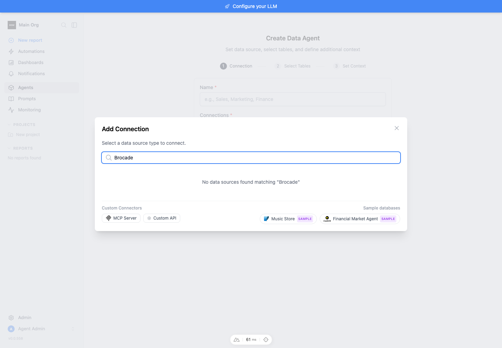
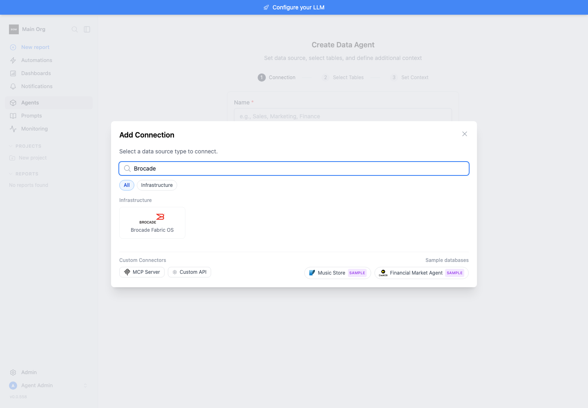
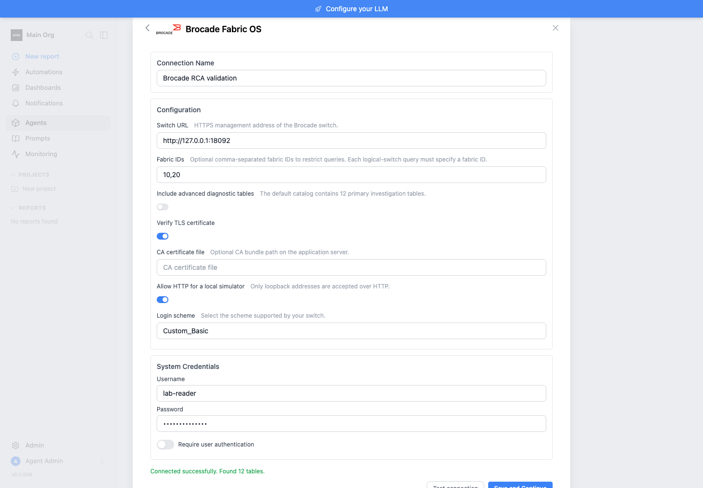
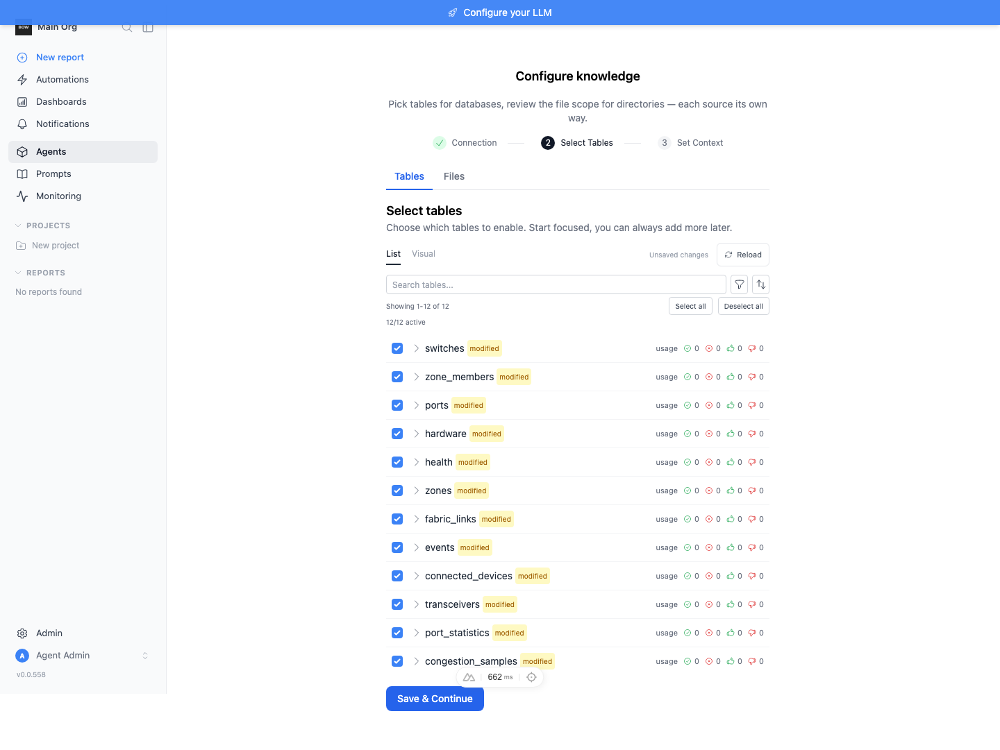

# Feedback loop — Brocade Fabric OS RCA connector

The requested behavior is a Brocade FOS 9.1.1c connector for root cause investigations: a small `get_tables` catalog and read-only `execute_query` with all reviewed fields. The implementation is simulation-verified; no real FOS instance or customer responses were used.

## Root cause / missing capability

At base `935d456dc`, `resolve_client_class('brocade')` raised `ValueError: Unknown data source type: brocade`. The registry lacked the type, and the UI catalog had no Brocade tile. The new registry entry is in `backend/app/schemas/data_source_registry.py:886`; the client and explicit query validation are in `backend/app/data_sources/clients/brocade_client.py`. This is a new capability, not a claim that existing connectors were defective.

## Loop A — deterministic regression

Use a fresh worktree and the repository's Python 3.12 environment:

```sh
cd backend
uv sync --frozen --extra dev
mkdir -p db
export TESTING=true
export BOW_DATABASE_URL=sqlite:///db/brocade-test.db
uv run python -c "from app.schemas.data_source_registry import resolve_client_class; print(resolve_client_class('brocade'))"
uv run pytest tests/unit/test_brocade_client.py -q --db=sqlite
uv run pytest tests/e2e/test_data_source.py tests/e2e/test_connection.py -q --db=sqlite
```

Observed baseline reproduction: `test_brocade_registry_resolves_query_client` failed with `Unknown data source type: brocade`. After registration and implementation the same public resolution succeeds. The unit HTTP boundary uses the independent synthetic server's documented resource shapes; the app's validation, catalog, normalization and execution code run normally. Tests cover all 12 primary views plus representative advanced resources, errors, scopes, nested arrays, timezone ordering, preserved uint64 values, projection evidence, unknown-field exclusion and bounded responses.

A quick isolated unit-only run can use `pytest --noconftest tests/unit/test_brocade_client.py`; the full commands above also exercise repository fixtures/migrations. The final connector, required lifecycle and enterprise-license suite passed **78/78 tests**, with no failures or skips.

A targeted mutation check removed numeric widening from the hardware union: the fractional-temperature regression failed as expected, then passed again after restoration. This guards against silently describing decimal temperatures as integers.

## Loop B — real HTTP transport, synthetic switch

Follow [tools/brocade/README.md](../../tools/brocade/README.md). Both the standalone Python server and the Docker Compose image were started and exercised. Docker built and ran on this M-series Mac. The generic integration harness passed against the container using environment credentials; all 12 primary table queries matched their advertised schemas. [Sanitized counts](../../media/pr/brocade-rca-connector/http-verification.json) record the Docker run.

The production `StreamingCodeExecutor` also executed a JSON RCA query against the Docker server. It returned the selected port and preserved the fixture's `18446744073709551614` counter exactly. `test_application_executor_preserves_json_query_and_uint64` keeps this shared-executor contract under regression coverage.

The server accepts only the authentication lifecycle and modeled diagnostic reads. It does not emulate hardware behavior. Its firmware label is intentionally synthetic. The 156 advanced baseline resources have generated schema/allowlist coverage, not 156 independently verified live response fixtures.

## Loop C — application UI

The isolated stack used backend port 18010, frontend port 13010 and a separate SQLite database. Seeded users/orgs were created through `tools/agent/seed_org.py`. A test-only enterprise license provider fixture was injected into the sandbox process; production license validation was not bypassed or weakened. Brocade was added to the backend enterprise-source gate as well as the UI metadata.

The before capture used the base registry and icon files temporarily restored in the isolated worktree. The after capture restored the implementation. Both catalog captures use a 1440 × 1000 viewport. The generated form was reviewed with the requested logo and synthetic credentials. “Test connection” returned “Connected successfully. Found 12 tables.” Saving created the connection and schema discovery completed with 12 tables. All 12 tables were selected and saved in the agent table selector, and RCA instructions were saved to finish agent setup.

The production Nuxt build completed successfully, and its served UI also passed the connection test. The sandbox has no configured LLM provider. Automatic LLM enrichment was disabled for agent creation; the deterministic production query executor was verified separately. A natural-language planner run is not claimed.

| Before | After |
| --- | --- |
|  |  |






## Implementation

- `brocade_client.py`: scoped session lifecycle, diagnostic allowlist, XML safety, bounded reads, explicit error classes, query DSL and durable row evidence.
- `brocade_catalog.py` and `brocade/catalog.json`: 12 primary views and 156 conditional advanced baseline resources, inherited types/units and resource dispositions.
- `tools/brocade/generate_catalog.py`: reproducible metadata generation; no PyFOS or pyang runtime dependency.
- Registry/config/icon: schema-generated connection form with explicit client resolution and the requested branding.
- `tools/brocade`: independent synthetic server, ARM-compatible container and count-only acceptance runner.

## What this proves and what remains

This proves connector/application behavior for the modeled XML contracts, including failure behavior and RCA evidence preservation. It does not prove compatibility across real switch models, all 9.1.1c resource revisions, account roles, retention limits or SAN operating conditions. Module discovery reports advertisement, not actual read permission. Retained events are not guaranteed incident-window coverage; rates/counters and defined/effective zoning remain distinct.

Real acceptance still requires the applicable 9.1.1c API contract, sanitized response replay and bounded read-only checks on representative customer hardware/FIDs/roles. Do not label the connector hardware-certified or claim that simulation establishes root cause in a real incident.
