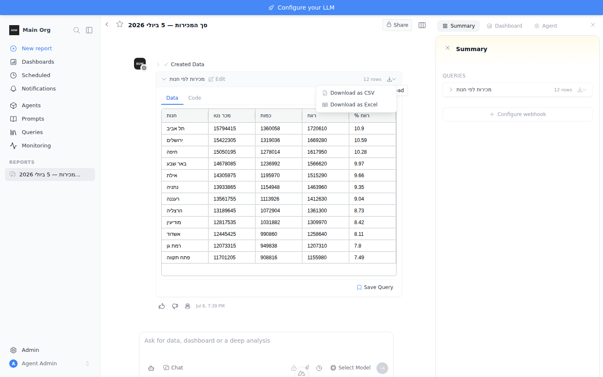

# Feedback Loop — CreateData "add export to Excel" + Hebrew CSV mojibake

Two related changes to the CreateData result export, validated together because
they share one theme — **exports that open cleanly in Excel**:

1. **Feature:** the download control becomes a dropdown offering **CSV** *and*
   **Excel (.xlsx)** (previously a single CSV button).
2. **Bug:** CSV attachments/downloads with non-ASCII (e.g. Hebrew) columns
   render as ANSI mojibake in Excel (reported from an emailed sales summary —
   headers like `מכר נטו` came through as `x̌ž×x¨…`).

## Root cause (validated)

- **Mojibake:** every CSV path emitted UTF-8 **without a BOM**. Excel only
  auto-detects UTF-8 in a `.csv` when a BOM (`EF BB BF`) leads the file;
  otherwise it falls back to the system ANSI codepage and mangles multi-byte
  characters. ASCII digits survive (single-byte), which is exactly the reported
  pattern. Offending sites:
  - `app/services/email_send_service.py:363` — `.encode("utf-8")`
  - `app/routes/step.py` — `df.to_csv(buffer)` returned as a `str`
  - `frontend/components/tools/ToolWidgetPreview.vue` — `new Blob([csv], …)`
- **Latent Hebrew-title crash (found while verifying):** the export route built
  `Content-Disposition` from the widget title. `str.isalnum()` is `True` for
  Hebrew letters, so the title survived sanitization and hit the **latin-1-only**
  HTTP header encoder → `'latin-1' codec can't encode…` → 500/404. Any non-ASCII
  title broke the download entirely.

## The fix

- **XLSX export** — `app/routes/step.py` now accepts `?format=csv|xlsx`. `xlsx`
  streams `df.to_excel()` (openpyxl, already a dependency) with the spreadsheet
  MIME type. `csv` encodes as **`utf-8-sig`** (BOM).
- **BOM everywhere** — `email_send_service.py` uses `utf-8-sig`;
  `ToolWidgetPreview.vue` prepends `` to the client-side blob.
- **Unicode filenames** — RFC 6266 `filename*=UTF-8''<pct-encoded>` with an
  ASCII `filename=` fallback, so a Hebrew title never crashes the header.
- **UI** — `ToolWidgetPreview.vue` replaces the single CSV button with a
  `UDropdown` (download icon + chevron): **Download as CSV** / **Download as
  Excel**. CSV is client-side (BOM); Excel hits the server endpoint. The client
  CSV header row now prefers `headerName` so it matches the on-screen table and
  the server export. `download` / `downloadExcel` i18n keys added to all 10
  locales.

## Loop A — deterministic reproduction / regression (no external services)

`backend/tests/e2e/test_step_export.py` seeds a step with Hebrew columns and
drives the real HTTP route:

```bash
cd backend
TESTING=true BOW_DATABASE_URL="sqlite:///db/app.db" \
  uv run pytest tests/e2e/test_step_export.py -v --db=sqlite
```

Asserts the invariants: CSV starts with the BOM and contains the Hebrew header
+ value; XLSX is an openable workbook with the Hebrew header and numeric cells;
`Content-Disposition` carries `filename*=UTF-8''`; unknown format → 400; unknown
step → 404. **Result: 6 passed.** With the BOM fix reverted,
`test_csv_has_bom_and_unicode` fails on the `body[:3] == b"\xef\xbb\xbf"` check.

## Loop B — live UI + HTTP confirmation

Full stack (`tools/agent/boot_stack.sh --dev`), a report seeded with a
`create_data` block over a Hebrew table, then:

- **HTTP:** `curl …/api/steps/{id}/export` → CSV begins `EF BB BF`, header
  `חנות,מכר נטו,…`; `?format=xlsx` → valid `A1:E13` workbook, Hebrew headers,
  numbers stay numeric.
- **Playwright:** log in, open the report, open the download dropdown, click
  each option, re-verify both downloaded files.



## What this proves / regression notes

- The dropdown renders both options and both downloads succeed against the real
  app.
- Hebrew round-trips through CSV (BOM) and XLSX end to end.
- A Unicode widget title no longer crashes the export response.
- The pytest loop survives as the durable regression guard.
