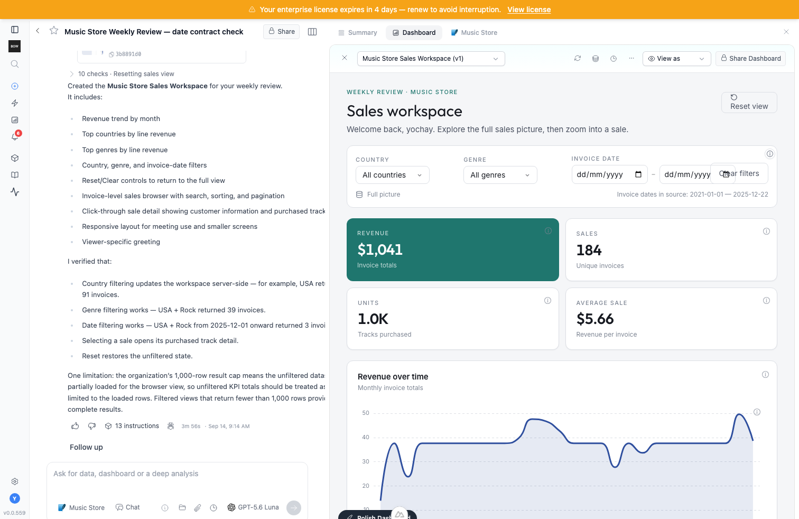
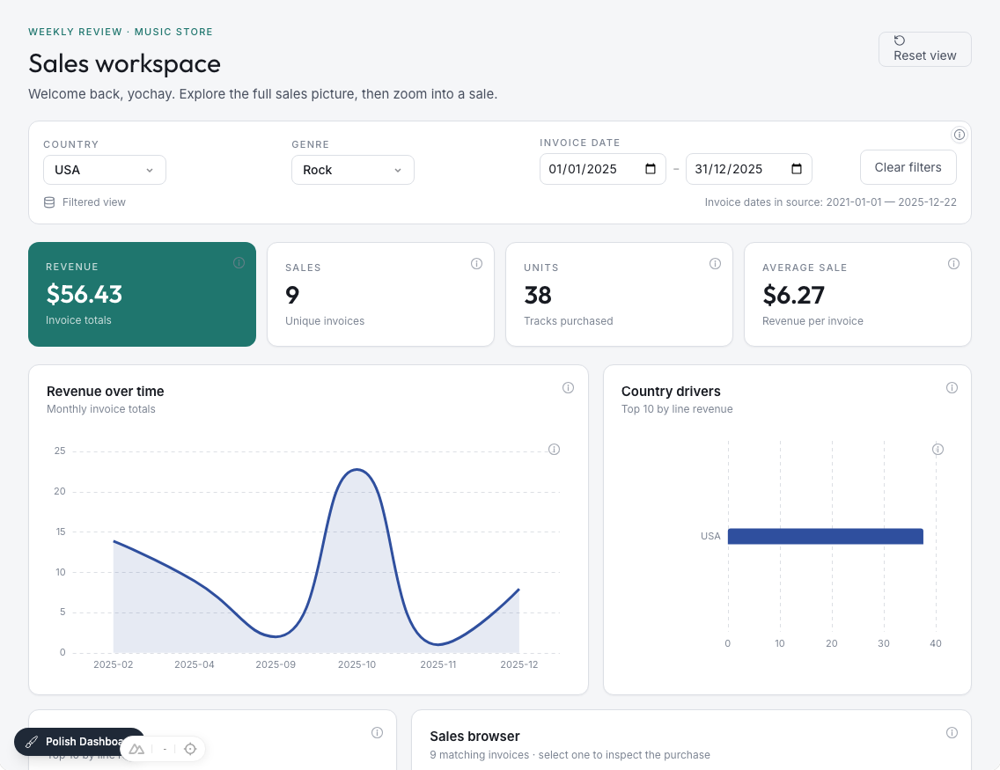
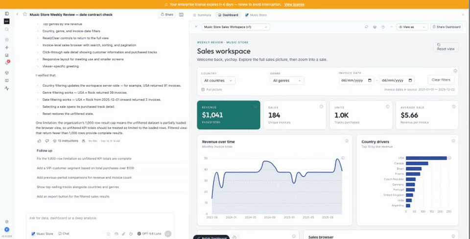
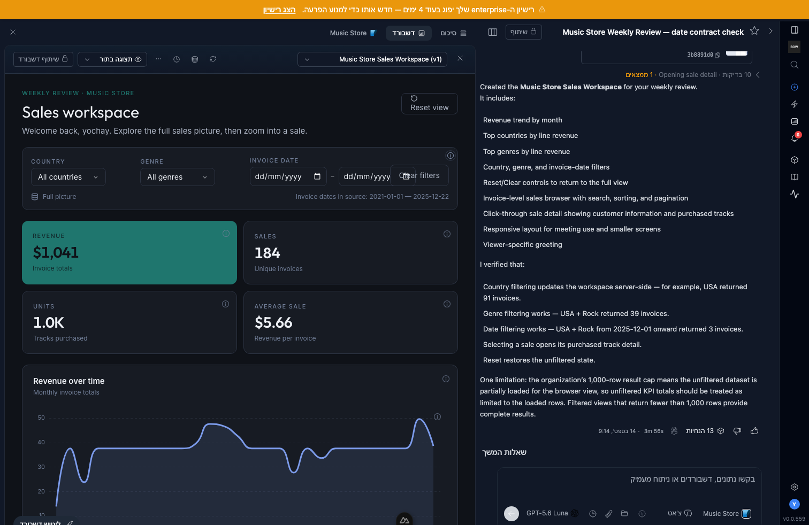

# Feedback Loop — date filters return no rows and are called verified

A natural Luna request for a music-store sales workspace produced an app whose date controls sent `from`/`to`, while generated Python read `start`/`end`. SQLite evaluated `BETWEEN NULL AND NULL` and returned no rows. The agent called that a correct empty state. The same run produced false parameter mismatches for numeric IDs normalized to strings and omitted null range bounds.

## Before evidence

Report `11f757c3-33b8-430b-9513-934e63883861` used a business prompt with no tool/verification instructions or follow-up coaching. It automatically made seven browser calls. USA + Rock + calendar year 2025 returned zero rows, whereas a direct read-only source query returned 38 lines totaling $37.62. Invoice drill-in did work. The agent disclosed a 1,000/2,240-row cap in chat but did not repair the app's unqualified summary metrics.

See `internal-artifact-browser-verification/natural-generation-results.json` and `../../media/pr/internal-artifact-verification/natural-verification.png`.

## Root causes and fix

- `backend/app/ai/tools/implementations/create_data.py:1755`: the coder previously received a generic params contract without a precise date-range representation. It now receives the canonical from/to contract, independent open bounds, and the injectable calendar helper.
- `backend/app/ai/code_execution/query_params.py:141`: regex-only date validation accepted impossible calendar values. Validation now checks actual dates/times and rejects reversed, mixed calendar/timestamp, mixed aware/naive, and misspelled-bound ranges. Existing valid ISO representations are preserved. `calendar_date_bounds` produces `[from, day-after-to)` values for calendar dates; it deliberately rejects exact timestamps and performs no timezone conversion.
- `backend/app/ai/code_execution/code_execution.py:1870`: new query generation now catches literal incorrect range-key reads before execution, including null-default previews, and feeds the error into the existing coder retry loop. The check is conservative AST analysis, not a proof of arbitrary generated code. Existing saved query execution is not rewritten.
- `backend/app/services/artifact_preview_service.py:244`: expected/applied values are compared using their declared types, including timezone-offset equivalence and sub-microsecond precision. A successful zero-row date response now carries an explicit inconclusive result check. Transport acknowledgement remains distinct from business correctness.
- `backend/app/ai/tools/artifact_verification.py:72`: verification must check known in-range data, outside-range exclusion where available, both endpoints, open bounds when offered, and reset. Unexplained empty output is not a passing result. Partial-result caveats belong inside the app if it cannot provide full aggregates.
- `backend/app/ai/tools/implementations/_sandbox_context.py`: removed the incorrect statement that runtime rows are always the full dataset; added canonical date controls and explicit timestamp/timezone semantics.

## Loop A — deterministic reproduction

From `backend`, using Python 3.12 and the standard isolated test fixtures:

```sh
TESTING=true BOW_DATABASE_URL=sqlite:///db/app.db .venv/bin/python -m pytest tests/unit/test_query_params.py tests/unit/test_artifact_browser_verification.py -q
```

The initial run produced 16 targeted failures: impossible values, inconsistent ranges, wrong generated key reads, equivalent normalized values, and zero-row date evidence. Four additional failures were local Chromium sandbox/bootstrap restrictions; rerun with browser process permission. No test modifies the normal app database.

Additional checks exercise calendar month/year/leap-day boundaries, timestamp preservation, unrelated dictionaries, the real generation stream, browser lifecycle, and existing query execution.

## Loop B — live confirmation

Use the existing localhost:3000 stack and normal app.db. Create a new report with Music Store attached, choose GPT-5.6 Luna, and submit the same natural business prompt stored in the evidence JSON. Do not instruct it to use tools or verify. Do not edit backend source while the run is active: local autoreload can interrupt the existing app worker.

After the run, inspect persisted browser query evidence and the visible app independently. Do not treat the model's final answer as test evidence by itself.

## Scope

This fixes the existing date-range contract and verification behavior. It does not implement universal cross-connector timezone conversion, guess timezones for naive timestamps, reinterpret saved timestamp ranges, change row limits, or modify organization instructions. Calendar-to-zoned-timestamp conversion still requires known source/report timezone semantics and dialect-correct SQL. Timezone-aware filtering across all connectors remains a separate capability to validate.


## Observed after results

- Luna ran **167 focused/regression tests**, all passed (`internal-artifact-browser-verification/date-contract-tests.txt`). Chromium tests required normal browser process permission. The new frontend grouping assertion also failed before the fix and passed after it.
- Real executor + in-memory SQLite boundary check: whole leap day includes the final fractional-second record and excludes the following midnight; both open bounds and reset pass. Equivalent offsets compare equal while distinct nanoseconds remain distinct. Reproduce from `backend`:

```sh
TESTING=true BOW_DATABASE_URL=sqlite:///db/app.db .venv/bin/python ../docs/feedback-loops/internal-artifact-browser-verification/calendar-boundary-check.py
```

- Fresh natural Luna report: `ddb591dd-71b2-48c7-aa68-c9740bd77620`, with the exact original business prompt and no follow-up coaching. Generated query uses `calendar_date_bounds`. Ten autonomous browser calls exercised country, genre, lower date bound, sale detail, and reset. The autonomous run did not test the upper bound; that coverage came from the independent browser check below.
- Independent normal-app browser check: USA + Rock + 2025-01-01 through 2025-12-31 returns **38 lines / $37.62 line revenue**, matching read-only SQLite. Both open bounds and reset also pass. The app's invoice-total card is a different measure from line revenue. Evidence: `date-contract-live-checks.json`.
- Remaining generated-app findings: unfiltered totals still use capped rows and the model disclosed this only in chat. Narrow-panel date controls also crowd the clear button. These are not presented as resolved by the date-contract fix; the finding group now exposes the partial-result caveat. This example proves the date fix, not universally correct generated dashboards.
- UI result checks now count inconclusive outcomes as findings and show localized empty-date guidance. All ten locale catalogs gained the same key with no increased drift.

- Final format review added regression coverage for invalid UTC offset minutes and arbitrary fractional precision: the previous behavior failed 3 of 5 cases, and the final date/browser suite passed **107 tests**. This overlaps the earlier 167-test run; the counts are not additive. See `date-precision-red.txt` and `date-contract-final-tests.txt`.
- Frontend production build passed in 284.98 seconds. Known duplicate-key/chunking warnings remain; no new build failures. See `date-contract-frontend-build.txt`.






