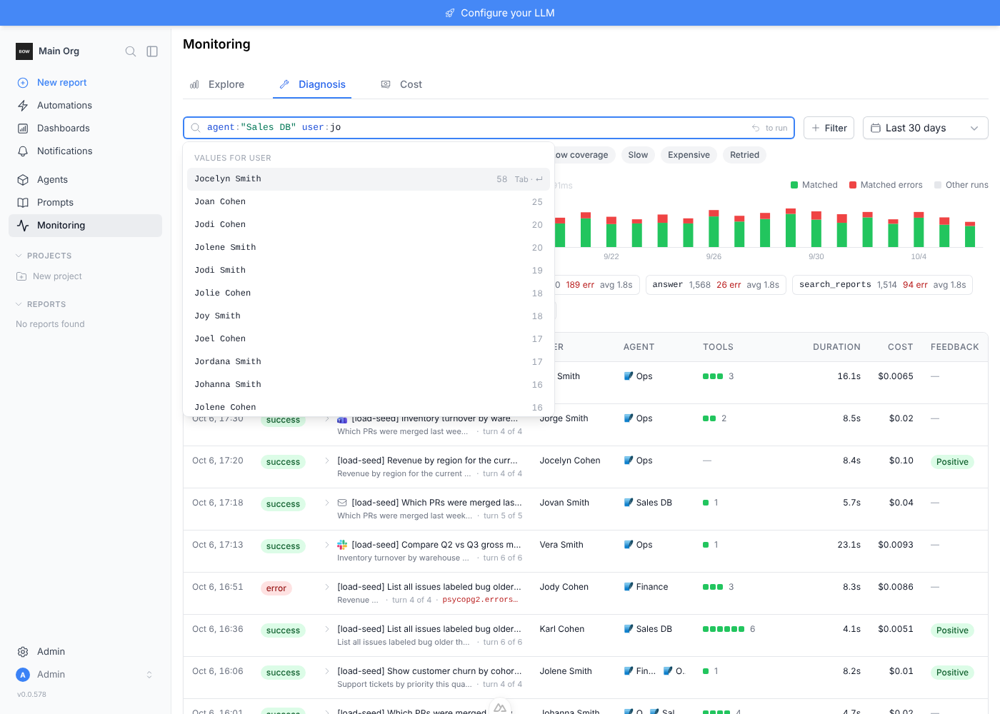
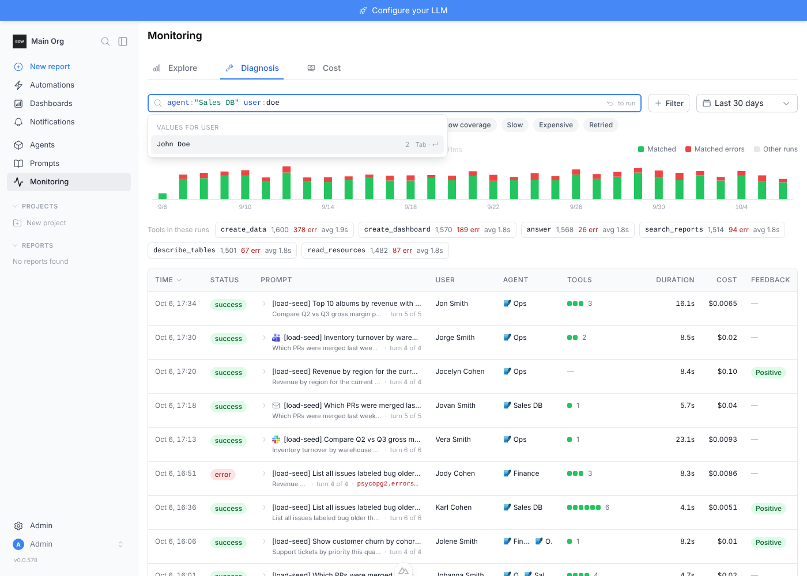
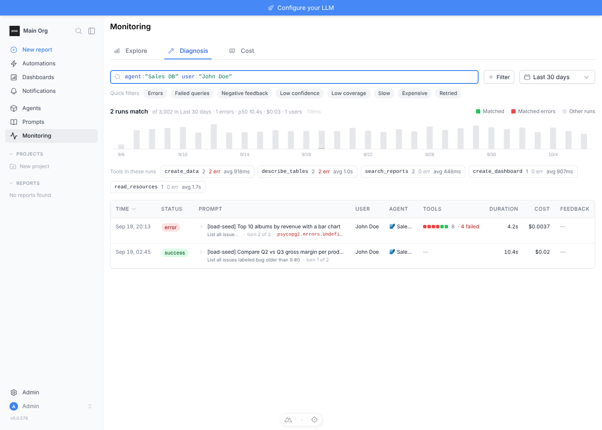
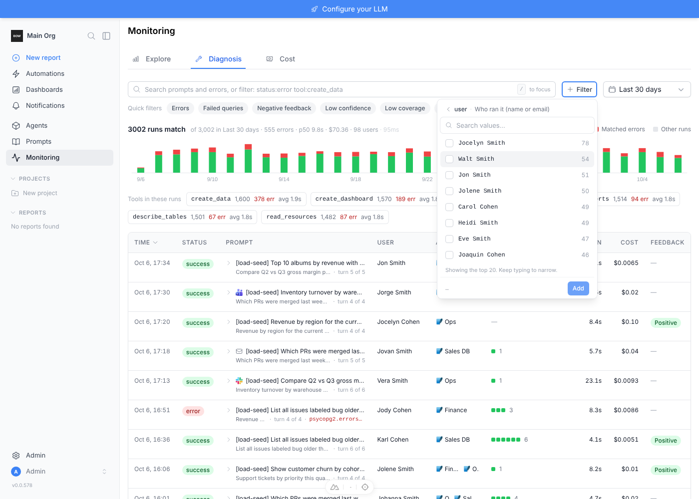
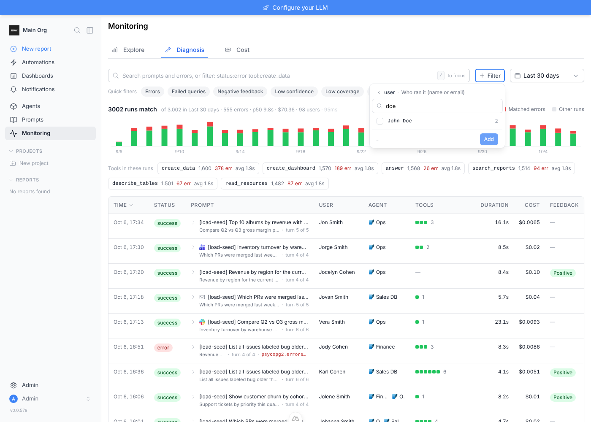

# Feedback Loop — diagnosis: a user that exists never shows in the `user:` suggestions

Report: *"with hundreds of users, filtering for an agent + user, I type the user
prefix (`jo` for John) and the user is not shown even though they exist."*

## Root cause

`DiagnosisService.facets` (`backend/app/services/diagnosis/service.py`) ranks a
field's values by matching-run count and returns the top `FACET_LIMIT = 20`,
silently. In a large org a short prefix (`jo`) matches more than 20 users, so a
user with few runs ranks off the bottom and the list looks complete. Names also
matched only from their first character, so a last name (`doe`) found nothing.
Same shape for every suggested field; it bites on `user`, `agent`, `table`
(and over time `version`).

## Fix

- Every facet query fetches `limit + 1` rows; the response is now
  `{"items": [...], "truncated": bool}`.
- The limit is 20 with no prefix and 50 once the user types
  (`FACET_SEARCH_LIMIT`).
- `user` and `agent` names match the start of any word (`% doe%`).
- The query bar and the Filter Builder show *"Showing the top N. Keep typing to
  narrow."* when `truncated` is set. The query bar dropdown now scrolls.
- Failed facet requests are no longer cached as empty.

## Sandbox

Backend + frontend per the `sandbox-feedback-loop` skill. Seeded through the
real API: an admin, 98 named members (the community license caps seats at 100;
~50 first names start with "Jo"), and 3 agents (`Sales DB`, `Finance`, `Ops`).
Runs from `backend/scripts/seed_diagnosis_load.py`: 3,000 across the other users
and agents, then 2 for `John Doe` on `Sales DB` only.

## Results

API (`/api/console/diagnosis/facets/user`, last 30 days):

| q | prefix | before | after |
|---|---|---|---|
| `agent:"Sales DB"` | `jo` | 20 rows, John absent, no signal | 50 rows, John listed, `truncated: true` |
| `agent:"Sales DB"` | `joh` | John listed | John listed |
| `agent:"Sales DB"` | `doe` | 0 rows | John listed |

UI (Playwright, `/monitoring/diagnosis`):

| Step | Observed |
|---|---|
| Type `agent:"Sales DB" user:jo` | John Doe in the dropdown; footer "Showing the top 50. Keep typing to narrow." |
| Type `agent:"Sales DB" user:doe` | John Doe is the only suggestion; no footer |
| Pick it and run | `agent:"Sales DB" user:"John Doe"` → 2 runs |
| Filter → user, empty search | footer "Showing the top 20. Keep typing to narrow." |
| Filter → user, search `doe` | John Doe listed |

Speed — `facets("user")` on the sandbox DB, median of 25 calls, old vs new code
on the same data:

| q | prefix | old | new |
|---|---|---|---|
| `agent:"Sales DB"` | — | 10.8 ms | 7.5 ms |
| `agent:"Sales DB"` | `jo` | 11.8 ms | 10.2 ms |
| — | `jo` | 15.5 ms | 15.3 ms |
| — | `doe` | 10.8 ms | 12.9 ms |

No measurable change: the work is still the one matched-runs aggregate.

## Regression test

`backend/tests/e2e/test_diagnosis_explorer.py::test_facets_never_hide_a_value_silently`
— 25 users sharing a first name, one with a single run: the empty list reports
`truncated`, a shared prefix lists all 25, and the last name (any case) finds the
rare user. Fails on the old code (no `truncated`, no last-name match).

Sandbox gotcha: a request with no `start`/`end` means "all time", floored at the
org's creation day, so runs the load script backdates before the org was
created are invisible to it. Pass an explicit range.
