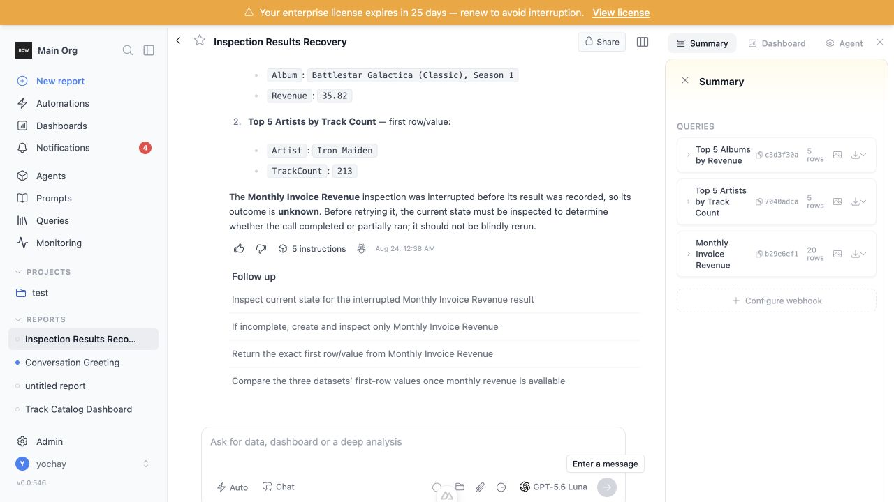
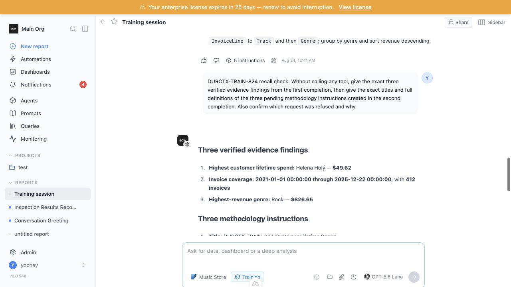
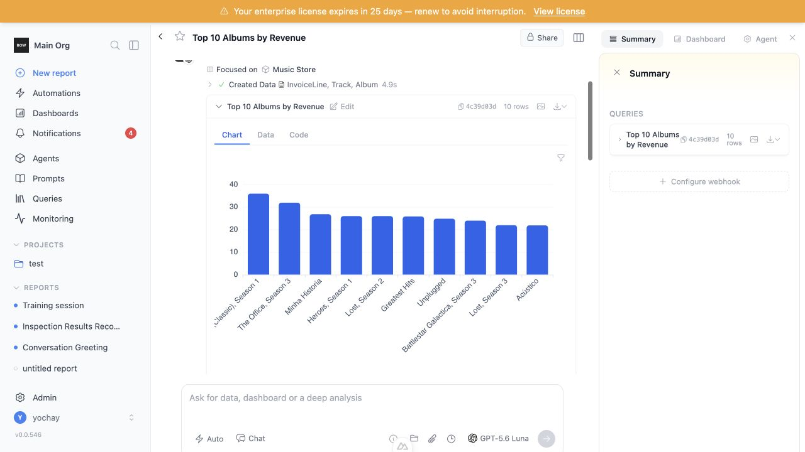

# Feedback Loop — tool context survives completion boundaries and hard stops

An agent used to begin each completion with a fresh typed transcript. Later
prompts could see a lossy message digest, but not the original ordered tool
calls, bounded structured results, provider identities, or an intent that was
dispatched immediately before a process died. This loop validates that the
canonical completion/decision/tool records now rebuild a provider-valid
transcript without adding a second event store or another prompt-build query.

## Root cause (validated)

- `AgentV2` created a fresh in-memory transcript for every completion while
  `MessageContextBuilder` rendered prior tool activity as prose. The tool
  call/result roles and provider call identity were therefore lost at the
  completion boundary.
- `ProjectManager.start_tool_execution` returned an uncommitted execution
  object. A worker could begin a side effect before another database session
  could see its intent, so a hard stop could erase the fact that the call had
  started.
- `persisted_summary.py` projected only selected high-volume tools. Other tool
  results had no deterministic, bounded model-facing representation to replay.

The fix points are `backend/app/ai/agent_v2.py`,
`backend/app/ai/context/builders/message_context_builder.py`,
`backend/app/ai/context/durable_transcript.py`,
`backend/app/ai/persisted_summary.py`, and
`backend/app/project_manager.py`.

## Loop A — deterministic reproduction (no external services)

From a fresh backend environment:

```bash
cd backend
TESTING=true uv run pytest -q \
  tests/unit/test_durable_agent_context.py \
  tests/unit/test_message_context_tool_result_projection.py \
  tests/unit/test_transcript_bridge.py \
  tests/unit/test_concurrent_tool_dispatch.py \
  tests/unit/test_report_summary_instruction_items.py
```

Before the fix, the minimal pre-dispatch regression failed: a second database
session could not select the tool intent returned by
`start_tool_execution`. The observed invariant was `persisted is None` before
the dispatch callback could begin.

After the fix, the same boundary plus transcript reconstruction tests pass:

```text
92 passed, 530 warnings in 93.49s
```

The suite covers the general invariants rather than the live report values:
pre-dispatch durability, finish-in-place semantics, parallel ordering,
provider call identity/signature preservation, legacy synthetic call IDs,
blockless hard-stop recovery, explicit `outcome_unknown`, bounded generic
summaries, no duplicated prose tool history, large-payload exclusion, and an
unchanged SQL query count for native transcript hydration.

The persistence and native-history boundary also passed on PostgreSQL 14 using
the repository's `--db=external` fixture against a dedicated disposable test
database:

```text
5 passed, 338 warnings in 7.12s
```

## Loop B — live confirmation on the target stack

Prerequisites:

1. Run the existing app at `http://localhost:3000` against a populated local
   database migrated to `durctx01`.
2. Sign in interactively. Credentials are supplied outside this document and
   are not stored in the repository, browser evidence, or command arguments.
3. Use a configured model and the existing Chinook/Music Store data source.

### Chat: parallel data work followed by SIGKILL recovery

In report `e349b8b8-4aa8-4f90-8b1e-085beae98228`:

1. Run `search_agents`.
2. Run three parallel `create_data` calls for album revenue, artist track
   count, and monthly invoice revenue.
3. Run three parallel `inspect_data` calls.
4. After two inspections settle and the third intent is visible as
   `in_progress` in a separate database connection, send SIGKILL to the worker
   process only.
5. Restart the backend, reload the report, and ask a no-tool follow-up for the
   exact completed results and the state of the unfinished call.

Observed result:

- The follow-up recalled album `Battlestar Galactica (Classic), Season 1`,
  `AlbumId 253`, revenue `35.82`.
- It recalled artist `Iron Maiden`, track count `213`.
- It described Monthly Invoice Revenue as interrupted with unknown outcome and
  told the planner to inspect current state before retrying. It did not invent
  a success or silently repeat the call.
- The database contained one ordered row for every parallel intent, including
  the blockless in-progress row written before the worker died.



### Training: repeated inspect and create-instruction turns

In training report `7b53ac58-ae55-495a-823c-985e3d2e20c8`:

1. Run three parallel `inspect_data` calls for customer lifetime spend,
   invoice coverage, and genre revenue.
2. Confirm the trainer refuses to save volatile record-level values as durable
   instructions.
3. In a follow-up, run `search_instructions`, then create three stable
   methodology instructions in parallel.
4. In another no-tool follow-up, ask for all evidence values, instruction
   titles/definitions, and the earlier refusal reason.

Observed result:

- Exact evidence survived: Helena Holý — `$49.62`; invoice coverage
  `2021-01-01 00:00:00` through `2025-12-22 00:00:00`, `412` invoices; Rock —
  `$826.65`.
- The follow-up recalled all three `DURCTX-TRAIN-824` instruction titles and
  their distinct aggregation/join methods.
- It also recalled why the earlier volatile-value instruction was refused.
- The three test-only pending instructions were rejected after capture so the
  shared local environment was not polluted.



### Existing reports and migration compatibility

The populated pre-change database was copied to a disposable directory. The
copy began at revision `rov01` with 117 reports, 466 completions, 200 agent
executions, and 389 tool executions. Upgrade to `durctx01`, downgrade to
`rov01`, and re-upgrade preserved every count. The migration performed zero
row backfills; all new columns are nullable and legacy call IDs are synthesized
at read time.

An existing report (`5356330d-da3a-4ea9-ac4a-989f422ee356`) continued to show
its historical tool block, chart, ten table rows, and follow-up controls.



## The fix

- Store durable call identity on the existing `tool_executions` row:
  provider call ID/name/signature and decision-local action index. The
  migration adds only nullable metadata and one uniqueness constraint; it
  creates no transcript table and performs no backfill.
- Stage all accepted parallel call intents in the existing PlanDecision
  transaction. Dispatch starts only after that commit. Settled results update
  those rows rather than insert duplicates.
- Produce a deterministic, media-free, maximum-16-KB
  `context_summary_json` projection for every tool while retaining canonical
  raw results for audit/UI use.
- Rehydrate typed assistant-call and user-result turns from existing
  Completion, PlanDecision, CompletionBlock, and ToolExecution records.
  Parallel calls remain grouped and ordered. Provider-opaque signatures are
  replayed only to their issuing provider.
- Convert prior nonterminal calls to an explicit model-facing
  `outcome_unknown` result during hydration. This is a read-time safety
  projection, so recovery adds no write or completion latency.
- Reuse MessageContextBuilder's existing batched tool query. When completion
  IDs are available, their predicate is already a superset of block-linked
  execution IDs, avoiding an expensive redundant `OR` and any extra query.

## Performance gate

The same populated-report builder was sampled repeatedly with
`time.perf_counter_ns` before and after native transcript hydration. The final
optimized result was:

| Path | Median | p95 |
|---|---:|---:|
| Legacy history | 2.587 ms | 4.655 ms |
| Native durable history | 2.897 ms | 4.478 ms |
| Increment | **0.310 ms** | **-0.177 ms** |

The regression suite also asserts that native hydration executes no more SQL
statements than the legacy builder. There is no additional model call, summary
call, database commit in the normal planner path, or large raw-result parse.
The generic write-time projector was separately sampled over a 1,000-row,
multi-megabyte synthetic payload: median `42.770 µs`, p95 `53.625 µs` across
200 runs; traversal stops at the bounded retained prefix.

## What this proves / regression notes

This proves the exact recent structured context needed by later completions is
available after sequential and parallel work, training turns, a real worker
SIGKILL, backend restart, and migration of a populated legacy database. It
also proves the normal prompt-building path keeps its existing query count and
adds only sub-millisecond local object construction in the measured report.

The deliberately killed third inspection has no canonical result, so the
system correctly cannot say whether its external work completed. The safety
contract is to preserve that uncertainty and require inspection before retry,
not to manufacture a terminal database status or guess a result.

The broad unit sweep surfaced two existing stale tests that reproduce alone
and touch no file changed here:

- `test_active_artifact_lookup_does_not_hydrate_report_graph` constructs an
  `AgentV2` instance without `report_id`, although the unchanged lookup has
  read `self.report_id` since an earlier commit.
- `test_sends_when_membership_present` expects a recipient string while the
  unchanged email implementation now returns a typed `NameEmail` recipient.

They are excluded from the remaining broad regression count and are not
silently attributed to this change.

For additional coverage, the rest of `tests/unit` was also run with four
workers after those two nodes were excluded. It completed with `3,647 passed`,
`19 failed`, and `44 errors` in 31 minutes. The errors were environmental:
macOS denied tests that deliberately create non-UTF-8 byte filenames or bind a
localhost mock-server socket. The failed nodes are in unchanged compaction,
eval-draft, filename, notification, MCP-settings, and WhatsApp tests. A serial
rerun confirmed the same baseline/environment contracts (including macOS
`Errno 92` for invalid byte paths and a missing `OPENAI_API_KEY_TEST` from the
last-failed cache). The only name adjacent to this change,
`test_background_compaction_emits_sse_event`, fails inside the unchanged
`AgentV2._run_auto_compaction` implementation; every line in that method
predates this branch. These results are recorded as non-gating evidence rather
than reported as a green broad suite.

Final optimization review also caught and fixed two issues introduced during
this work: direct detached-row attachment collided when the same execution was
already present in a long-lived session's identity map, and the first no-join
legacy query used a bound `None` literal that changed its parameter shape.
The final attach path reuses an in-map identity without a SELECT, and the
legacy projection emits SQL `NULL` without an extra bind parameter; both
original regression tests now pass.

The same review also removed a redundant `execution-id OR completion-id`
predicate from native hydration. The completion predicate already contains
the block-linked executions, so the final query retains the simpler populated-
report plan measured above.
