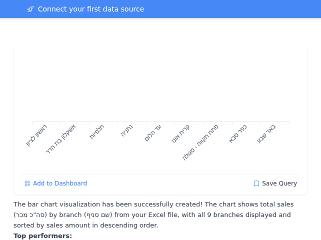
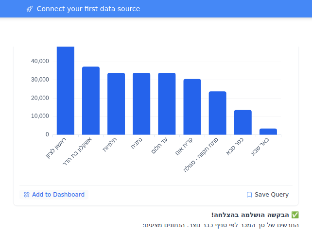

# Feedback Loop — "we keep getting viz errors in infer viz, even for simple cases"

`create_data` runs the query fine — the **Data** tab shows the rows — but the
**Charts** tab renders an axis with no bars (or a completely blank canvas). No
error is shown anywhere: not in the chat, not in the widget, not in the logs.

Field report (Hebrew org, `salesfinalfullwithretlix`, "פילוח מכר לפי סניפים"):
9 rows × 5 columns — `שם סניף | סה"כ מכר | סה"כ כמות | מרווח | אחוז מרווח` —
renders as rotated x-axis branch labels with **zero bars**.

Diagnosis below, then the fix that shipped ("The fix (implemented)") and its
end-to-end verification against a real agent run on Claude 4.5 Haiku.

## TL;DR

Visualization inference is a **single, unretried, free-text LLM call whose
output is validated all-or-nothing, with no check that the column names it
returns actually exist in the result set**, feeding a chart type that is
**forced** regardless of whether inference succeeded.

Any one hiccup in that call — a stray quote, a `value` that is a list, a filter
key spelled `field` instead of `column`, `"type": "bar"` instead of
`"bar_chart"`, a `group_by` that echoes the prompt's placeholder — produces a
`data_model` of `{"type": "<forced chart type>", "series": []}` or one pointing
at non-existent columns. Both render as an empty chart, silently.

The count/metric_card path already has a deterministic guard that demotes an
unrenderable card to a table (`ensure_single_value_card_renderable`,
`create_data.py:428`). **Cartesian, pie, scatter and heatmap charts have no
equivalent.** That asymmetry is the single largest gap.

## The pipeline

| Step | Location |
| --- | --- |
| Planner picks `visualization_type` *before* any data exists | `schemas/create_data.py:48` |
| Type is pinned early and never revisited | `create_data.py:1382`, `create_data.py:1846` |
| Query runs, `formatted` built (raw column names, no sanitization) | `code_execution.py:1146` |
| Viz inference: one LLM call, free-text JSON, `small_model` | `create_data.py:850`, `create_data.py:1076` |
| JSON extraction (fences / trailing prose) | `create_data.py:61` |
| **All-or-nothing** validation into `DataModel` | `create_data.py:1102-1105` |
| Type forced back to the planner's choice; series/group_by carried | `create_data.py:228-242`, `create_data.py:1852` |
| Card-only renderability guard | `create_data.py:428-507` |
| `ViewSchema` built — **no column existence check** | `create_data.py:578-631` |
| Chat preview renders | `RenderVisual.vue:317-390` |
| Dashboard/artifact renders | `EChartsVisual.vue:297-430` |

## Root causes (validated)

### 1. One bad field discards the entire inference result

`create_data.py:1102` validates the whole candidate in one shot; the `except`
at `:1104` throws away *everything* and substitutes `{"type": "table",
"series": []}`. Because the final type is then **forced** back to the planner's
chart type (`finalize_inferred_data_model`, `:228`), the outcome is not a
table — it is `{"type": "bar_chart", "series": []}`, which is a chart that
cannot render.

`DataModel` (`schemas/create_data_model.py:145`) rejects several shapes the
model plausibly emits. Measured (harness below, pydantic 2.13.4):

| LLM emits | Result |
| --- | --- |
| `"value": ["סה\"כ מכר", "מרווח"]` (two measures) | **whole candidate discarded** |
| `"filters": [{"field": ..., "op": ...}]` | **whole candidate discarded** |
| `"filters": {...}` (object, not list) | **whole candidate discarded** |
| `"series": {...}` (object, not list) | **whole candidate discarded** |
| `"type": "bar"` | **whole candidate discarded** |

Two of these are self-inflicted:

- `_build_default_filters` (`create_data.py:155`) *deliberately* accepts
  `field`/`op` aliases — but `DataModel` rejects them first, so that leniency
  is unreachable.
- `normalizeType` in both renderers (`EChartsVisual.vue:65`) *deliberately*
  accepts `bar`/`line`/`pie`/`area` aliases — but `DataModel` rejects them
  first.

Also note `sort` and `limit` are commented out of `DataModel`
(`create_data_model.py:184-185`) while still being passed in at
`create_data.py:1102` and carried at `:197` — they are silently dropped unless
they arrive via `candidate_json.view`.

### 2. Nothing validates that inferred column names exist

`build_view_from_data_model` uses `available_columns` only as a fallback for a
*missing* `x_key` (`create_data.py:597-601`). A `key`, `value` or `group_by`
naming a column that isn't in the result passes through untouched into the
persisted view.

Downstream, both renderers fail **silently** on a missing column:

- `RenderVisual.vue:348-352` — groupBy mode collects groups via
  `getSafeValue(row, groupByKey)`; a missing column yields `''` for every row,
  `.filter(Boolean)` empties the list, `series = []`. Categories still render.
  → **axis labels, no bars.**
- `RenderVisual.vue:386` — traditional mode reads
  `dataModel.series[i].value`; a missing column makes every point `null`.
  → **axis labels, no bars.**

This is the exact screenshot. The likeliest triggers on Hebrew data:

- `group_by` echoing the prompt's own placeholder. The OUTPUT FORMAT block
  literally says `"group_by": "column_name_or_null"` (`create_data.py:1063`),
  and `normalize_group_by` happily returns the literal strings
  `"column_name_or_null"` / `"none"` / `"null"` as if they were columns.
- A transliterated or "cleaned" column name — `total_sales` for `סה"כ מכר`,
  or the same name with the embedded `"` stripped.

### 3. `"` inside a column name breaks the JSON contract

`סה"כ מכר` contains an ASCII double quote (the standard Hebrew gershayim in
"סה\"כ" = total). The model must emit `"value": "סה\"כ מכר"`. If it emits the
quote unescaped, `_extract_json_object` returns `None` for *all three*
strategies — the balanced-brace scanner finds a `{...}` span but `json.loads`
still fails — and the candidate is lost entirely.

The prompt makes this more likely, not less: the column list is interpolated as
a Python `repr` (`create_data.py:881`, `:1069`), so the model sees
`['שם סניף', 'סה"כ מכר']` — single-quoted strings with a bare `"` inside —
and is asked to reproduce them inside a double-quoted JSON string.

This class of name is common well beyond Hebrew: `Size ("in)`, `Q1 "actual"`,
`5" pipe`.

### 4. The chart type is decided before the data exists, and never reconsidered

`visualization_type` is chosen by the planner from a one-line description
(`schemas/create_data.py:48-51`) before the query has run. Inference *does*
pick a type, and it is thrown away (`finalize_inferred_data_model`,
`create_data.py:236-237`). So when inference degrades, the pipeline commits to
a chart it cannot draw instead of falling back to the table it just produced.

### 5. The guard exists — for cards only

`ensure_single_value_card_renderable` (`create_data.py:428`) is a well-built
deterministic net: resolve the value column, drop hallucinated ones, require a
row selector, otherwise **demote to table**. It is gated on
`_SINGLE_VALUE_CARD_TYPES` (`:247`) and never runs for `bar_chart`,
`line_chart`, `area_chart`, `pie_chart`, `scatter_plot` or `heatmap`.

### 6. Silent failure end to end (unfixed Layer 1 from `kpi-card-blank.md`)

`chartOptions = { ...baseOptions, ...specificOptions }` and `getBaseOptions()`
always returns keys, so the template guard
(`RenderVisual.vue:2`, `EChartsVisual.vue:3`) always passes once rows exist.
The `"Chart configuration error or unsupported type."` branch is unreachable.
An empty ECharts canvas mounts and paints nothing.

The `visualization_error` progress event (`create_data.py:1838`) only fires
when the inference block *raises*. Every failure above is a swallowed
`except` — so the UI shows a green check, and the planner's observation says
`chart: bar_chart` (`create_data.py:1885`) as if it worked.

### 7. Chat preview and dashboard renderers disagree

`EChartsVisual.vue` has two recovery paths that `RenderVisual.vue` lacks:

- it merges `view.view.x` / `view.view.y` back into `dm.series`
  (`EChartsVisual.vue:830-848`), so a view with valid x/y survives an empty
  `data_model.series`;
- `inferDefaultSeries` (`:787`, called at `:924`) picks the first string column
  as key and the first numeric column as value when series is empty — which
  would have rendered this exact dataset correctly.

`RenderVisual.vue` — the in-chat preview (`ToolWidgetPreview.vue:152`) — has
neither. Same step can look broken in chat and fine on a dashboard.

### 8. Contributing factors

- **No retry.** One call; on exception `raw = None` (`create_data.py:1083`) and
  the fallback is the same broken empty-series model.
- **Free-text JSON, not structured output.** `inference_stream_v2` supports
  `tools` with an `input_schema` (`llm.py:550`) and the planner uses it
  (`planner_v3.py:201`). Viz inference asks a ~190-line prompt for "only valid
  JSON" and hopes.
- **Weakest model.** `viz_model = small_model or model` (`create_data.py:850`)
  — the hardest instruction-following step in the tool runs on the cheapest
  model, on RTL/non-ASCII column names.
- **No diagnostics.** The only log line is
  `create_data.viz_infer elapsed_ms=… got_raw=…` (`:1086`). The raw output is
  never logged, the validation error is never logged, the demotion is never
  logged. There is no way to tell case 2 from case 5 from a production trace.
- **Prompt bias.** ~60% of the prompt is metric_card rules; the cartesian
  contract is a handful of lines, and its only worked "WRONG" example is a
  *missing key* — not the failures that actually happen.

## Reproduction (deterministic, no network, no credentials)

Copy the harness below; it loads the real `DataModel`, the real
`_extract_json_object` / `finalize_inferred_data_model` /
`build_view_from_data_model`, and applies `RenderVisual.vue`'s resolution rules
to say what the chart would draw.

```bash
uv venv .venv && uv pip install --python .venv/bin/python pydantic
.venv/bin/python infer_viz_probe.py
```

<details>
<summary><code>infer_viz_probe.py</code></summary>

```python
import importlib.util, json, re, sys, typing

def load(name, path):
    spec = importlib.util.spec_from_file_location(name, path)
    m = importlib.util.module_from_spec(spec); sys.modules[name] = m
    spec.loader.exec_module(m); return m

B = "backend/app/"
vs  = load("view_schema", B + "schemas/view_schema.py")
cdm = load("cdm", B + "ai/tools/schemas/create_data_model.py")

src = open(B + "ai/tools/implementations/create_data.py").read()
ns = {"json": json, "re": re, "logger": __import__("logging").getLogger("probe")}
ns.update({k: getattr(typing, k) for k in ("Optional", "Dict", "Any", "List", "Union")})
ns.update({n: getattr(vs, n) for n in dir(vs) if not n.startswith("_")})
ns["normalize_group_by"] = cdm.normalize_group_by
ns["_VALID_AGGREGATIONS"] = {"sum", "avg", "count", "min", "max"}
ns["_INFERRED_DM_CARRY_KEYS"] = ("series", "group_by", "sort", "limit", "filters", "display")
ns["_ALLOWED_DISPLAY_FORMATS"] = {"number", "currency", "percent", "compact"}
ns["_CURRENCY_CODE_RE"] = re.compile(r"^[A-Za-z]{3}$")
for fn in ("_extract_json_object", "_build_series_styles", "_build_default_filters",
           "_first_series_aggregation", "sanitize_display_options",
           "finalize_inferred_data_model", "build_view_from_data_model"):
    start = src.index(f"def {fn}(")
    nxt = re.search(r"^(def |class |[A-Za-z_]+ *=|@)", src[start + 5:], re.M)
    exec(src[start: start + 5 + nxt.start()], ns)

CARRY = {"type", "series", "group_by", "sort", "limit", "filters"}
COLS = ['שם סניף', 'סה"כ מכר', 'סה"כ כמות', 'מרווח', 'אחוז מרווח']

def pipeline(label, raw, requested="bar_chart"):
    cj = ns["_extract_json_object"](raw)
    inferred = None
    if isinstance(cj, dict):
        try:
            inferred = cdm.DataModel(**{k: v for k, v in cj.items() if k in CARRY}).model_dump()
        except Exception:
            inferred = {"type": "table", "series": []}        # create_data.py:1105
    final = ns["finalize_inferred_data_model"](requested, inferred)
    v = ns["build_view_from_data_model"](final, title="t", available_columns=COLS)
    view = (v.model_dump(exclude_none=True) if v else {"view": {"type": final["type"]}}).get("view", {})
    series = final.get("series") or []
    cat = view.get("x") or (series[0].get("key") if series else None)
    gb = view.get("groupBy") or final.get("group_by")
    vals = [s.get("value") for s in series if s.get("value")]
    if not cat:                       out = "BLANK canvas (no axes, no bars)"
    elif gb and gb not in COLS:       out = f"AXIS ONLY, NO BARS (group_by {gb!r} is not a column)"
    elif not vals:                    out = "AXIS ONLY, NO BARS (no series value)"
    elif any(v not in COLS for v in vals): out = "AXIS ONLY, NO BARS (value is not a column)"
    else:                             out = "chart OK"
    print(f"{label}\n    final_dm={json.dumps(final, ensure_ascii=False)}\n    RENDER -> {out}\n")

Q = '\\"'
pipeline("1. happy path",
    '{"type":"bar_chart","series":[{"name":"מכר","key":"שם סניף","value":"סה' + Q + 'כ מכר"}]}')
pipeline("2. unescaped quote inside the Hebrew column name",
    '{"type":"bar_chart","series":[{"name":"מכר","key":"שם סניף","value":"סה"כ מכר"}]}')
pipeline("3. group_by echoes the prompt placeholder",
    '{"type":"bar_chart","series":[{"name":"מכר","key":"שם סניף","value":"סה' + Q + 'כ מכר"}],"group_by":"column_name_or_null"}')
pipeline("4. group_by \"none\"",
    '{"type":"bar_chart","series":[{"name":"מכר","key":"שם סניף","value":"סה' + Q + 'כ מכר"}],"group_by":"none"}')
pipeline("5. two measures: value as a list",
    '{"type":"bar_chart","series":[{"name":"S","key":"שם סניף","value":["סה' + Q + 'כ מכר","מרווח"]}]}')
pipeline("6. filter with field/op aliases",
    '{"type":"bar_chart","series":[{"name":"S","key":"שם סניף","value":"מרווח"}],"filters":[{"field":"שם סניף","op":"equals","value":"נתניה"}]}')
pipeline("7. type alias \"bar\"",
    '{"type":"bar","series":[{"name":"S","key":"שם סניף","value":"מרווח"}]}')
pipeline("8. transliterated column names",
    '{"type":"bar_chart","series":[{"name":"Total Sales","key":"branch_name","value":"total_sales"}]}')
```

</details>

### Observed output

```
1. happy path                                   RENDER -> chart OK
2. unescaped quote in Hebrew column name        RENDER -> BLANK canvas (no axes, no bars)
3. group_by echoes the prompt placeholder       RENDER -> AXIS ONLY, NO BARS (group_by 'column_name_or_null')
4. group_by "none"                              RENDER -> AXIS ONLY, NO BARS (group_by 'none')
5. two measures: value as a list                RENDER -> BLANK canvas (no axes, no bars)
6. filter with field/op aliases                 RENDER -> BLANK canvas (no axes, no bars)
7. type alias "bar"                             RENDER -> BLANK canvas (no axes, no bars)
8. transliterated column names                  RENDER -> AXIS ONLY, NO BARS (value is not a column)
```

Cases 3, 4 and 8 reproduce the screenshot exactly: real x-axis labels, no bars.
Cases 2, 5, 6 and 7 are the fully blank variant. In all seven the tool reports
`success: true` and the observation claims `chart: bar_chart`.

## The fix (implemented) — deterministic base, inference as refinement

`app/ai/tools/chart_spec.py`. The inversion, in two functions:

1. `build_chart_spec(formatted, requested_type)` derives a **complete, valid**
   chart from the result set alone — pure, no LLM, no I/O. It can only name
   columns the query actually returned, so it cannot produce an empty chart.
2. `apply_inference_overrides(spec, inferred, formatted)` layers the model's
   answer on **one field at a time**, resolving every column reference against
   the real columns. What doesn't resolve is dropped; the deterministic value
   stands. `ensure_renderable` demotes to `table` if the result still can't be
   drawn, and the whole thing is logged (`create_data.viz_spec`) with span
   attributes for `spec_source` / `overrides_applied` / `overrides_dropped`.

The all-or-nothing `DataModel(**candidate)` gate at the old `:1102` is gone —
every field is now validated individually against real columns, so one bad
field costs that field instead of the entire reply.

The column-classification rules that existed three times over
(`_pick_value_column`, `inferDefaultSeries`, `isProbablyNumeric`) now have one
implementation, in `chart_spec.profile_columns`.

### Verified end to end — real agent, real Haiku

Sandbox per `.claude/skills/sandbox-feedback-loop`: fresh DB, Claude 4.5 Haiku
as both default and small-default (so viz inference genuinely runs on it), the
9-row Hebrew branch sheet uploaded through the chat UI, prompt
`צור תרשים עמודות של סך המכר לפי סניף מתוך הקובץ המצורף`. Same prompt, same
model, same data; only `create_data.py` differs.

| | before | after |
| --- | --- | --- |
|  |  |

**The bug reproduced on the first attempt**, and the mechanism was narrower
than expected. Haiku returned the measure column as `סה״כ מכר` — with
**U+05F4 HEBREW PUNCTUATION GERSHAYIM (``״``)** where the real column has an
ASCII `"`. Not a hallucination: a one-character typographic normalization of a
name it was shown. Persisted `view.y` from each run:

```
BEFORE:  view.y='סה״כ מכר'   codepoints=[0x5e1, 0x5d4, 0x5f4, 0x5db]   -> no such column, no bars
AFTER:   view.y='סה"כ מכר'   codepoints=[0x5e1, 0x5d4, 0x22,  0x5db]   -> renders
```

In the "after" run the override was not merely discarded — `resolve_column`
matched the gershayim variant back onto the real column and *applied* it:

```
create_data.viz_spec type=bar_chart source=llm_refined
  applied=['key=שם סניף', 'value=[\'סה"כ מכר\']']
```

Note the "before" chat message: *"The bar chart visualization has been
successfully created!"* — the silent-success problem, verbatim, next to an
empty canvas.

### Tests

`tests/unit/test_chart_spec.py` (49 cases) is table-driven rather than
one-file-per-incident: every realistic LLM output from the probe below is a row,
and all rows assert the same invariant — *the emitted spec references only real
columns, and either renders or is a table*. A new failure adds a row.
`test_create_data_card_guard.py` and `test_repro_group_by_dropped.py` still
pass unchanged (196 tests green across the affected modules).

## Remaining direction (not implemented, roughly by value/effort)

1. **Structured output.** Pass the data model as a `ToolSpec` `input_schema`
   with column names as an `enum` — the plumbing exists (`llm.py:550`) and it
   removes cases 2, 5, 6, 7 at the source.
2. **Fix the silent render.** Have the builders return a sentinel instead of
   `{}` so the existing `"Chart configuration error"` branch becomes reachable
   (also fixes `kpi-card-blank.md` Layer 1), and give `RenderVisual.vue` the
   view→series merge and `inferDefaultSeries` fallback that
   `EChartsVisual.vue` has.
3. **Prompt hygiene.** Emit the column list as `json.dumps(..., ensure_ascii=False)`
   rather than a Python `repr`, add an explicit "escape `\"` inside names"
   note, replace `"column_name_or_null"` with `null` in the OUTPUT FORMAT, and
   rebalance the cartesian vs metric_card sections.
4. **Don't run this on `small_model` unconditionally** — or retry once on the
   main model when the candidate fails to validate.
5. **Delete the now-dead repair code.** `derive_kpi_row_filter`,
   `ensure_single_value_card_renderable`, `finalize_inferred_data_model` and the
   `x_key` fallback in `build_view_from_data_model` are now belt-and-braces on
   top of a spec that is already guaranteed renderable. They stayed in this
   change so the diff is additive and the existing regression tests keep their
   coverage; removing them is the follow-up that should make `create_data.py`
   materially smaller.
6. **Frontend parity.** With the server guaranteeing a valid spec, the
   renderers should stop guessing: delete `inferDefaultSeries` and the
   view→series merge from `EChartsVisual.vue` so the two renderers cannot
   disagree.

## Related

- `docs/feedback-loops/kpi-card-blank.md` — Layer 1 (silent blank render) is
  still present; verified against `RenderVisual.vue:2` at time of writing.
- `backend/tests/unit/test_repro_group_by_dropped.py` — same choke point
  (`create_data.py:1102`), previous instance: `group_by` as a string against
  `Optional[List[str]]`.
- `backend/tests/e2e/test_repro_viz_breakdown.py` — outer-loop agent repro.
- `backend/tests/unit/test_create_data_card_guard.py` — the card-side guard
  this doc proposes mirroring for cartesian charts.
