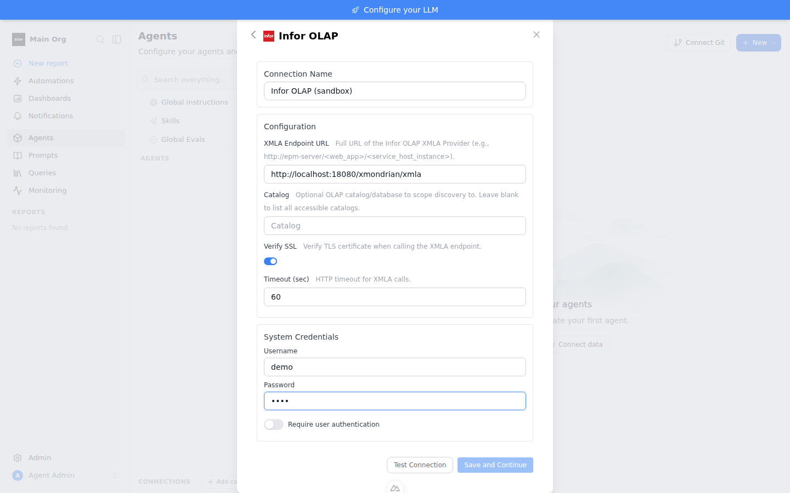
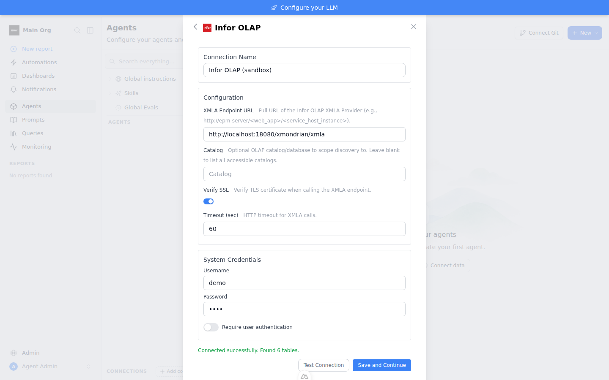
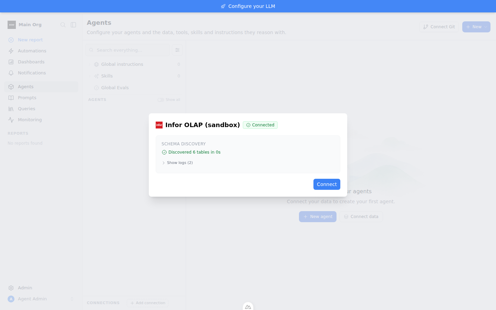

# Sandbox Feedback Loop — Infor OLAP connector, end-to-end against a real XMLA server

Validates the claim behind a customer escalation ("Reached the XMLA endpoint
but discovery failed: …") that the `infor_olap` connector itself is sound:
the full product path — connection form → Test Connection → save → schema
indexing — works against a real XML for Analysis server. Infor d/EPM cannot
run in a sandbox (licensed, Windows-farm-only), so the loop uses Mondrian
(xmondrian), which speaks the same XMLA SOAP contract the connector targets
(`backend/app/data_sources/clients/xmla_base.py:12`).

## Root cause notes (from the customer investigation, validated in code)

- The connector is a plain HTTP POST with Basic auth to the **exact** configured
  URL — no path discovery, no redirects handling
  (`xmla_base.py:374-401`). Whatever URL works in `curl` works in the form,
  verbatim; nothing else is inferred.
- `connect()` does no network I/O (`xmla_base.py:84-96`), so a DNS failure on
  the *first* Discover call is reported as
  `"Reached the XMLA endpoint but discovery failed"` with `connectivity: True`
  (`xmla_base.py:104-111`) — misleading when the endpoint was never reached
  (e.g. `NameResolutionError`). Candidate follow-up, intentionally **not**
  changed in this loop.
- Infor EPM on-prem endpoint paths are farm-specific (self-hosted HTTP.sys
  services); Infor does not document them publicly. Customer-side discovery:
  `netsh http show servicestate view=requestq` on the OLAP app server, or the
  service's target URL in ION API admin.

## Loop A — full-stack reproduction (no external services, no credentials)

Fresh sandbox, from the repo root.

```bash
# 1. Real XMLA server: Mondrian + FoodMart sample, one WAR, zero config
curl -sSL -o /tmp/xmondrian.war \
  https://raw.githubusercontent.com/rpbouman/xmondrian/master/dist/xmondrian.war
docker run -d --name xmondrian -p 18080:8080 \
  -v /tmp/xmondrian.war:/usr/local/tomcat/webapps/xmondrian.war tomcat:9-jre11
# alive when GET returns 405 (endpoint is POST-only):
curl -s -o /dev/null -w '%{http_code}\n' http://localhost:18080/xmondrian/xmla

# 2. Full stack (backend :8000 + frontend :3000)
tools/agent/boot_stack.sh --dev

# 3. infor_olap requires an enterprise license — mint the sandbox one and
#    restart the backend with it (backs up app/ee/license_public_key.pem):
cd backend
LIC=$(uv run python scripts/gen_sandbox_license.py 5)
kill -- -"$(cat /tmp/bow-agent/backend.pid)"
TESTING=true ENVIRONMENT=production TEST_DATABASE_URL="sqlite:///db/agent.db" \
  BOW_LICENSE_KEY="$LIC" setsid uv run python main.py > /tmp/bow-agent/backend.log 2>&1 &
echo $! > /tmp/bow-agent/backend.pid

# 4. Seed org + admin (admin@example.com / Password123!)
uv run python ../tools/agent/seed_org.py
cd ..

# 5. Drive the real UI end to end
PLAYWRIGHT_BROWSERS_PATH=/opt/pw-browsers node tools/agent/e2e_infor_olap_sandbox.mjs

# 6. Restore the tracked license public key when done
mv backend/app/ee/license_public_key.pem.orig backend/app/ee/license_public_key.pem
```

Observed output (2026-07-11, fresh run):

```
>> test connection
TEST CONNECTION => Connected successfully. Found 6 tables.
>> save and continue
>> wait for schema indexing to complete
>> verify schema via API
CONNECTION => Infor OLAP (sandbox) infor_olap 68fab450-…
INDEXING => completed tables: 6
E2E RESULT: PASS
```

The script logs in, opens **Agents → Connect data**, picks **Infor OLAP**,
fills the form (`http://localhost:18080/xmondrian/xmla`, any non-empty
credentials — the demo server ignores them, the client requires them), clicks
**Test Connection**, saves, waits for schema indexing, and asserts the
indexing API reports `completed` with `table_count > 0`. Screenshots land in
`/tmp/bow-agent/e2e-media/` (override with `MEDIA_DIR`).

Evidence from the recorded run:

| Form filled | Test Connection | Schema indexed |
|---|---|---|
|  |  |  |

The 6 tables are the FoodMart cubes (`FoodMart/HR`, `FoodMart/Sales`, …), each
stored with dimension/measure columns in `connection_tables`.

A thinner client-only leg (no UI) of the same loop:

```python
from app.data_sources.clients.infor_olap_client import InforOlapClient
c = InforOlapClient(host="http://localhost:18080/xmondrian/xmla",
                    username="demo", password="demo")
c.test_connection()   # {'success': True, 'message': 'Connected to Infor OLAP. Found 1 catalog(s).' ...}
c.execute_query("SELECT { [Measures].[Unit Sales] } ON COLUMNS, "
                "NON EMPTY { [Product].[Product Family].Members } ON ROWS FROM [Sales]",
                table_name="FoodMart/Sales")   # 3-row DataFrame
```

## What this proves / regression notes

- The `infor_olap` connector works end to end — UI form, registry fields,
  `test_connection`, save, schema indexing, and MDX `Execute`
  (`Format=Tabular`) — against a real XMLA provider. Discovery
  (`DBSCHEMA_CATALOGS`, `MDSCHEMA_CUBES/MEASURES/HIERARCHIES`) and rowset
  parsing are exercised for real, not mocked.
- Failures reported against on-prem Infor farms are therefore isolatable to
  the customer-side endpoint (DNS, firewall, and above all the farm-specific
  XMLA URL path), not the connector's request shape.
- Useful triage signature confirmed while probing: a live XMLA endpoint
  answers GET with **405**; Windows HTTP.sys answers unregistered paths with a
  generic **404** (`Server: Microsoft-HTTPAPI/2.0`) — 404s mean wrong path,
  never a broken client.
- Known cosmetic issue left open: the `"Reached the XMLA endpoint"` wording in
  `xmla_base.py:110` fires even on pure DNS failures.
