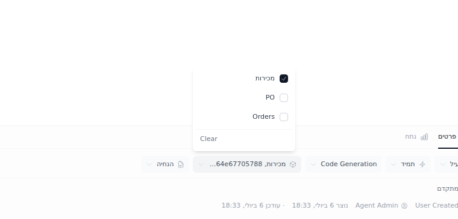

# Sandbox Feedback Loop — Instruction editor shows the agent's ID instead of its name

Reproduces the report: *"in instructions editor … it shows data source (agent)
ID and not the agent name"*. In the instruction detail's editable meta row, the
agents chip renders a raw UUID (e.g. `מכירות, a1b9dbd0-1696-4cfa-8086-…`), and
the agent behind that UUID does not appear in the dropdown at all.



---

## Root cause (validated)

Two facts combine:

1. **`KSelect` falls back to the raw value when an id has no matching option.**
   `frontend/components/KSelect.vue:69` (multi) and `:71` (single):

   ```ts
   return a.map((v: string) => props.options.find(o => o.value === v)?.label || v).join(', ')
   ```

   Any selected id that is missing from `options` renders as itself — a UUID.

2. **The options list is narrower than the instruction's scoping.** The agents
   KSelect (`frontend/components/KnowledgeExplorer.vue:676`) gets its options
   from `agentOpts` (`KnowledgeExplorer.vue:1043`), populated from
   `GET /data_sources/active` (`KnowledgeExplorer.vue:2131`). That endpoint
   (`backend/app/services/data_source_service.py:1250`) filters to
   `is_active == True` AND (public OR caller is a member). But the
   instruction's own `data_source_ids` (`KnowledgeExplorer.vue:2281`, from the
   `instruction_data_source_association` — `backend/app/models/instruction.py:97`)
   are **not** filtered that way.

So any instruction linked to a data source that is deactivated — which happens
*automatically* when a system-credentials connection test fails
(`backend/app/services/data_source_service.py:1745` sets `is_active = False`) —
or that the viewer can't see (non-public, non-member), renders that agent as a
raw UUID. The read-only rendering of the same row does **not** have the bug: it
uses the names embedded in the instruction payload
(`detail.data_sources[].name`, `KnowledgeExplorer.vue:679`).

Validated hypothesis for the original report: one of the instruction's agents
(a Qlik source) was auto-deactivated by a failed connectivity check, so it
dropped out of `/data_sources/active` while remaining linked to the
instruction.

---

## Loop A — deterministic reproduction (no external services)

```bash
tools/agent/boot_stack.sh                       # backend :8000 + frontend :3000 (prod build)
cd backend && uv run python ../tools/agent/seed_org.py
uv run python ../../frontend/.repro/seed_repro.py   # see note below
cd ../frontend
export PLAYWRIGHT_BROWSERS_PATH=/opt/pw-browsers
node .repro/repro.mjs <instructionA-id> <instructionB-id> .repro/shots
```

`frontend/.repro/seed_repro.py` (run with the backend venv) creates agents
`מכירות` / `PO` / `Orders` / `Legacy DWH`, scopes an instruction to
`[Legacy DWH, מכירות]`, then flips `Legacy DWH.is_active = 0` — the exact state
a failed connection test produces. `frontend/.repro/repro.mjs` logs in with the
UI locale set to Hebrew (`localStorage['bow.locale'] = 'he'`) and deep-links to
the instruction.

Observed FAIL (current code):

```
issue1: UUID chip visible = true
issue1: chip text = "מכירות, a1b9dbd0-1696-4cfa-8086-b64e67705788"
issue1: dropdown panel = מכירות | PO | Orders | Clear
```

Note the second-order bug: because the hidden agent isn't in the dropdown,
there is **no way to unselect just that agent** — only "Clear" removes it.

## Proposed fix (not yet applied)

Merge the instruction's own `detail.data_sources` (which carry names) into the
KSelect options as fallback entries, e.g. in `KnowledgeExplorer.vue`:

```ts
const agentOptsForDraft = computed(() => {
  const opts = [...agentOpts.value]
  for (const ds of (detail.value?.data_sources || [])) {
    if (!opts.some(o => o.value === ds.id)) opts.push({ value: ds.id, label: ds.name, type: ds.type })
  }
  return opts
})
```

This renders the real name, keeps the hidden agent visible (and individually
removable) in the dropdown, and requires no backend change. Optionally style
such entries as unavailable. A defensive second layer: have `KSelect` render a
neutral "unknown" label instead of a raw id.

## What this proves / regression notes

The loop proves the UUID rendering comes from the options/scoping mismatch, not
from bad data: the name exists in the same payload the read-only view uses.
Pre-existing sandbox quirk (unrelated): the Vite **dev** server duplicates
ProseMirror modules and crashes the detail editor
(`RangeError: Adding different instances of a keyed plugin`) — run the frontend
as a production build (default `boot_stack.sh`) for this loop.
