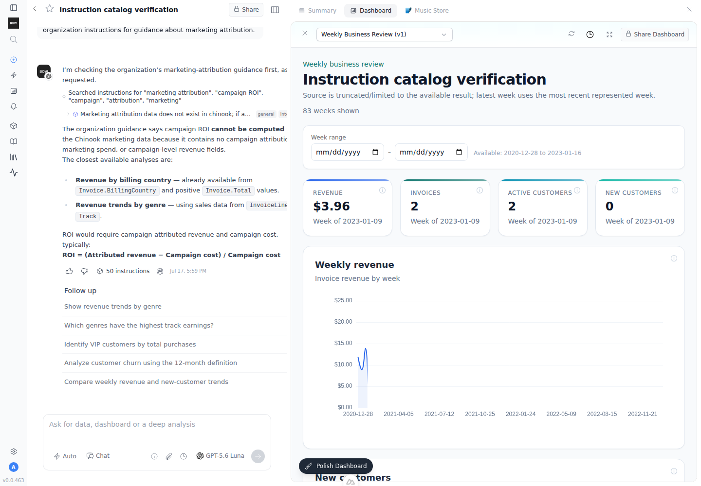
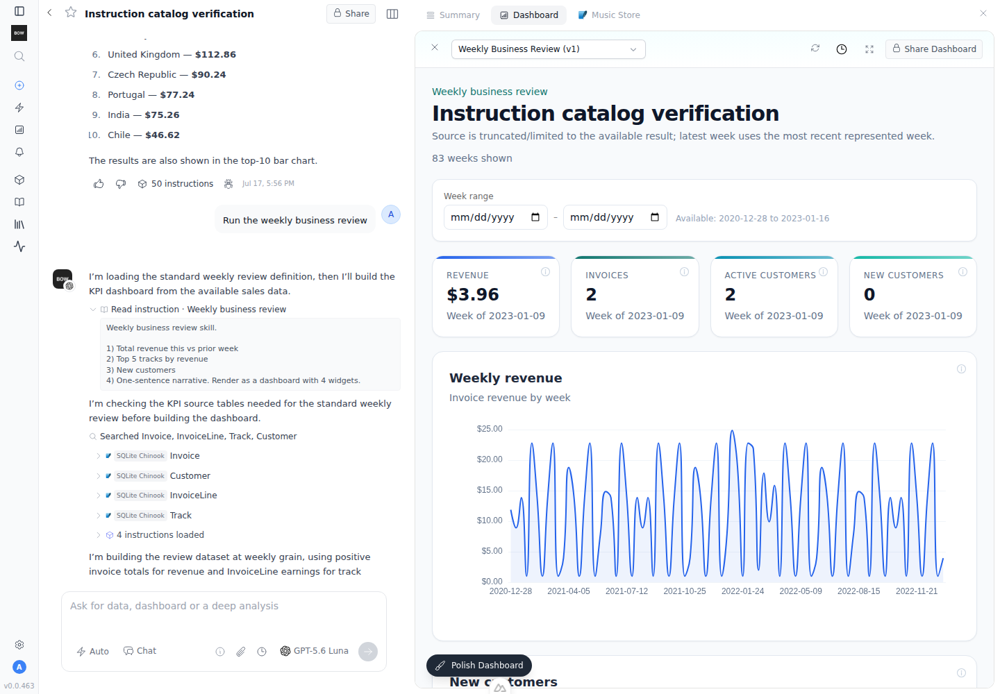
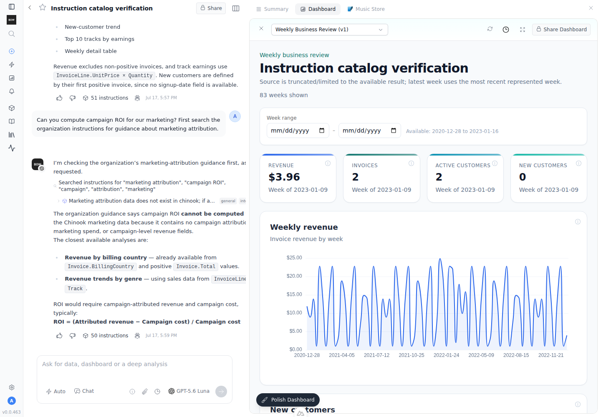

# Feedback Loop — "intelligent instructions only load on exact keyword match"

Instructions with `load_mode='intelligent'` were matched against the user's
prompt with a Jaccard/one-way-substring scorer, and anything scoring zero was
**silently dropped** — even with 40+ free slots under the
`max_instructions_in_context` cap. Unless the user typed (nearly) the exact
words of the instruction, it never loaded. Ironically, an *empty* prompt loaded
every intelligent instruction, so asking a specific question produced *fewer*
instructions than saying nothing.

This loop proves the failure, then proves the fix: coverage-based scoring with
fill, an `<available_instructions>` catalog for the overflow, and two chat
tools (`read_instruction`, `search_instructions`) that let the planner pull any
advertised instruction on demand — the planner LLM itself becomes the semantic
matcher.

---

## Root cause (validated)

- `InstructionContextBuilder._score_text()` used Jaccard similarity
  (intersection / union of both vocabularies), so long instructions could
  never rank: 300 body words in the union divide any match toward zero.
- `search_instructions()` / `_load_from_build()` kept only `score > 0`
  candidates. One missing keyword ⇒ invisible, regardless of remaining
  capacity (`instruction_context_builder.py`, old lines 468/773).
- The query was only the newest message (`agent_v2.py` `prime_static(query=prompt_text)`),
  so follow-ups ("now break it down by month") lost every match from the
  opening message.
- Labels and referenced table names were not searchable: an instruction scoped
  to the `Invoice` table got zero credit for a prompt about invoices.
- Substring matching was one-directional (query keyword inside text), so
  "churned" (query) never matched "churn" (text).
- Nothing advertised the unloaded instructions: over-cap or zero-score
  intelligent instructions were unreachable — the old `read_skill` tool was
  hard-filtered to `kind='skill'`.

## What changed (the feature)

Backend — `app/ai/context/builders/instruction_context_builder.py`:
- Coverage scoring (`matched query keywords / total query keywords`) with a
  light stemmer (`revenues→revenue`, `churned→churn`, `matches→match`),
  symmetric containment, and a 0.5× boost for title/label/table-name matches.
- **Fill, don't drop:** all intelligent candidates are ranked
  (score desc, then org-wide `InstructionStats.usage_count`); the top fills
  remaining capacity (`load_reason='fill'` when score is 0), the overflow (up
  to `CATALOG_LIMIT=50`) becomes `section.available_instructions`.
- Untitled catalog entries advertise the first 140 chars of the body
  (whitespace-collapsed); titled ones advertise title + one-line description.
- Referenced table names (from `InstructionReference.display_text` /
  `InstructionVersion.references_json`) are searchable and rendered as a
  `tables="Invoice, Customer"` attribute on `<instruction>` and
  `<instruction_ref>` tags.

Rendering — `app/ai/context/sections/instructions_section.py`:
- `render(include_catalog=True)` adds `<available_instructions>` (planner
  only — `agent_v2.py` passes the flag; coder/answer keep the default render
  so tool-less agents never see references they can't open).

Query enrichment — `app/ai/context/context_hub.py`:
- `prime_static` combines the current prompt with the last 3 user prompts of
  the report before matching (cache key includes the combined query).

Tools:
- `read_instruction` (renamed from `read_skill`, `app/ai/tools/implementations/read_instruction.py`):
  resolves ANY published instruction by short-id prefix; **hard-scoped** — the
  id is verified against the report's data sources + per-user table
  accessibility, and without a report context the tool refuses instead of the
  old org-wide fallback. Records an `on_demand` usage event via
  `InstructionUsageService` so pulled instructions climb the ranking.
- `search_instructions` gains chat mode (`allowed_modes=["training","knowledge","chat"]`):
  in chat the report scope is FORCED (agent-supplied `data_source_ids`
  ignored), drafts are excluded, per-user table accessibility applies, and
  results are 140-char snippets (progressive disclosure — full text via
  `read_instruction`).

Frontend:
- `components/tools/ReadInstructionTool.vue` — minimal, collapsed-by-default
  row ("Read instruction · <title>"); click expands the instruction text.
  Registered in `reports/[id]/index.vue`, `c/[token]/index.vue`,
  `console/TraceModal.vue`; `tools.readInstruction` i18n keys in all locales.
- `search_instructions` reuses the existing `SearchInstructionsTool.vue`
  (per-item collapsed), now also registered in the shared-view and trace modal.

## Loop A — deterministic (no LLM)

```bash
cd backend
uv sync --extra dev
export BOW_DATABASE_URL="sqlite:///db/app.db"
uv run --extra dev pytest \
  tests/unit/test_instruction_scoring.py \
  tests/e2e/test_instruction_catalog.py \
  tests/e2e/test_skills_catalog.py \
  tests/e2e/test_read_instruction_tool.py \
  tests/e2e/test_search_instructions_chat_mode.py -q
```

Observed: **30 passed** (3 consecutive runs). Highlights:
- `test_zero_score_intelligent_fills_capacity` — a prompt with zero token
  overlap no longer hides intelligent instructions (`load_reason='fill'`).
- `test_overflow_intelligent_lands_in_catalog` — with capacity 3, every
  instruction is either loaded or advertised; `<available_instructions>`
  renders only with `include_catalog=True`.
- `test_no_report_context_is_refused` / `test_chat_mode_forces_report_scope` —
  the scope guard on both tools.
- `test_long_document_not_penalized` — the Jaccard failure mode, now covered.

Registry gating (chat gets exactly the two research tools):

```
chat       -> ['read_instruction', 'search_instructions']
training   -> ['create_instruction', 'edit_instruction', 'search_instructions']
knowledge  -> ['create_instruction', 'edit_instruction', 'search_instructions']
```

## Loop B — live agent (OpenAI gpt-5.6-luna, chinook demo)

```bash
tools/agent/boot_stack.sh --dev
cd backend && uv run python ../tools/agent/seed_org.py --demo
OPENAI_API_KEY=$OPENAI_API_KEY uv run python ../tools/agent/setup_openai_llm.py
# seed 75 instructions (3 always + 70 intelligent + 2 skills, some table-scoped,
# some untitled) then drive prompts via POST /api/reports/{id}/completions
```

Observed with 75 seeded instructions and the prompt *"What is our total
invoice revenue by billing country? Show the top 10."*:

```
_load_from_build: loaded 6 always + 44 intelligent + 0 dependencies + 26 catalog (max=50)
top matches: [('Revenue definition', 'search_match:0.67', ['Invoice']),
              (None,                'search_match:0.55', ['Invoice']),   # untitled, matched via table ref
              ('Churn definition',  'search_match:0.25', ['Customer','Invoice']), ...]
```

- "Top-N convention" matched from "top 10" in the prompt; the untitled
  Italian-language billing-country rule matched via its `Invoice` table
  reference — both were invisible under the old scorer.
- *"Run the weekly business review"* → the planner called
  `read_instruction` on the advertised skill, then built the 4-widget
  dashboard. SQLite:
  `instruction_usage_events.load_reason='on_demand'` recorded and aggregated
  into `instruction_stats.usage_count`.
- *"…search the organization instructions for guidance about marketing
  attribution"* → `search_instructions` (chat mode) found the untitled
  attribution rule and the agent correctly declined to fabricate campaign ROI.

UI evidence (`assets/instruction-catalog/`):





## Follow-ups (not in this change)

- Embedding-based re-ranking (Phase 2): store per-version vectors in a JSON
  column, blend `max(lexical, cosine)` — the catalog split makes this a pure
  ranking upgrade, never a gate.
- `POST /api/llm/models` is broken (`LLMService.create_model` doesn't exist)
  and creating a provider with an inline `models` list dies with
  MissingGreenlet; recreating a provider under a soft-deleted name 500s on the
  unique constraint. Worked around in the sandbox; worth separate fixes.
