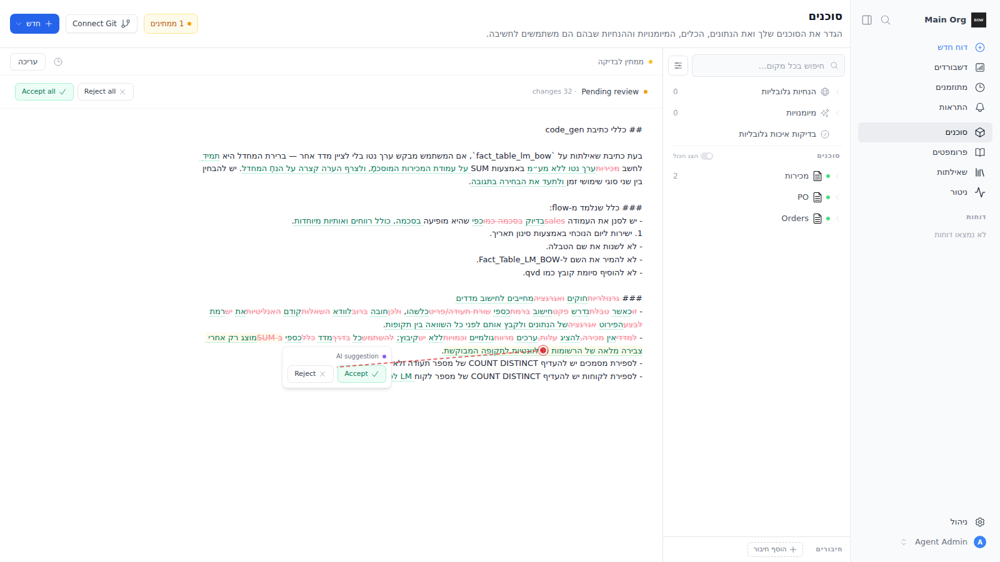
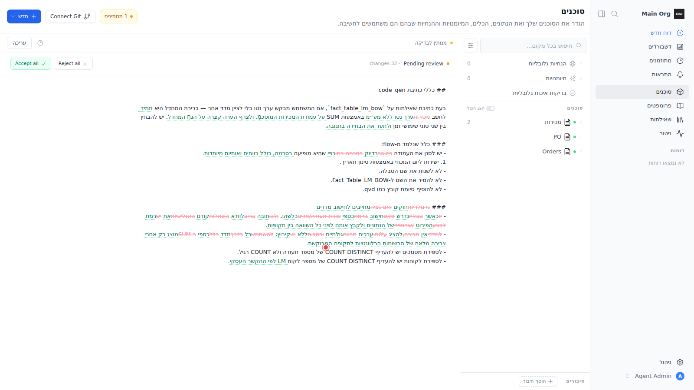

# Sandbox Feedback Loop — Suggestion Accept/Reject popover renders far from the change and disappears en route (RTL)

Reproduces the report: *"the agent suggested changes to instruction show well
but the popover is far from the change, and hovering the change then going to
the suggestion makes the popover disappear — it is too far"* (Hebrew / RTL
review of a pending AI suggestion).

| Popover far from the hovered change | Vanishes while moving toward it |
|---|---|
|  |  |

Measured on current code: hovering the last line of a wrapped hunk placed the
popover **331 px** from the cursor, and walking the mouse toward it made it
vanish at step **5 of 14** — it can never be reached.

---

## Root cause (validated)

`frontend/components/instructions/InstructionTrackedChanges.vue:31-47`. Each
hunk is an **inline** `<span class="group/h relative inline …">`; the
Accept/Reject card is its absolutely-positioned child anchored
`top-0 left-0 pt-[1.7em]` (line 36), shown purely via CSS
`group-hover/h:visible`.

1. **Anchor position (why it's far).** When an inline element wraps across
   lines it fragments, and the containing block for an abs-pos child is derived
   from those fragments (CSS 2.1 §10.1): in LTR `left:0` is the **first**
   fragment's left edge; with `dir="rtl"` (set on `<html>` for Hebrew by
   `frontend/plugins/i18n.ts:34`) `left:0` resolves to the **last** fragment's
   left edge while `top:0` stays on the **first** fragment. For multi-line
   hunks the card therefore lands at a diagonal offset from wherever the user
   is actually hovering — reproduced at 331 px. Aggravators: `left-0` is
   physical (not logical `start-0`), and the diff container sets no
   `dir`/`unicode-bidi: plaintext` (unlike the read view,
   `KnowledgeExplorer.vue:598`), so mixed Hebrew/English content misplaces the
   anchor in LTR locales too.

2. **Disappearing on approach.** Visibility is pure `group-hover` on the hunk
   span. The only hover bridge is the card wrapper's own `pt-[1.7em]`, which
   assumes the card sits directly under the hovered line. An inline element's
   hover area is only its text fragments, so once the anchor is displaced the
   mouse must cross ground belonging to neither element — `:hover` drops, the
   wrapper flips to `visibility: hidden` (which also stops pointer events), and
   the card cannot be reached.

The component is shared by five surfaces (`KnowledgeExplorer`,
`KnowledgeGroup`, `ReportAgentPanel`, `PendingInstructionItem`,
`EditInstructionTool`) — one fix covers all.

---

## Loop A — deterministic reproduction (no external services)

Same harness as `instruction-agent-chip-uuid.md`:

```bash
tools/agent/boot_stack.sh
cd backend && uv run python ../tools/agent/seed_org.py
uv run python ../../frontend/.repro/seed_repro.py
cd ../frontend
export PLAYWRIGHT_BROWSERS_PATH=/opt/pw-browsers
node .repro/repro.mjs <instructionA-id> <instructionB-id> .repro/shots
```

The seed injects a pending AI suggestion build (same DB shape as
`backend/tests/e2e/test_instruction.py::_inject_suggestion_build`) whose diff
includes a whole rewritten Hebrew paragraph, producing a hunk that wraps lines.
The driver sets the locale to Hebrew, opens the instruction's Pending-review
view, hovers the wrapped hunk's **last** fragment, measures the popover's
distance, then walks the mouse toward it sampling visibility.

Observed FAIL (current code):

```
issue2: hover point = { hx: 869, hy: 561 }
issue2: popover = { visibility: 'visible', x: 452.2, y: 554.8, w: 173.6, h: 66 }
issue2: distance from hover point to popover center = 331px
issue2: popover VANISHED at step 5/14 (mouse 751,571) before reaching it
```

A passing run must show the popover anchored adjacent to the hovered fragment
(distance on the order of one line height) and still visible when the mouse
reaches its buttons.

## Proposed fix (not yet applied)

Replace the per-hunk CSS-hover card with **one JS-managed floating card** in
`InstructionTrackedChanges.vue`:

- On hunk `mouseenter`, pick the fragment rect under the cursor from
  `el.getClientRects()` and position a single `position: fixed` card just below
  that rect (logical inline-start alignment; clamp to the scroll container).
- Keep it visible while the pointer is over the hunk **or** the card, and hide
  after a short grace timeout (~200 ms) so the cursor can travel across the
  small gap — instead of `visibility` driven by `group-hover`.
- Set `dir="auto"` / `unicode-bidi: plaintext` on the diff text container for
  parity with the read view, so bidi content lays out predictably.

This fixes both symptoms in RTL and LTR, and replaces N hidden per-hunk cards
with one shared element.

## What this proves / regression notes

The loop demonstrates the failure is geometric (fragmented-inline containing
block + hover-path gap), not data-related — the hunks themselves render
correctly. Run the frontend as a production build; the Vite dev server has an
unrelated duplicate-ProseMirror crash that blanks this pane (see the sibling
doc).
