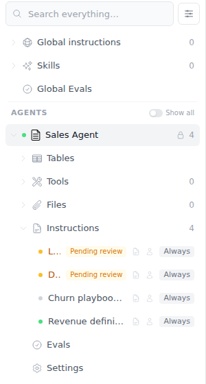
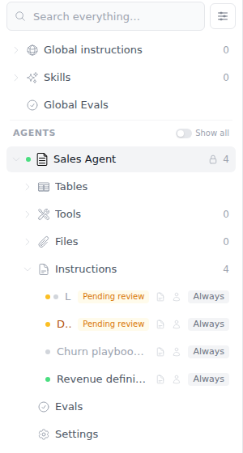
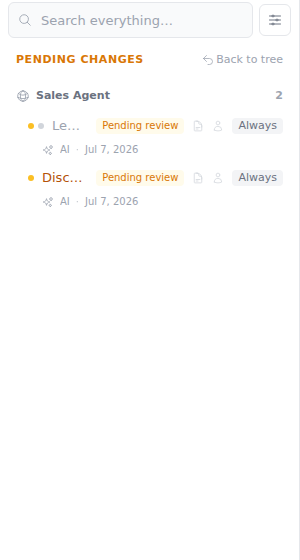

# Feedback Loop — inactive instruction with pending changes indistinguishable from an active one in the Knowledge Explorer

Reported: in `/agents`, a KnowledgeExplorer instruction row that is **pending
changes AND inactive** should show **two dots — amber (pending) and gray
(inactive)** — and an **inactive** instruction's title should render grayer
than active rows **regardless of whether it is also pending**. Before the fix,
a pending row always rendered a single amber dot and an amber title, so an
inactive instruction with a pending suggestion looked exactly like an active
one, and inactive titles were styled like active ones.

## Root cause (validated)

`InstrLeaf` in `frontend/components/KnowledgeExplorer.vue` (pre-fix ~line
2489) keyed both the status dot and the title color solely on membership in
`pendingInstrIds`:

- dot: `pending ? 'bg-amber-400' : h.getStatusIconClass(ins)` — the amber
  pending dot *replaced* the lifecycle dot, dropping the inactive (gray)
  signal entirely;
- title: `pending ? 'text-amber-700 …' : ''` — inactive rows got the same
  default text color as active rows, and a pending inactive row got an amber
  title implying it was live.

`useInstructionHelpers.getStatusIconClass` already maps `draft` (displayed as
"Inactive") to `bg-gray-300`, but the pending branch short-circuited it.

## Loop A — deterministic reproduction (no external services)

Boot the stack and seed one agent with all four (status × pending)
combinations:

```bash
tools/agent/boot_stack.sh --dev
cd backend && uv run python ../tools/agent/seed_org.py
BOW_DATABASE_URL=sqlite:///db/agent.db uv run python scripts/seed_instruction_states.py
```

`scripts/seed_instruction_states.py` creates a "Sales Agent" data source with:

| Instruction | status | pending suggestion build |
|---|---|---|
| Revenue definitions | published | no |
| Churn playbook (retired) | draft (Inactive) | no |
| Discount policy | published | yes |
| Legacy pricing rules | draft (Inactive) | yes |

`GET /api/instructions/pending-changes` confirms both pending ids (including
the draft one) — so the row state is purely a rendering question:

```
200 {'instruction_ids': ['<Discount policy>', '<Legacy pricing rules>']}
```

Then log in as `admin@example.com` / `Password123!` (dismiss onboarding via
`PUT /api/organization/onboarding {"dismissed": true, "completed": true}`),
open `/agents`, and expand Sales Agent → Instructions.

**Observed FAIL (pre-fix):** "Legacy pricing rules" (inactive + pending)
rendered one amber dot and an amber title — identical to "Discount policy"
(active + pending); "Churn playbook (retired)" (inactive) had the same title
color as active rows.



## The fix

`frontend/components/KnowledgeExplorer.vue`, `InstrLeaf`:

- keeps the amber dot for any pending row, and adds a **second gray dot**
  (`bg-gray-300 dark:bg-gray-600`) when the row is pending **and** not
  `published`, so the pending flag no longer erases the lifecycle state;
- inactive rows (status ≠ `published`) now render the title in
  `text-gray-400 dark:text-gray-500` **regardless of pending state**; the
  amber title is reserved for pending rows that are actually live.

The "Pending changes" flat view and search results reuse `InstrLeaf`, so they
inherit the same treatment.

**Re-run, observed PASS:** two dots (amber + gray) and a muted title on
"Legacy pricing rules"; "Churn playbook (retired)" muted; active rows
unchanged; no page errors.

| Before | After |
|---|---|
|  |  |

Pending-changes view after the fix:



## What this proves / regression notes

- The two-dot treatment only appears for pending **and** inactive rows; the
  three other state combinations render exactly as before except that
  inactive titles are muted.
- Playwright `pageerror` listener stayed empty during capture — no runtime
  errors introduced.
- Evidence captured with the dev stack (`boot_stack.sh --dev`); Playwright in
  cloud sandboxes needs `PLAYWRIGHT_BROWSERS_PATH=/opt/pw-browsers` and (for
  the pinned @playwright/test) `executablePath: '/opt/pw-browsers/chromium'`;
  dev-mode HMR keeps sockets open, so wait on `load`, not `networkidle`.
