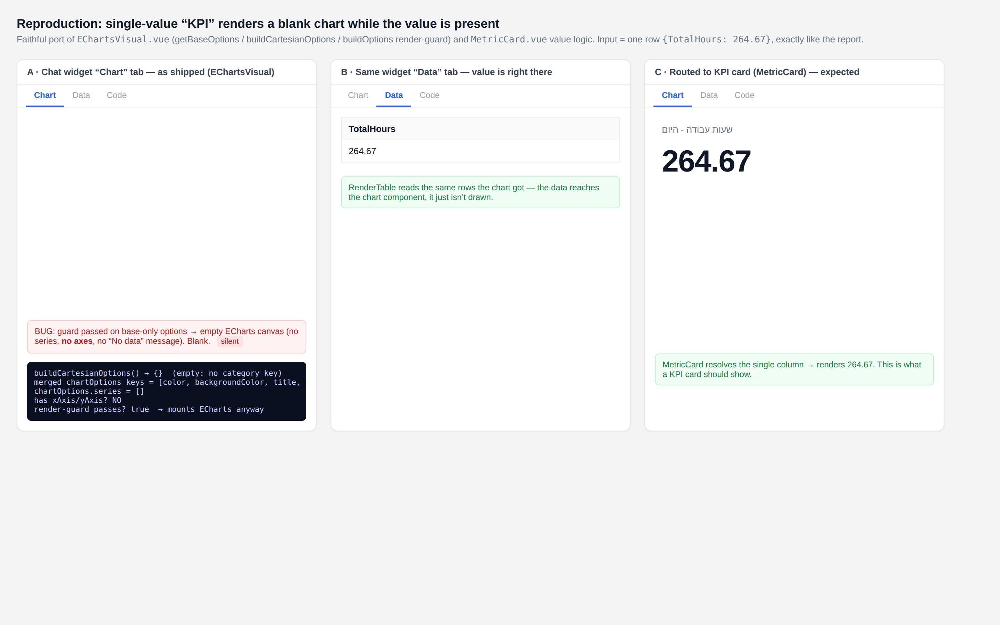

# Feedback Loop — "it doesnt show the data in the KPI card"

A single-value result (e.g. one row `{TotalHours: 264.67}`) renders a **blank
chart area** in the chat widget preview, even though the value is present and
shows correctly in the **Data** tab. Reported in Hebrew reports ("שעות עבודה -
היום"). This doc validates the root cause and reproduces the blank render.

## Root cause (validated)

Two layers combine.

### Layer 1 — the ECharts renderers fail *silently* when the builder can't encode the data

Both `frontend/components/RenderVisual.vue` and the dashboard
`frontend/components/dashboard/charts/EChartsVisual.vue` gate rendering on
whether `chartOptions` has *any* keys:

- `RenderVisual.vue:2` / `EChartsVisual.vue:3`:
  `... && Object.keys(chartOptions).length > 0 && (data?.rows?.length||0) > 0`

But `chartOptions` is `{ ...baseOptions, ...specificOptions }`
(`RenderVisual.vue:801`; `EChartsVisual.vue:944`), and `getBaseOptions()`
**always** returns keys (`grid`, `legend`, `tooltip`, `series: []` —
`EChartsVisual.vue:206`). So the guard is *always true* once rows exist.

Every per-type builder bails to `return {}` when it cannot resolve the
encoding — e.g. `EChartsVisual.vue:300` / `RenderVisual.vue:320`:

```js
const categoryKey = (viewV2?.x || dm?.series?.[0]?.key)?.toLowerCase()
if (!categoryKey) return {}
```

There are ~10 such `return {}` exits per file. When one fires, `chartOptions`
collapses to base-only options (empty `series`, **no axes**), the guard still
passes, and an empty ECharts canvas mounts and paints nothing. The dedicated
fallbacks — `"No data to display."` / `"Chart configuration error or
unsupported type."` (`RenderVisual.vue:14-19`; `EChartsVisual.vue:6-8`) — are
**unreachable dead code** whenever rows are present. Result: a blank chart, no
error, while the value sits in the Data tab.

### Layer 2 — a scalar has no category, so it hits Layer 1

- The value genuinely reaches the chart. The Data tab renders via `RenderTable`
  reading `step.data.rows` (`RenderTable.vue:141`), the *same* `filteredData`
  the chart tab receives (`ToolWidgetPreview.vue:121-133`).
- The persistence chain preserves the visualization type and `view.value`
  end-to-end; a `count`/`metric_card` correctly resolves to the robust
  `MetricCard.vue` via the registry (`registry/index.ts:70-83`), which renders a
  1-row/1-column scalar as the number — it can only ever show the value or `—`,
  never a fully blank card.
- Therefore a fully blank card means the scalar was **not** classified as
  `count`/`metric_card`; it fell to a Cartesian chart renderer. A single
  aggregate has no dimension, so `data_model.series[0].key` is undefined and the
  view has no `x` → `buildCartesianOptions` returns `{}` → Layer 1 → blank
  canvas. Screenshot 1 in the report corroborates this: the agent said it would
  make a **chart**, and that (28-row) widget is blank too — same mechanism when
  the category `key`/`x` isn't encoded.

## Loop A — deterministic reproduction (no backend, no credentials)

The bug is pure frontend rendering, so the loop runs against a static harness
(`assets/kpi-card-blank/harness.html`) that ports the real
`getBaseOptions` / `buildCartesianOptions` / `buildOptions` render-guard from
`EChartsVisual.vue` and the value logic from `MetricCard.vue`, then renders the
report's exact input (`rows: [{TotalHours: 264.67}]`, a `bar_chart` data_model
with a `value` series but no category `key`, a view with no `x`) using the real
ECharts library in headless Chromium.

```bash
cd docs/feedback-loops/assets/kpi-card-blank
# ECharts UMD is not vendored in the repo; fetch it next to the harness:
curl -sSL -o echarts.min.js https://cdn.jsdelivr.net/npm/echarts@5/dist/echarts.min.js

export PLAYWRIGHT_BROWSERS_PATH=/opt/pw-browsers
node - <<'EOF'
import { chromium } from '/opt/node22/lib/node_modules/playwright/index.mjs';
const chrome = (await import('node:child_process')).execSync(
  'ls -d /opt/pw-browsers/chromium-*/chrome-linux/chrome | head -1').toString().trim();
const b = await chromium.launch({ executablePath: chrome });
const p = await (await b.newContext({ viewport:{width:1440,height:900}, deviceScaleFactor:2 })).newPage();
const errs = []; p.on('pageerror', e => errs.push(e.message));
await p.goto('file://'+process.cwd()+'/harness.html', { waitUntil:'load' });
await p.waitForTimeout(1200);
await p.screenshot({ path:'reproduction.png', fullPage:true });
await b.close();
console.log('saved reproduction.png', errs.length?('ERRORS '+errs.join('|')):'(no page errors)');
EOF
```

### Observed output (FAIL — the bug)

The harness prints the computed pipeline for the single value:

```
buildCartesianOptions() → {}  (empty: no category key)
merged chartOptions keys = [color, backgroundColor, title, grid, legend, tooltip, series]
chartOptions.series = []
has xAxis/yAxis? NO
render-guard passes? true  → mounts ECharts anyway
```

Screenshot: `assets/kpi-card-blank/reproduction.png`

- **Panel A** ("Chart" tab, as shipped): **blank** ECharts canvas — matches the report.
- **Panel B** ("Data" tab): `264.67` — the value is right there.
- **Panel C** (routed to `MetricCard`): `264.67` — what a KPI card should show.



## The fix (not applied here — diagnosis only)

Two independent, complementary changes:

1. **Make the renderers honest.** Gate on the *specific* per-type options being
   non-empty (or `series.length > 0`), not on the merged base having keys, so a
   builder that `return {}`s surfaces the existing "Chart configuration error /
   No data" state instead of a blank canvas. Touches `RenderVisual.vue:2` and
   `EChartsVisual.vue:3` (+ their `buildOptions`).
2. **Route scalars to a KPI card.** Classify single-value / category-less
   results as `count`/`metric_card` (or have the Cartesian builders degrade to a
   single labeled point) instead of emitting a category-less chart. Touches the
   viz-type inference in `backend/app/ai/tools/implementations/create_data.py`
   and/or the frontend fallback.

## What this proves / notes

- The value is never lost — it reaches the component and renders in the Data
  tab; only the chart draw silently no-ops.
- The blank is not a persistence, registry, or `MetricCard` bug (a traced,
  clean chain; `MetricCard` renders the scalar correctly — Panel C). It is the
  intersection of a viz-type classification gap for scalars and the
  silent-blank-canvas render guard.
- Harness ports the logic rather than importing the SFCs (no frontend build in a
  clean sandbox); when converted to a fix PR, add a real component/Playwright
  test asserting the invariant "rows present + unresolvable encoding ⇒ a visible
  message, never an empty canvas."
