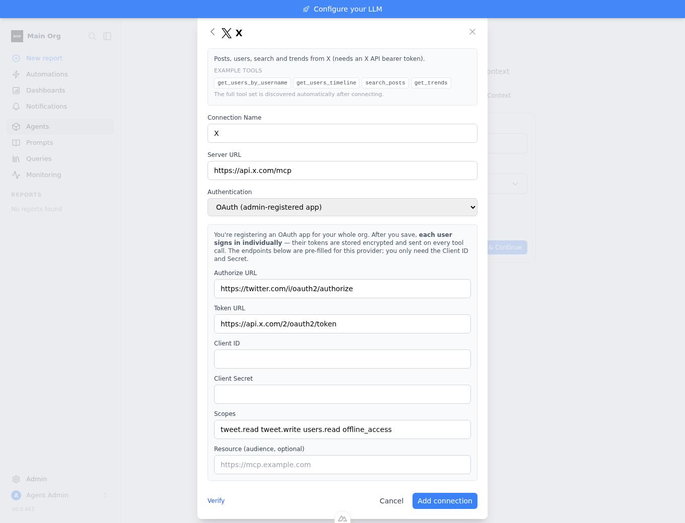
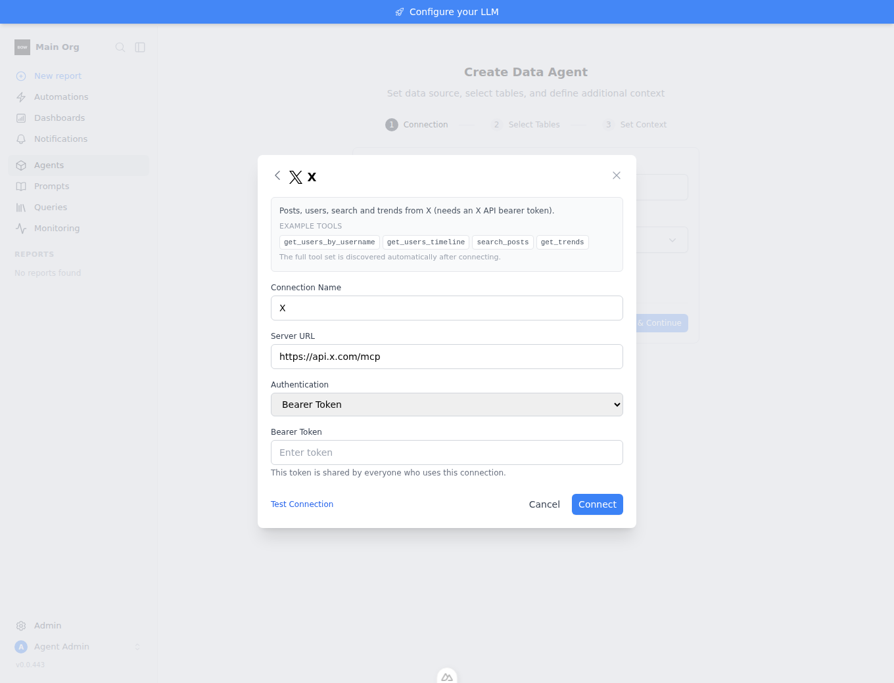
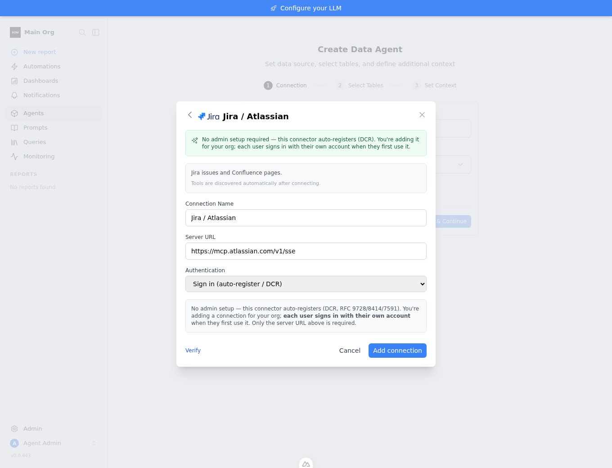
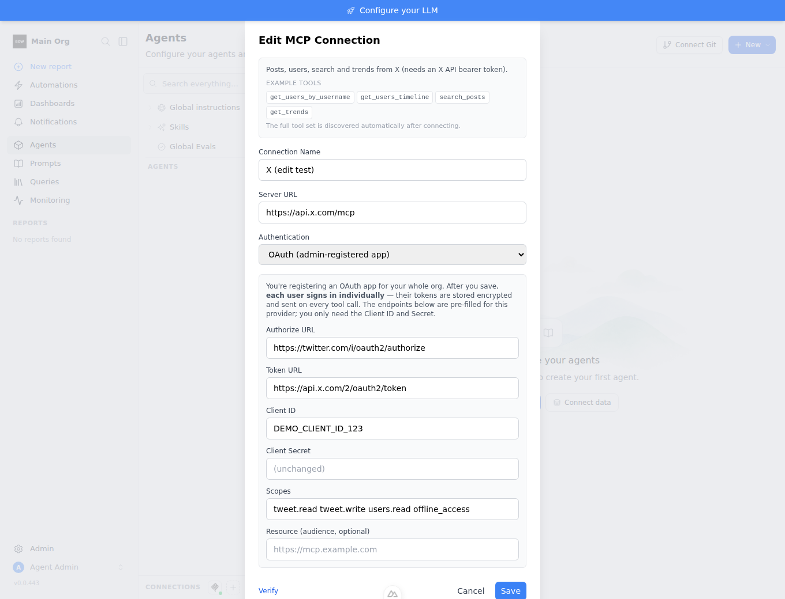

# Feedback Loop — MCP preset OAuth forms ask for constants + "Test Connection" 401s

When an admin connects an `oauth_app` MCP preset (X, GitHub, Gmail, Google
Drive), the connect form shows **blank** Authorize URL / Token URL / Scopes —
even though those are invariant per provider — and "Test Connection" fails with
`401 Unauthorized` because there is no user token at admin-config time. Two
papercuts, both validated below.

## Root cause (validated)

1. **No per-preset form defaults.** `McpPreset` carried only
   `server_url`/`transport`/`auth`/`description`
   (`backend/app/schemas/data_source_registry.py`), so the catalog gave the
   frontend nothing to pre-fill. The admin hand-typed X's constant endpoints.
2. **`test_connection_params` treats an auth challenge as failure.** For
   `oauth_app`/`dcr` there is no token yet, so the MCP client's unauthenticated
   probe gets `401` and `test_connection_params`
   (`backend/app/services/connection_service.py`) returned that verbatim as a
   failure — even though a `401`/`WWW-Authenticate` is the *expected, healthy*
   response for a per-user OAuth server (RFC 9728).

## Loop A — deterministic reproduction (no external services)

```bash
cd backend
pip install uv && uv sync --frozen --extra dev
export BOW_DATABASE_URL="sqlite:///db/app.db" && mkdir -p db
uv run pytest tests/unit/test_mcp_presets.py -q
```

With the `test_connection_params` reinterpretation disabled
(`oauth_user_mode = False and (...)`), the OAuth-mode test fails exactly as the
live X flow did:

```
>       assert res["success"] is True
E       assert False is True
tests/unit/test_mcp_presets.py:130: AssertionError
FAILED tests/unit/test_mcp_presets.py::test_oauth_mcp_test_treats_auth_challenge_as_pass
1 failed, 2 passed
```

The other two cases still pass — proving the fix is scoped: a non-auth error
(DNS/refused) and a `bearer`-mode `401` (bad token) must still fail.

## Loop B — live confirmation (already observed)

The reproduction mirrors real X behavior seen in-app: connecting the X preset as
`oauth_app` returned
`Failed to connect to MCP server: Client error '401 Unauthorized' for url 'https://api.x.com/mcp'`
— the exact failure Loop A pins deterministically.

## The fix

1. `McpPreset` gains `allowed_auth` (which auth modes the tile offers, in form
   vocabulary) and `oauth_defaults` (`McpAuthDefaults`: authorize_url /
   token_url / scopes / audience). Populated for X, GitHub, Gmail, Google Drive;
   DCR presets keep `oauth_defaults=None` (they discover endpoints). Flows to
   `GET /connectors/catalog` automatically via `mcp_presets()` → `model_dump()`.
2. `test_connection_params` now recognizes `oauth_app`/`dcr` MCP and treats a
   reachable-but-auth-challenged probe (`_looks_like_auth_challenge`) as a pass
   with `requires_user_auth: True` — "Server reachable — sign-in required (as
   configured)." The real per-user auth is still validated at the OAuth callback
   (`test_user_connection`).

Re-run Loop A with the fix in place:

```
14 passed, 209 warnings in 25.30s
```

## Loop C — UI evidence (Playwright)

`cd frontend && node ../tools/agent/shoot_mcp_forms.mjs` and
`shoot_mcp_edit.mjs` (stack booted via `tools/agent/boot_stack.sh --dev` +
`seed_org.py`) drive the real connect form and capture four states:

| X — OAuth (admin app) | X — Bearer | Jira/Atlassian — DCR | X — Edit (filled) |
|---|---|---|---|
|  |  |  |  |

- **X / OAuth (create)**: connector **description** + **example tools**
  (`get_users_by_username`, …) shown at the top; **no transport picker** (known
  for a preset); Authorize/Token URL + Scopes (`tweet.read tweet.write users.read
  offline_access`) **pre-filled**, only Client ID/Secret blank; admin-voiced
  copy; **Verify** / **Add connection** buttons.
- **X / Bearer**: auth dropdown gated (no DCR — X's server has none); shared-token
  note; system-mode buttons (Test Connection / Connect).
- **Atlassian / DCR**: dropdown gated to sign-in only; admin-voiced banners.
- **X / Edit**: re-opening the saved connection shows the **same fields, filled**
  — Server URL, Authorize/Token URL, Client ID (`DEMO_CLIENT_ID_123`), Scopes,
  description + tools — with Client Secret masked as `(unchanged)`. This required
  a backend fix: `GET /connections/{id}` now returns `credentials_meta` (the
  non-secret OAuth fields — `connection_schema.py` + `connection.py`), which the
  edit form was already written to consume but the backend never emitted.

Before this change the OAuth fields opened blank on both create and edit, and
Test Connection returned `Failed to connect … 401`.

## What this proves / regression notes

- Presets now carry their form spec; X's OAuth endpoints + `tweet.write` scope
  are pre-fillable instead of hand-typed. Runtime stays `type="mcp"` — no new
  types, no dispatch-site changes.
- "Test Connection" for per-user OAuth MCP no longer mis-reports the healthy
  401 as a failure, while genuine failures (unreachable, bad bearer token) still
  fail.
- **Pre-existing unrelated failures:** `test_connection_oauth.py::TestGetOAuthParams::test_ms_fabric`
  and `TestOBOExchange::test_obo_exchange_ms_fabric` fail on base too (verified
  with this change stashed) — Microsoft OBO exchange, untouched here.
