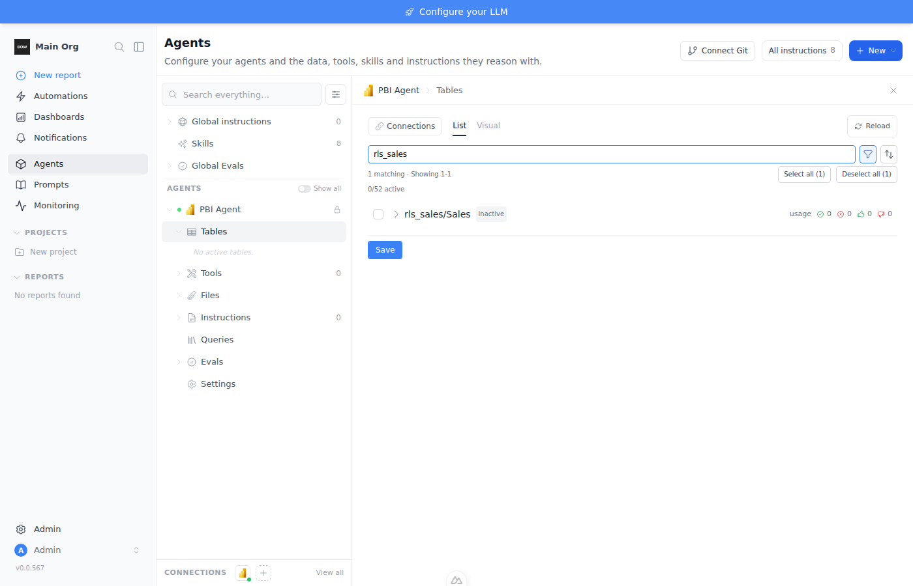
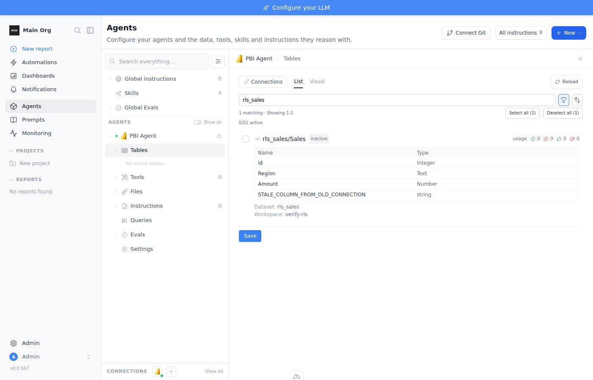

# Power BI: a brand-new connection inherits the deleted connection's tables

**Report:** a customer deleted their Power BI connection, created a brand-new one, and the
agent still showed the old Power BI tables.

**Verdict:** reproduced end to end against a real tenant. The new connection's first
delegated sync copies table definitions from rows the deleted connection left behind on the
agent, instead of introspecting Power BI. A control run without those leftover rows
introspects live and returns the real columns.

## Root cause

1. **Delegated discovery creates unlinked agent rows.** When a user's own token can see a
   semantic model the service principal cannot (every RLS model returns 401 to the SP),
   `_upsert_user_overlay` inserts a `DataSourceTable` with `connection_table_id = NULL` and
   the owning connection recorded only as JSON metadata `discovered_connection_id`
   (`backend/app/services/data_source_service.py:4947`).
2. **Deleting or detaching the connection leaves them behind.** `delete_connection`
   (`backend/app/services/connection_service.py:696`) and remove-from-agent
   (`backend/app/services/data_source_service.py:6155`) only delete `DataSourceTable` rows
   joined through a `ConnectionTable`. Nothing deletes by `discovered_connection_id`.
3. **The new connection is handed the orphans as prior state.** The overlay sync builds
   `prior_tables` from every agent row whose `connection_table` is None
   (`backend/app/services/data_source_service.py:4687`). The comment says "only this
   connection's known tables", but the filter never checks `discovered_connection_id`.
4. **Power BI rebuilds instead of introspecting.** `PowerBIClient.get_schemas` keys
   `prior_tables` by `datasetId` (`backend/app/data_sources/clients/powerbi_client.py:1429`),
   skips introspection for those datasets and rebuilds them from the stored definition
   (`:1615`), and probes datasets the listing no longer returns (`:1498`).
5. **The upsert writes a second row.** `canonical_by_dataset_table` is connection-scoped, so
   the orphan is not reused; a new row for the new connection is created with the orphan's
   columns. The agent ends up with two `rls_sales/Sales` rows, both carrying the old
   definition.

## Environment

```bash
cd backend && uv sync --extra dev
export BOW_DATABASE_URL='sqlite:///db/app.db'
export BOW_ENCRYPTION_KEY=<fernet key>          # pin it; see the skill notes
export BOW_CHROMIUM_EXECUTABLE=/opt/pw-browsers/chromium
uv run alembic upgrade head && uv run python main.py
cd ../frontend && yarn install && yarn dev
```

Tenant: an Entra app registration with `Fabric`/`Power BI` "read all" application
permissions, plus two member users with password sign-in (ROPC) enabled. The tenant must
have at least one semantic model the service principal cannot read (an RLS model) but the
user can. Here: workspace `verify-rls`, models `geo` and `rls_sales`.

Secrets are not in this doc; export them as `PBI_TENANT`, `PBI_CLIENT_ID`, `PBI_SECRET`,
`PBI_USER`, `PBI_PASSWORD` before running the steps.

## Loop A: deterministic reproduction (API + DB)

All calls: `Authorization: Bearer <jwt from POST /api/auth/jwt/login>`,
`X-Organization-Id: <org id from GET /api/organizations>`.

1. Register an admin user, log in, read the org id.
2. Create connection **A**: `POST /api/connections` with `type: powerbi`,
   `credentials: {tenant_id, client_id, client_secret}`, `auth_policy: user_required`,
   `allowed_user_auth_modes: ["oauth"]`. Wait for `connection_indexings.status = completed`.
   Observed: 52 `connection_tables`, log line
   `2 semantic model(s) ... found but not readable ... geo, rls_sales`.
3. Create the agent: `POST /api/data_sources` with `connection_ids: [A]`.
4. Seed the user's delegated token on A. The UI does this through
   `/api/connections/{id}/oauth/authorize`; in a headless sandbox obtain the token with the
   password grant and write the row the callback would write:

   ```python
   # run from backend/ with BOW_* env set
   import main; from app.models.user_connection_credentials import UserConnectionCredentials
   tokens = {"access_token": ..., "refresh_token": ..., "expires_at": <iso utc>, "token_type": "Bearer"}
   row = UserConnectionCredentials(connection_id=A, user_id=<admin user id>, organization_id=<org>,
                                   auth_mode="oauth", is_active=True, is_primary=True, expires_at=...)
   row.encrypt_credentials(tokens); session.add(row); session.commit()
   ```

   Token request: `POST https://login.microsoftonline.com/{tenant}/oauth2/v2.0/token` with
   `grant_type=password`, `scope=https://analysis.windows.net/powerbi/api/.default offline_access`.
5. Run the delegated sync: `POST /api/connections/A/my-schema/refresh`.

   ```
   datasource_tables total/unlinked: (53, 1)
   UNLINKED: rls_sales/Sales | discovered_by=user | discovered_connection_id=<A> | datasetId=443cb0b4-...
   ```

6. Mark the orphan so staleness is detectable (stands in for the model changing upstream):
   append a column `STALE_COLUMN_FROM_OLD_CONNECTION` to that row's `columns` JSON.
7. Create connection **B** with the same credentials. Wait for indexing.
8. `POST /api/data_sources/{agent}/connections/B`, then
   `DELETE /api/data_sources/{agent}/connections/A`, then `DELETE /api/connections/A`.

   ```
   connections: [B]                       connection_tables: B=52
   datasource_tables total/unlinked: (53, 1)
   ORPHAN: rls_sales/Sales | discovered_connection_id=<A, deleted> | columns=[id, Region, Amount, STALE_COLUMN_FROM_OLD_CONNECTION]
   ```

9. Seed the same user's token on B and run `POST /api/connections/B/my-schema/refresh`.

   ```
   log: PowerBI incremental discovery: 8 dataset(s) reused from prior catalog, 3 introspected live
        (the previous run on A was 7 reused, 4 introspected: the RLS model moved to "reused")
   datasource_tables total/unlinked: (54, 2)
   ROW 8d0ce6ed rls_sales/Sales | discovered_connection_id=<A, deleted> | columns=[..., STALE_COLUMN_FROM_OLD_CONNECTION]
   ROW abbdd6e7 rls_sales/Sales | discovered_connection_id=<B>          | columns=[..., STALE_COLUMN_FROM_OLD_CONNECTION]
   ```

   `GET /api/data_sources/{agent}/full_schema?connection_filter=B` returns
   `rls_sales/Sales` under "PBI B (brand new)" with the marker column Power BI never sent.

**Control.** Delete every unlinked row on the agent and rerun step 9:

```
log: PowerBI incremental discovery: 7 dataset(s) reused from prior catalog, 4 introspected live
FRESH ROW f035392e rls_sales/Sales | discovered_connection_id=<B> | columns=[id, Region, Amount]
```

Same connection, same user, same tenant: without the orphan the model is introspected live and
the marker column is gone. One control attempt returned 2 live datasets and no RLS row at all;
Power BI's workspace listing dropped two datasets for that call and returned them on the next.
That variance is unrelated to the bug and is why the control was run twice.

## Loop B: what the customer sees

Sign in, open the agent, Tables, search `rls_sales`, expand the row.




The only connection on the agent is the brand-new one, and its table carries a column that
exists only in the deleted connection's leftover row.

## Related but not the cause

- `_SCHEMA_CACHE` in `backend/app/ai/context/context_hub.py:22` caches the chat schema
  context per (org, agent ids, identity) for 5 minutes and `invalidate_schema_cache` has no
  callers. It makes any change look stale for a few minutes but clears on its own.
- A per-user crawl never prunes (`backend/app/services/connection_service.py:1690`), so a
  delegated-only connection also never drops tables that disappeared upstream.
- The PBIX and Report Server disk caches are keyed by file or report, not connection, and do
  not apply to the Power BI service connector.

## Proposed fix (not implemented)

Minimal: in the overlay sync (`data_source_service.py:4687`) only pass unlinked rows whose
`discovered_connection_id` equals the connection being crawled (legacy rows with no tag can
stay), and on `delete_connection` and remove-from-agent also delete unlinked rows whose
`discovered_connection_id` is the removed connection.

Fuller: give user-discovered rows a real `connection_id` column instead of a JSON tag so the
FK cascade and every scoping query see them, and make `_probe_unlisted_prior_datasets` only
probe datasets the same connection contributed.
