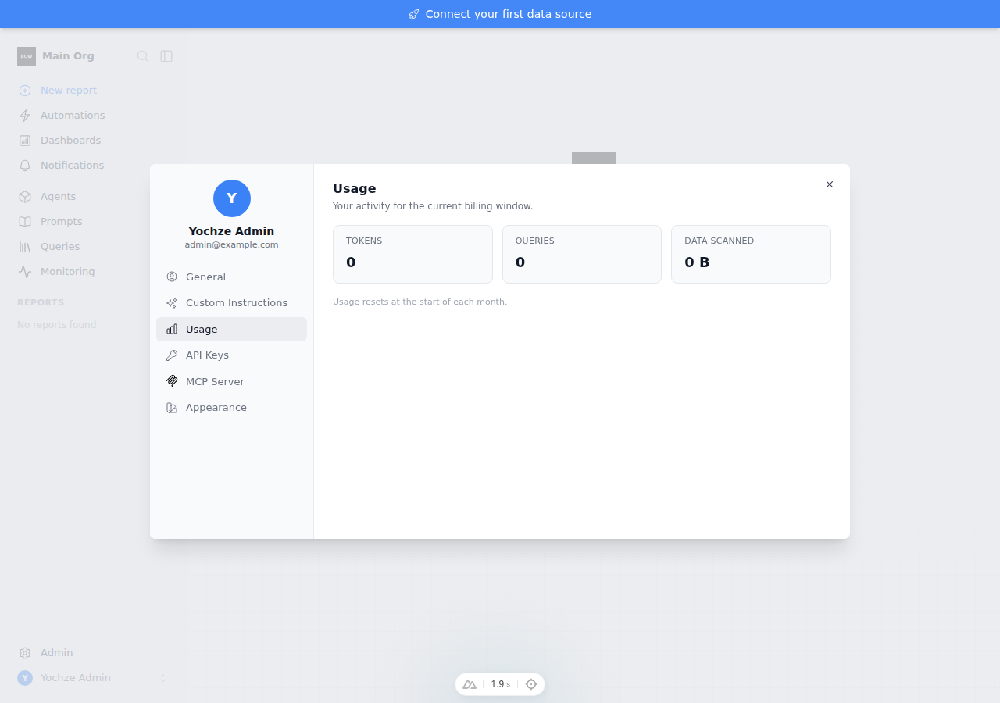
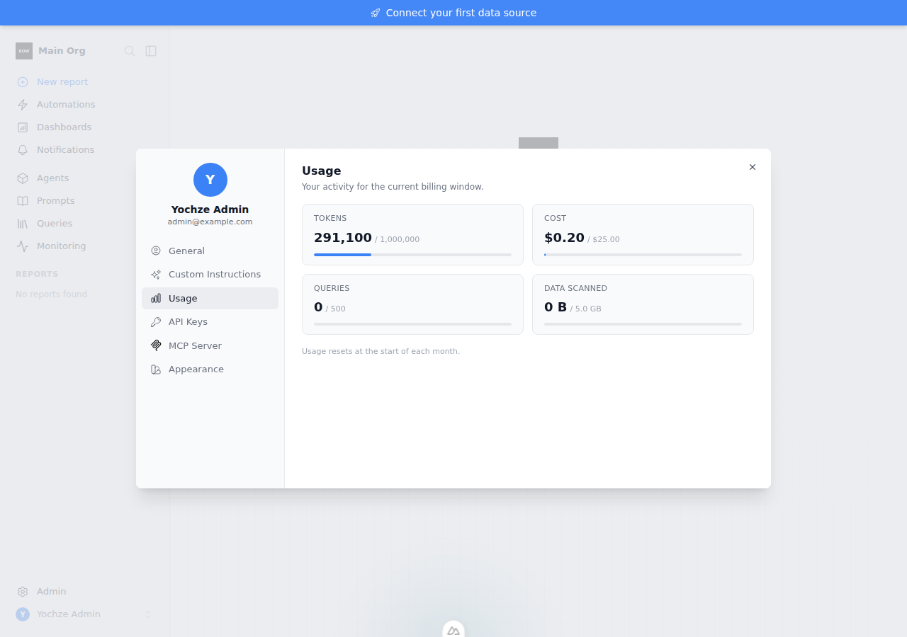
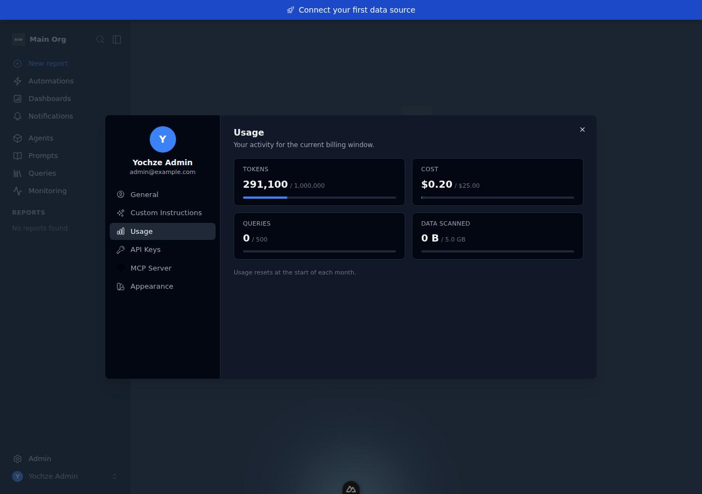

# Feedback Loop — Profile → Usage tab "I have usage but it's empty"

The **Account Settings → Usage** tab (`UserProfileModal.vue`) shows zeros for
Tokens / Queries / Data even on an enterprise instance that has been making real
LLM calls this month. This doc validates the cause and the fix that surfaces the
current-month tokens and cost.



## Root cause (validated)

The Usage tab reads `organizations[].usage_quota`, populated by
`usage_policy_service.get_user_quota_summary()`
(`backend/app/services/usage_policy_service.py`). Two things combine to leave it
empty:

1. The token/spend `used` values come **only** from the quota `UsageCounter`
   rows (`usage_policy_service.py:608-609`).
2. Those counters are written by `record_llm_tokens` /`record_llm_cost`, which
   **return early when no monthly limit is configured**
   (`usage_policy_service.py:710-711`, `:757-758`):

   ```python
   limits = await self.resolve_effective_limits(db, org_id, user_id)
   if limits.monthly_token_limit is None:
       return   # <-- no policy => nothing is ever recorded
   ```

So for the common case (feature enabled, but no usage-limit policy assigned) the
counters stay at zero and the tab shows `0` — even though every LLM call is
independently written to the always-on `LLMUsageRecord` ledger
(`app/ai/llm/llm.py:737`, the source the Cost console already trusts).
Separately, the `spend` metric was returned by the API but never rendered.

Validated by booting the stack with the enterprise license, seeding
`LLMUsageRecord` rows for the month, and observing the tab still read `0`
(screenshot above; `whoami` returned `tokens.used = 0`).

## Loop A — deterministic reproduction (no external services)

Backend regression tests, feature flag stubbed via the module's autouse
`_enable_usage_limits_license` fixture; usage seeded straight into
`LLMUsageRecord` (no live LLM):

```bash
cd backend
export BOW_DATABASE_URL="sqlite:///db/app.db"; mkdir -p db
uv run pytest tests/e2e/test_usage_limits.py \
  -k "ledger_without_a_policy or ledger_excludes_unattributed" -p no:warnings
```

- **Before the fix:** `test_quota_summary_reflects_llm_ledger_without_a_policy`
  FAILS — `quota["tokens"]["used"] == 0`, not `6500`.
- **After the fix:** both tests PASS. Full file: `18 passed`.

## Loop B — live UI confirmation (Playwright)

Boot with the license wired in, seed an org, insert month-to-date
`LLMUsageRecord` rows + a quota policy, then screenshot the tab:

```bash
BOW_CONFIG_PATH=configs/bow-config.sandbox-usage.yaml \
ANTHROPIC_API_KEY=... BOW_LICENSE_KEY=... \
TEST_DATABASE_URL="sqlite:///db/usage.db" tools/agent/boot_stack.sh --dev
cd backend && uv run python ../tools/agent/seed_org.py
# seed LLMUsageRecord rows + usage policy for the admin user, then:
cd ../frontend && node tests/usage-shot.mjs after.png   # PLAYWRIGHT_BROWSERS_PATH=/opt/pw-browsers
```

(The sandbox config + `usage-shot.mjs` harness are scratch aids — they are not
committed. Secrets come from env vars only.)

## The fix

`get_user_quota_summary` now reconciles the quota counters against the
always-on ledger via a new `_llm_usage_totals_for_user` helper, and the UI
renders the cost metric plus per-metric quota bars.

- `backend/app/services/usage_policy_service.py` — sum this month's
  `LLMUsageRecord` tokens (provider-aware, mirroring the Cost console so cached
  tokens aren't double-counted) and cost for the user; use
  `max(counter, ledger)` so the realized total shows whether or not a policy
  exists.
- `frontend/components/UserProfileModal.vue` — surface `spend` (Cost) and draw a
  usage/limit progress bar for each metric that has a limit.
- `locales/*.json` — add `profile.usage.cost`.

After the fix, with a 1,000,000-token / \$25 monthly policy and ~291k tokens of
seeded activity:



Dark mode:



## What this proves / regression notes

- The Usage tab reflects real month-to-date tokens **and** cost even with no
  usage-limit policy — the reported "empty" state.
- Per-user attribution holds: unattributed (NULL-user) ledger rows stay out of
  the summary (`test_quota_summary_ledger_excludes_unattributed_usage`).
- When a token/spend cap **is** set, the counter and ledger agree, so `max()`
  is a no-op and the existing quota-enforcement tests still pass (`18 passed`).
