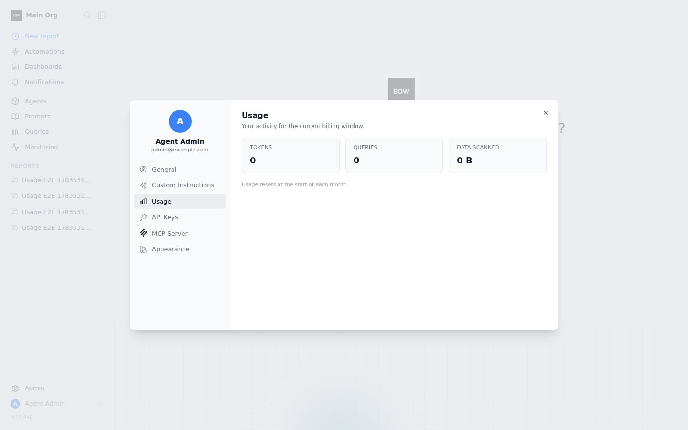
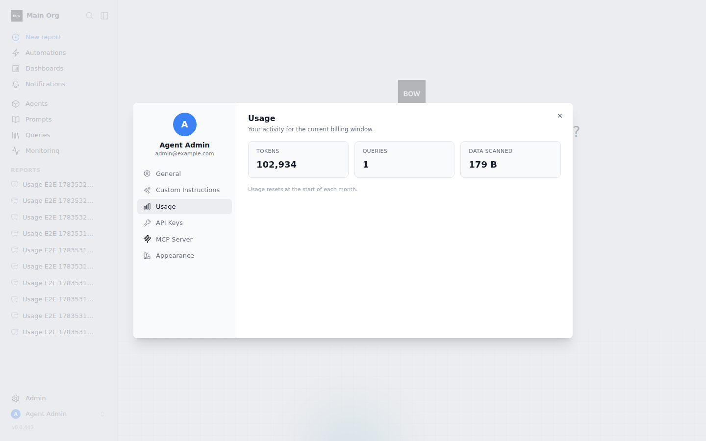

# Feedback Loop — "Usage tab in account profile is not working. Not updated at all"

The profile modal's **Usage** tab (Account Settings → Usage) always showed
Tokens 0 / Queries 0 / Data 0 B, no matter how much the user actually used the
product. This loop reproduces the failure end-to-end (real agent run → real SQL
against the demo source → tab still shows zeros), isolates the two root causes,
and shows the same flow counting after the fix.

---

## Root cause (validated)

Two independent defects compound into "never updates":

1. **Backend — counters were only written when a hard cap was configured.**
   Every recording function early-returned when the user's effective limit for
   that metric was `None`:
   - `record_llm_tokens` — `if limits.monthly_token_limit is None: return`
   - `record_llm_cost` — same for the spend cap
   - `consume_data_query` / `consume_data_bytes` — same per-connection

   Meanwhile `resolve_effective_limits` reports `enabled=True` for a user with
   **no policy at all** (`usage_policy_service.py`, `resolution_source ==
   "default"`, every limit `None`). So the tab rendered the enabled view while
   nothing ever incremented the counters → zeros forever. It also meant a cap
   added mid-month started from 0, ignoring all prior usage.

2. **Frontend — the tab rendered a stale whoami snapshot and never refetched.**
   `UserProfileModal.vue` computes `usage` from
   `currentUser.organizations[].usage_quota` (the nuxt-auth session). The
   modal's open/tab watchers loaded data for the Instructions / API Keys / MCP
   tabs but did nothing for Usage, and the session only refreshes on window
   focus (`nuxt.config.ts`, `enableRefreshOnWindowFocus`). Within a session the
   numbers were frozen at page-load values.

## The fix

- `backend/app/services/usage_policy_service.py` — drop the `limit is None`
  early-returns in `record_llm_tokens`, `record_llm_cost`,
  `consume_data_query`, `consume_data_bytes`. Counters now record whenever the
  `usage_limits` feature is licensed, cap or no cap. Enforcement is untouched:
  `_increment_counter` only runs its enforcement SELECT when a finite limit is
  present, and the pre-flight `check_tokens` cache path is unchanged — so the
  per-LLM-call hot path gains nothing.
- `frontend/components/UserProfileModal.vue` — `loadUsage()` forces a whoami
  refresh (via `useUsageQuota().refreshQuotaIfStale({ force: true })`) whenever
  the Usage tab is shown (modal opened on it, or tab switched to).
- `backend/app/ai/code_execution/code_execution.py` — the inline query/bytes
  metering now treats SQLite's single-writer lock timeout as best-effort skip
  (same policy the LLM usage recorder already applies in `llm.py`). On SQLite
  the agent's long-lived session can hold the write lock while model code runs;
  without this, a *bookkeeping* write could fail the user's actual query.
  `UsageLimitExceeded` (enforcement) is not an `OperationalError` and still
  propagates. Postgres deployments take the short row lock as before.

## Loop A — deterministic reproduction (pytest, no external services)

```bash
cd backend
pip install uv && uv sync --frozen --extra dev
export BOW_DATABASE_URL="sqlite:///db/app.db" && mkdir -p db
uv run pytest tests/e2e/test_usage_limits.py -q
```

The regression test
`test_uncapped_user_usage_is_still_recorded_and_visible_in_whoami` records
tokens / queries / bytes / spend for a user with **no policy assigned** and
asserts the whoami `usage_quota` reflects them. On pre-fix code it fails
exactly as reported:

```
>       assert quota["tokens"]["used"] == 3
E       assert 0 == 3
1 failed
```

After the fix the whole file passes (17 passed), including the flipped
invariant `test_default_unlimited_usage_limits_record_counters_without_enforcement`
(previously `..._do_not_write_counter_rows`, which asserted the old skip
behavior).

## Loop B — live stack confirmation (full UI, scripted LLM)

No LLM credentials exist in the sandbox, so the agent runs against a local
OpenAI-compatible scripted mock (planner round 1 → `create_data` tool call with
`tables_by_source` targeting the Music Store demo; coder prompt → a
`generate_df` that runs one real `SELECT ... FROM Artist`; round 2 → final
answer). Everything else — agent loop, tool execution, SQL against the demo
SQLite, counters, whoami, UI — is the real product path.

```bash
tools/agent/boot_stack.sh                     # backend :8000 + frontend :3000
# enterprise license: BOW_LICENSE_KEY env + a bow-config with `license.key:
# ${BOW_LICENSE_KEY}` (the root bow-config.yaml ships with it commented out)
cd backend && uv run python ../tools/agent/seed_org.py --demo --org-name "Main Org"
# register the mock provider as default, then drive one conversation through
# POST /api/reports/{id}/completions and one SQL-editor run through
# POST /api/queries/{id}/preview
export PLAYWRIGHT_BROWSERS_PATH=/opt/pw-browsers
```

Observed, same seeded stack, same flow:

| | Before fix | After fix |
|---|---|---|
| whoami `usage_quota` after a real agent run + SQL run | tokens 0, queries 0, bytes 0 | tokens 102,934, queries 1, bytes 179 |
| Usage tab |  |  |

Live-refresh leg (frontend fix): with the modal open, a SQL-editor preview was
executed via the API from outside the browser, then the user switched to
General and back to Usage — **no page reload**. Queries went 1 → 2 and Data
Scanned 179 B → 1.3 KB (`assets/profile-usage-tab-live-1.png` /
`profile-usage-tab-live-2.png`).

## Latency (before vs after, uncapped user)

SQLite sandbox, N=50 per path, fresh session per call
(`scratchpad/bench_usage.py`, direct service calls):

| Path | Before p50 / p95 | After p50 / p95 | Delta |
|---|---|---|---|
| `consume_data_query` (sync, per executed query) | 10.40 / 14.47 ms | 12.17 / 20.20 ms | ~+1.8 ms |
| `record_llm_tokens` (once per agent run, fire-and-forget bg flush) | 10.25 / 17.66 ms | 11.59 / 14.44 ms | ~+1.3 ms, off hot path |
| `get_user_quota_summary` (whoami leg) | 10.05 / 11.64 ms | 10.03 / 12.15 ms | none |

The policy-resolution SELECTs were already paid on every call before the fix
(the early-return happened *after* `resolve_effective_limits`); the delta is
just the atomic counter `UPDATE` + event `INSERT`. Per-LLM-call recording was
already buffered in memory and is unaffected.

## Follow-up — daily per-metric charts

The tab now also renders a daily breakdown since the start of the month: one
small bar chart per metric (Tokens / Queries / Data Scanned), single series
each, per-day tooltip, light + dark.

- Backend: `GET /organizations/{org_id}/usage/daily` (self-serve, membership
  checked, enterprise-gated) aggregates `usage_events` by UTC day and
  zero-fills day 1 → today. Covered by
  `test_daily_usage_series_groups_events_by_day_and_zero_fills`.
- Frontend: `UserProfileModal.vue` fetches the series on tab open and renders
  three ECharts small multiples. Hues (#2563eb / #0d9488 / #7c3aed) validated
  with the dataviz palette checker against both surfaces (all six checks pass,
  worst adjacent CVD ΔE 72.5).
- Evidence: `assets/profile-usage-tab-daily-light.png`,
  `profile-usage-tab-daily-dark.png`, `profile-usage-tab-daily-hover.png`
  (tooltip). Multi-day series seeded via backdated `usage_events` in the
  sandbox; the totals in the tiles match the sum of the bars.

## What this proves / regression notes

- Counters accrue for uncapped users through the real paths (agent token
  flush, code-executor query metering, SQL-editor preview), and the profile
  Usage tab shows them and refreshes on every open.
- Enforcement semantics unchanged: caps still block
  (`test_admin_is_still_blocked_by_token_quota_before_provider_call`,
  `test_execute_query_inside_quota_context_counts_failures_and_blocks_n_plus_one`
  et al. still pass), and the community/unlicensed path stays inert
  (`test_usage_limits_feature_disabled_is_inert`).
- Pre-existing, not introduced here: on SQLite, mid-agent-run query/bytes
  metering can be skipped under write-lock contention (now logged at debug
  instead of failing the query). Postgres is unaffected. Tokens/spend always
  record because their flush runs after the run's transaction completes.
- `tests/e2e/test_usage_limits.py` + `tests/e2e/rbac/test_pending_membership_rbac.py`:
  30 passed post-fix.
