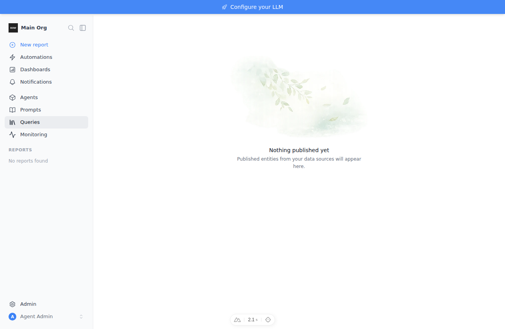
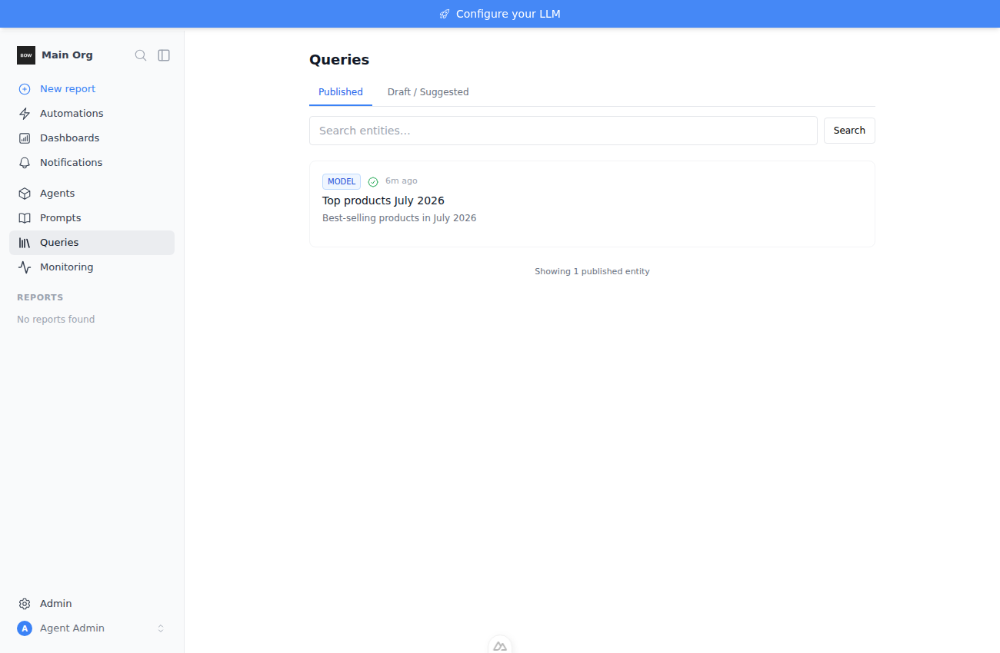

# Feedback Loop — "Publishing entities / queries but I can't see them in the queries page"

An admin saves a query as **Published** ("As an admin, your query will be
published directly"), but `/queries` shows the full-page **"Nothing published
yet"** empty state — the just-published entity never appears, even though the
backend stored and returns it.

## Root cause (validated)

`frontend/pages/queries/index.vue` computed the full-page empty state from a
ref that was **never populated**:

```ts
const items = ref<EntityList[]>([])          // declared…
const allItems = ref<EntityList[]>([])
// …loadEntities() only ever assigns allItems:
allItems.value = data.value as any           // items stays [] forever
// …so the empty-state gate is effectively `!q && suggestedCount === 0`:
const isPageEmpty = computed(() => !q.value && items.value.length === 0 && suggestedCount.value === 0)
```

`items.value.length` is always `0`, so `isPageEmpty` depends only on
`suggestedCount`. A published entity is `global` (private_status=null,
global_status=`approved`, status=`published`) and is **not** counted in
`suggestedCount`. So an org with published entities but no drafts/suggestions
gets `isPageEmpty === true`, and the `v-else` block holding the entire list
(published tab included) is skipped.

The backend is correct: `POST /api/entities/from_step/{step_id}` with
`publish=true` for an admin sets `private_status=None, global_status="approved",
status="published"` (`backend/app/services/entity_service.py:103-114`), and
`GET /api/entities` returns it (verified against the live API below).

## Loop A — deterministic reproduction (no external services)

Seed a single admin-published entity directly, mirroring the "Save Query →
Published" result, then load `/queries`.

```bash
# stack
tools/agent/boot_stack.sh --dev
cd backend && export TESTING=true ENVIRONMENT=production TEST_DATABASE_URL="sqlite:///db/agent.db"
uv run python ../tools/agent/seed_org.py            # admin@example.com / Password123!

# seed one global/approved/published entity (raw SQL — no ORM registry needed)
python3 - <<'PY'
import json, sqlite3, uuid
from datetime import datetime
c = sqlite3.connect("db/agent.db")
org = c.execute("SELECT id FROM organizations LIMIT 1").fetchone()[0]
owner = c.execute("SELECT id FROM users WHERE email='admin@example.com'").fetchone()[0]
now = datetime.utcnow().isoformat(sep=" ")
c.execute("""INSERT INTO entities
 (id,organization_id,owner_id,type,title,slug,description,tags,code,data,
  original_data_model,view,status,published_at,pinned,auto_refresh_enabled,
  private_status,global_status,created_at,updated_at)
 VALUES (?,?,?,?,?,?,?,?,?,?,?,?,?,?,?,?,?,?,?,?)""",
 (str(uuid.uuid4()),org,owner,"model","Top products July 2026","top-products-july-2026",
  "Best-selling products in July 2026",json.dumps([]),"SELECT 1",
  json.dumps({"info":{"total_rows":42,"total_columns":5}}),json.dumps({}),
  json.dumps({"type":"table"}),"published",now,0,0,None,"approved",now,now))
c.commit(); print("seeded published entity")
PY
```

Backend confirms the entity is stored and served:

```
GET /api/entities  ->  [{ "title": "Top products July 2026",
                          "status": "published",
                          "global_status": "approved",
                          "private_status": null, ... }]
```

Drive the page with a real login (Playwright, `executablePath:
/opt/pw-browsers/chromium`), navigate to `/queries`:

```
FAIL (current code):
{"url":".../queries","emptyStateVisible":true,"publishedCardVisible":false}
```

The empty state renders and the published card is hidden — the reported bug.



## The fix

`frontend/pages/queries/index.vue` — drop the dead `items` ref and gate the
empty state on the actual loaded data:

```ts
const publishedCount = computed(() =>
  allItems.value.filter(item => getEntityType(item) === 'global' && !isArchived(item)).length
)
// Full-page empty state only when there is genuinely nothing across both tabs.
const isPageEmpty = computed(() =>
  !q.value && publishedCount.value === 0 && suggestedCount.value === 0
)
```

Re-run the same loop against the fixed code:

```
PASS:
{"url":".../queries","emptyStateVisible":false,"publishedCardVisible":true}
```



## What this proves / regression notes

- The published entity now renders under the **Published** tab with its
  approved check badge; "Showing 1 published entity".
- Regression test: `frontend/tests/queries/published-visibility.spec.ts` mocks
  `GET /api/entities` with one `global`/`approved` entity and asserts the card
  renders while "Nothing published yet" is absent. Verified it **fails** on the
  pre-fix code (`emptyStateCount:1, cardVisible:false`) and **passes** after the
  fix — it asserts the general invariant (any published entity shows), not the
  one seeded scenario.
- No backend change required; the API already returned the entity correctly.
