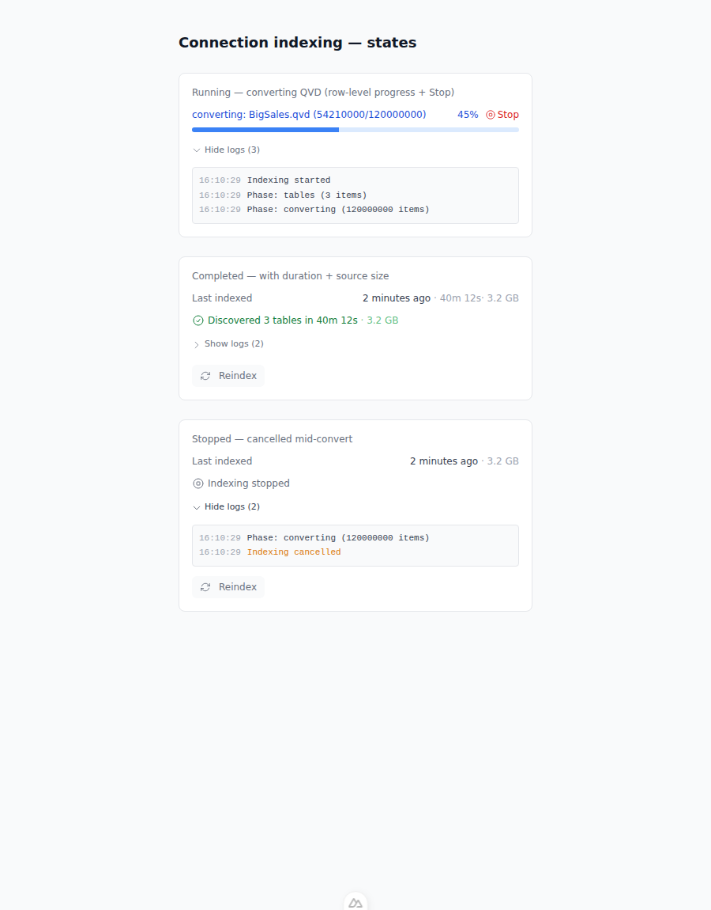

# Feedback Loop — "the progress bar is done in 3 seconds but indexing takes 40 minutes"

Indexing a large QVD connection shows a progress bar in the connection detail
modal that completes in ~3 seconds and reads "done", while the actual QVD →
Parquet conversion keeps the pod busy for up to 40 minutes in the background.
There was also no way to stop a running index, and no visibility into how big
the indexed source was or how long it really took. This loop validates that the
progress bar now tracks the real conversion work, that an index can be stopped
mid-flight, and that size/duration are recorded.

## Root cause (validated)

The indexing runner marked the run **completed** after schema discovery — which
for QVD only reads XML headers (seconds) — and then kicked the expensive
convert as fire-and-forget:

- `connection_indexing_service._run` set `status = COMPLETED` right after
  `refresh_schema`, then did `asyncio.ensure_future(client.awarm_all())`
  (old `connection_indexing_service.py`, warm block) — so the row hit 100% /
  completed while the 40-minute convert had only just started.
- `QVDClient.awarm_all` had no progress reporting and no cancellation, and the
  Rust `qvd2parquet` binary emitted only a single summary line at the end, so
  even if warming were tracked there was no sub-file signal for a multi-GB file.
- There was no cancel endpoint; `POST /reindex?force=true` only flipped the DB
  row to `cancelled` but never stopped the running task or its subprocess.

## Loop A — deterministic reproduction (no external services)

Build the converter and run the QVD unit tests (fixture + real Rust binary,
no network, no DB):

```bash
cd tools/qvd2parquet && cargo build --release
cd ../../backend
export BOW_DATABASE_URL="sqlite:///db/app.db"
export QVD2PARQUET_BIN="$(pwd)/../tools/qvd2parquet/target/release/qvd2parquet"
uv run python -m pytest tests/unit/test_qvd_client.py -q
```

Against the **old** code these new assertions fail, demonstrating the bug:

- `test_warm_reports_row_level_converting_progress` — `awarm_all` reported no
  progress at all (no `converting` phase, no row counts).
- `test_warm_honors_cancel_and_writes_no_parquet` — `awarm_all` took no
  `cancel_check`; the convert could not be stopped.
- `test_convert_streaming_cancels_midway` — `subprocess.run` blocked until the
  child exited, so a cancel could never land mid-convert.

And the runner-level behavior (`tests/e2e/test_connection_indexing.py`):

- `test_indexing_cancel_endpoint` — `POST /connections/{id}/indexing/cancel`
  did not exist (404 → route missing).

## The fix

- **Rust** (`tools/qvd2parquet/src/main.rs`): read `header.no_of_records` and
  emit throttled `qvd2parquet: progress <done> <total>` lines to stderr per
  chunk, plus a final 100% marker.
- **QVDClient** (`qvd_client.py`): `_run_convert_streaming` runs the binary via
  `Popen`, streams stderr through `select` (so a cancel is noticed within
  250 ms even mid-chunk), forwards row progress, and kills the child on cancel.
  `awarm_all(progress_callback, cancel_check)` pre-scans header row counts for a
  global total and reports a `converting` phase in **rows**. `index_stats()`
  returns `source_bytes` / `file_count` / `row_count`.
- **Runner** (`connection_indexing_service.py`): the warm phase now runs
  *inside* the tracked run — awaited, progress-reported, cancellable — and the
  row only reaches `completed` after it finishes. A module-level cancel-event
  registry plus `request_cancel()` and the `POST .../indexing/cancel` route let
  a request thread stop the background job; `progress_cb` raises
  `IndexingCancelled` and the runner marks the row `cancelled`. `source_bytes`
  is folded into `stats_json`.
- **Frontend**: `ConnectionIndexingProgress.vue` gains a **Stop** button while
  active, a "stopped" state, and size/duration on completion;
  `ConnectionDetailModal.vue` wires the cancel call and shows file size +
  human-readable duration on the "Last indexed" line.

Re-run Loop A — all green:

```
tests/unit/test_qvd_client.py .........                    [9 passed]
tests/e2e/test_connection_indexing.py ......               [6 passed]
```

## UI evidence

The real `ConnectionIndexingProgress` component in the three new states —
row-level convert progress with a **Stop** button, a completed run showing
duration + source size, and a stopped run with its event log:



## What this proves / regression notes

- The `converting` phase reports monotonically increasing **row** progress up to
  the file's true `NoOfRecords`, so the bar reflects the real convert instead of
  settling instantly on the header read.
- A cancel raises `IndexingCancelled`, kills an in-flight convert, leaves no
  half-written `.parquet`, and marks the run `cancelled` (never `failed`).
- `source_bytes` / duration are persisted and surfaced in the modal.
- Warm is now awaited, so `completed` genuinely means "queryable". Warm failures
  stay non-fatal (logged as a `warn` event) — the catalog is still indexed and
  the scheduled warmup retries the convert, preserving prior behavior.
- Cancellation, event logs, and duration live at the runner level, so they apply
  to **every** data source; row-level convert progress and `source_bytes` are
  specific to QVD (and any future client that overrides `awarm_all`/`index_stats`).
