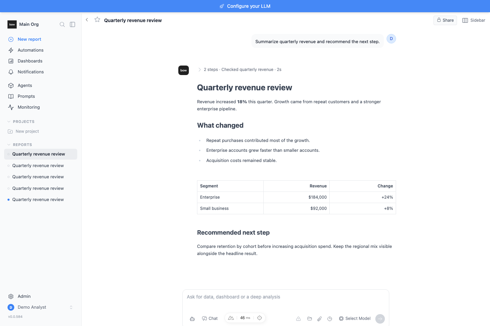
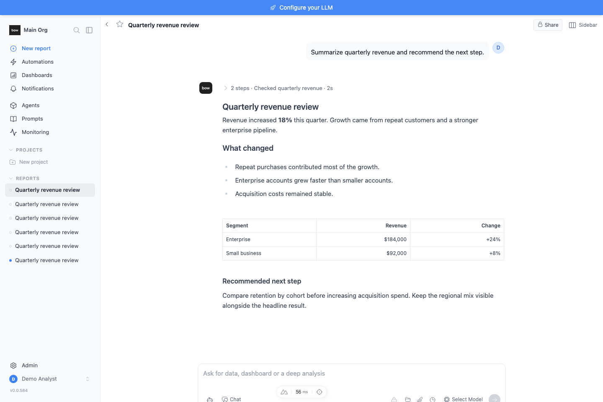
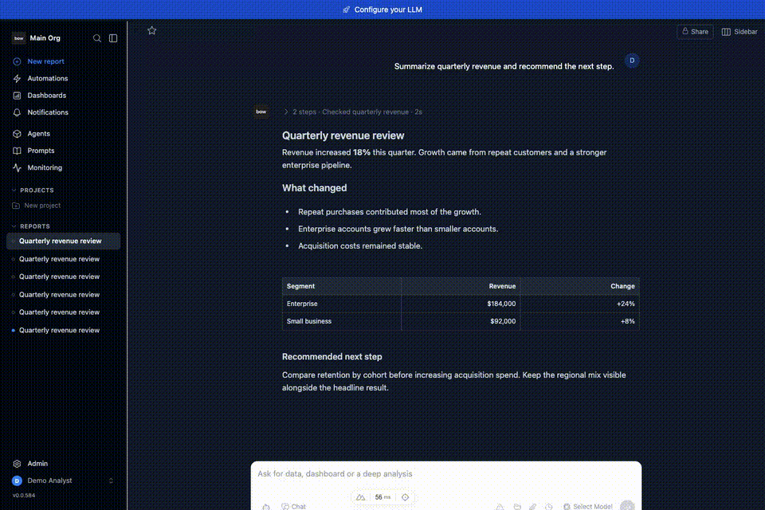

# Feedback Loop — report reading proportions and streaming jumps

The report conversation uses a wider reading column, larger body text, restrained headings, and a short opacity fade for appended text. Stream following must also respond to child layout growth while leaving a reader who scrolls upward in control.

## Root cause and observed baseline

`frontend/pages/reports/[id]/index.vue` previously used a 672 px outer column, 13 px body text, and 24 px top-level headings. The installed renderer's unconfigured text entrance duration was 900 ms.

The scroll scheduler queued an animation frame followed by a fixed 40 ms timer and an explicit layout read. Token events requested scrolling, but later child layout growth had no content-size observer. An upward wheel gesture with no available upward movement could also leave following enabled because no scroll-position change occurred.

The baseline browser recording measured a **316 px bottom gap** after a late child grew. A subsequent upward gesture followed by more growth moved the viewport from **0 to 516 px**. These are observed layout/follow failures; this loop does not measure model delivery latency.

## Deterministic loop

Use a fresh local test database and the real frontend/backend. No model provider or customer data is needed.

```bash
tools/agent/boot_stack.sh --dev
cd backend
uv run python ../tools/agent/seed_org.py
cd ../frontend
# Set BOW_TEST_EMAIL and BOW_TEST_PASSWORD to the throwaway seeded credentials.
node tests/reports/reading-stream-evidence.mjs after
```

The macOS verification used the existing backend virtual environment, a separate SQLite database at `/tmp/report-reading-evidence.db`, migrations, and `uvicorn main:app` on port 8000. The frontend ran on port 3000. The boot helper's Linux process-launch commands were replaced with direct local launches.

The browser runner creates an empty demo report through the real API, then supplies a deterministic transcript and word-sized deltas through the production event handler. This tests rendering and scrolling independently of network chunking and model behavior. It also adds a child that grows without a new token event.

Run `before` against the unchanged source to record the baseline. Run `after` against the implementation to enforce the general invariants: late growth stays within 4 px of the bottom while following; growth leaves a detached reader within 2 px of their chosen position; finalizing a block preserves its rendered text; reduced motion leaves appended text fully visible; mobile has no page overflow; Hebrew remains RTL; compact prose stays 13 px; and no browser errors occur.

The same transcript is captured at 1440 × 960 for light, dark, and Hebrew, with additional narrow-pane and 390 × 844 mobile captures. Evidence lands in `media/pr/report-reading-stream/`; credentials remain in environment variables and are not written to evidence.

## Changes and observed pass

- Conversation and composer outer maximum: **672 → 768 px**.
- Prose: **13 → 15 px**, with **24 px** line height.
- Top-level heading: **24 → 20 px**; secondary headings: 18/16 px.
- Appended text and node entrance opacity fade: **900 → 180 ms**.
- Scroll requests share one pending animation frame after the render commit. Content and viewport resize observation handles deferred layout growth. An upward wheel gesture that reaches the conversation releases following immediately and cancels a queued forced scroll; one consumed by a nested scroller (it can still scroll up, or blocks chaining with `overscroll-behavior`) leaves following on. The position-based scroll handler remains the fallback for other inputs. `node tests/reports/wheel-ownership.mjs` checks nested scrolling, a nested top boundary with and without containment, and upward scrolling directly over the conversation.
- Composer padding follows the same outer column; automatic split opening retains a 480 px chat minimum while manual resizing still permits a narrower pane.
- Reasoning and activity text are 13 px; compact typography and reduced-motion behavior are retained.

Final browser output: **late bottom gap 0 px**, detached position **14 → 14 px**, mobile overflow **false**, reduced-motion animation **none** and opacity **1**, compact font **13 px**, Hebrew direction **rtl**, browser errors **0**. The existing six kickoff-stream regression checks also passed.

`yarn build` completed successfully. A separate production smoke supplied completed transcript data through the completions API boundary, confirming 15 px prose, 24 px line height, the minified equivalent `.18s` fade, a 0 px late bottom gap, a detached position of 180 → 180 px, and zero browser errors. Those measurements are saved in `production.json`; the settled dark-mode capture is `production-dark.png`. Detailed token playback uses development component inspection and is intentionally run against the dev server.

Implementation entry points: `frontend/pages/reports/[id]/index.vue:99` (column), `:3061` (scroll coordinator), `:3107` (resize observation), and `:5683` (prose and fade styling). Activity presentation lives in `frontend/components/BlockGroupTicker.vue`.

## Evidence

| Before | After |
| --- | --- |
|  |  |



Additional matching screenshots, full recordings, and measured results are saved beside these files. The demo transcript is injected for verification and is not persisted as a generated report answer.
