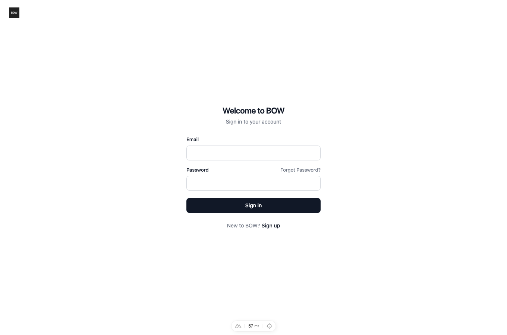
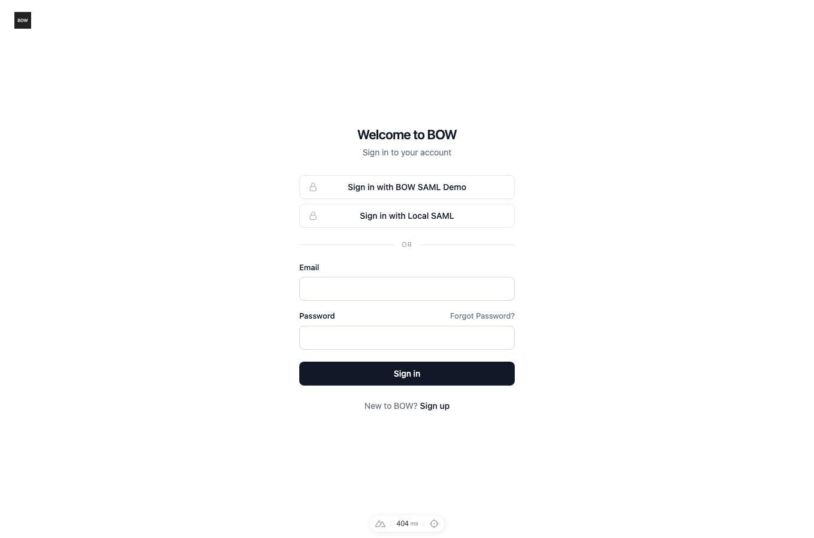

# Feedback Loop — “Support any SAML provider, including Entra, on localhost”

BOW now supports provider-neutral SAML 2.0 browser SSO configured in YAML.
The loop verifies real XML signatures, browser-bound request correlation,
organization admission, and BOW sessions. It exercises live Entra and a separate
local test IdP with a different issuer, claim namespace, and signature placement.
The supported profile and exclusions are explicit in [the setup guide](../guides/saml-sso.md).

## Root cause / missing capability (validated)

Before this change, `BowConfig` exposed OIDC/LDAP but no SAML provider model,
and `backend/app/routes/auth.py` mounted only OAuth/OIDC authorization/callback
routes and the login-code exchange. The first public-surface regression test
requested `/api/auth/saml/test-idp/metadata` and observed **404 rather than 200**.
This was a missing protocol implementation, not an Entra tenant setting.

Navigation in the resulting implementation:

- `backend/app/settings/bow_config.py:165`: IdP, SP, claim mapping, and admission configuration.
- `backend/app/services/saml_service.py:60`: trusted metadata loading and strict toolkit configuration.
- `backend/app/services/saml_service.py:181`: database-backed, browser-bound authentication request.
- `backend/app/services/saml_service.py:206`: signed response validation and atomic consumption.
- `backend/app/services/saml_service.py:308`: organization-scoped admission and explicit account linking.
- `backend/app/routes/saml_auth.py:58`: bounded POST callback, safe errors, existing login-code handoff.
- `backend/app/core/auth.py:1106`: SAML identity/provider/membership checks on session use.
- `backend/alembic/versions/saml1001_add_saml_identities.py`: persistent identities and replay/request state.

## Loop A — deterministic reproduction and verification

Prerequisites: Python 3.12 and the repository dependencies. The test suite seeds
through existing API fixtures, uses temporary signing keys, and mocks only the
external identity-provider boundary. It performs real XML signing/verification,
real SQL migrations, real account admission, and real session exchange. No live
IdP credentials are needed. No SAML validator is stubbed.

From `backend/`:

```bash
uv sync --frozen --extra dev
TESTING=true uv run pytest \
  tests/e2e/test_saml_auth.py \
  tests/unit/test_saml_config.py \
  tests/e2e/test_login_exchange_code.py \
  tests/unit/test_sso_login_hint.py \
  tests/e2e/test_ldap_auth_security.py --db=sqlite -q
```

Observed baseline:

```text
FAILED tests/e2e/test_saml_auth.py::test_saml_metadata_endpoint - assert 404 ...
1 failed
```

Observed after implementation, 2026-10-01:

```text
82 passed, 1918 warnings in 171.72s
```

The warnings are emitted by existing fixtures/dependencies plus uses of the
repository's naive UTC timestamp convention. They do not indicate failed tests.
A separate route-removal mutation checks that the final metadata regression test
still fails with 404 when the feature is disconnected; the route is restored
immediately afterward.

PostgreSQL verification uses a **disposable** database. The external mode resets
its schema; never point it at an application/development/customer database:

```bash
# Set TEST_DATABASE_URL to the disposable PostgreSQL instance.
TESTING=true uv run pytest \
  tests/e2e/test_saml_auth.py tests/unit/test_saml_config.py --db=external -q
# Alternatively use --db=postgres for the suite's testcontainers setup.
```

Observed on a fresh local PostgreSQL 14 database:

```text
56 passed, 3309 warnings in 184.68s
```

Additional targeted metadata-source checks were added after those full runs.
They verify file-backed trust, expired metadata rejection, unambiguous entity
selection, and rejection of unsupported POST-only IdP endpoints. The restored
metadata endpoint and these four cases passed on both SQLite and PostgreSQL
(`5 passed` for each targeted run).

The suite covers:

- Signed assertion, signed response, and both; custom claim names and provider slugs.
- Signed AuthnRequests and AES-256-GCM encrypted signed assertions.
- Current/next signing certificates during rollover.
- Missing/ambiguous email, unsigned/tampered/expired assertions, untrusted keys,
  SHA-1 signatures, duplicate-assertion wrapping, and XML entity declarations.
- Wrong issuer/audience/destination/request, absent request correlation,
  missing/wrong browser cookie or RelayState, duplicate POST fields, replay,
  request expiry, and configuration changes during login.
- Invitation-only admission, explicit linking to existing members, rejection of
  email auto-linking and links without membership, provider isolation, and no
  recreation of removed memberships through JIT.
- Revocation by identity removal, membership removal, user deactivation, and
  provider disablement; single-use BOW login-code exchange.
- Public configuration excludes trust material; malformed YAML models fail validation.

One security test initially exposed the toolkit's prefix-based destination
comparison: a signed response addressed to `/acs/other` was accepted for `/acs`.
BOW now independently requires **exact** Destination and Recipient equality, an
explicit audience, expiration, and response/subject request correlation. The
same negative test now passes.

### Browser loop with a second IdP

Stop any existing servers on 3000/8010/9443. With `mkcert` installed and its CA
trusted, run from the repository root:

```bash
backend/.venv/bin/python tools/agent/saml_sandbox.py
```

The runner creates a fresh database and organization, temporary keys and YAML,
and starts BOW on trusted `https://localhost:3000` plus a local IdP on 9443.
It refuses occupied ports rather than stopping unrelated services. It was also
verified with `--entra` from a fresh database during this run.

In another terminal:

```bash
export NODE_EXTRA_CA_CERTS="$(mkcert -CAROOT)/rootCA.pem"
node frontend/tests/saml/local-sso.mjs
```

Observed:

```text
PASS: provider discovery, signed SAML POST, member session, localized failure,
Hebrew RTL, embedded SSO, error-loop guard, signup
```

The browser uses the real cross-site form POST and Secure/SameSite=None
correlation cookie. Its authenticated current-user response is checked for
identity, exactly one organization, and member role. The embedded-flow check
varies only public frontend settings; protocol and session endpoints stay real.

## Loop B — live Microsoft Entra confirmation

The public tenant metadata and localhost SP values live in
`configs/bow-config.saml-demo.yaml`. Run the sandbox with `--entra` and provide
`BOW_SAML_DEMO_USERS` (comma-separated assigned users) and
`BOW_SAML_DEMO_PASSWORD` through environment variables only. Then:

```bash
node frontend/tests/saml/entra-sso.mjs
```

Observed on the fresh sandbox:

```text
PASS: Entra test user 1 authenticated as a BOW organization member
PASS: Entra test user 2 authenticated as a BOW organization member
```

Initially Entra returned a valid response, but the demo accounts lacked the
configured `emailaddress` claim (`user.mail` was empty). BOW correctly refused
to invent an email. The **demo YAML only** now maps email to the populated
`name` claim containing their email-shaped UPN. No Entra-specific fallback was
added to the generic validator. Both users passed after that explicit mapping.
Passwords, assertions, session tokens, traces, HARs, and login-page videos are
not committed or captured as evidence. Live screenshots show only authenticated
demo pages.

## UI evidence

| Before | After |
| --- | --- |
|  |  |


- [Local authenticated member](../../media/pr/saml-sso/local-signed-in.png)
- [Entra user 1](../../media/pr/saml-sso/entra-user-1.png)
- [Entra user 2](../../media/pr/saml-sso/entra-user-2.png)
- [Localized error](../../media/pr/saml-sso/error.png)
- [Hebrew RTL](../../media/pr/saml-sso/he.png)

The repository's existing 10-locale Playwright sweep also passed:

```bash
cd frontend
PLAYWRIGHT_BASE_URL=https://localhost:3000 \
  node node_modules/@playwright/test/cli.js test --config=playwright.i18n.config.ts --workers=2
```

```text
30 passed (17.2s)
```

All ten locale catalogs received the two new error keys without increasing
pre-existing missing/extra-key counts. New Python files pass Ruff checks and
formatting, and the final diff passes whitespace validation.

The before capture was taken on the isolated stack before enabling SAML; after
captures use the same page and viewport with the two configured providers.

## What this proves / limits

This proves the supported SAML 2.0 profile with live Entra and an independent
local IdP, real cryptography, two database engines, browser/session behavior,
and existing login regressions. It does not certify every vendor/version or
unimplemented protocol bindings. SAML Single Logout, unsolicited IdP-initiated
login, group-claim role mapping, and OAuth delegated data access are outside this
implementation. See the guide for supported configuration and operational setup.
