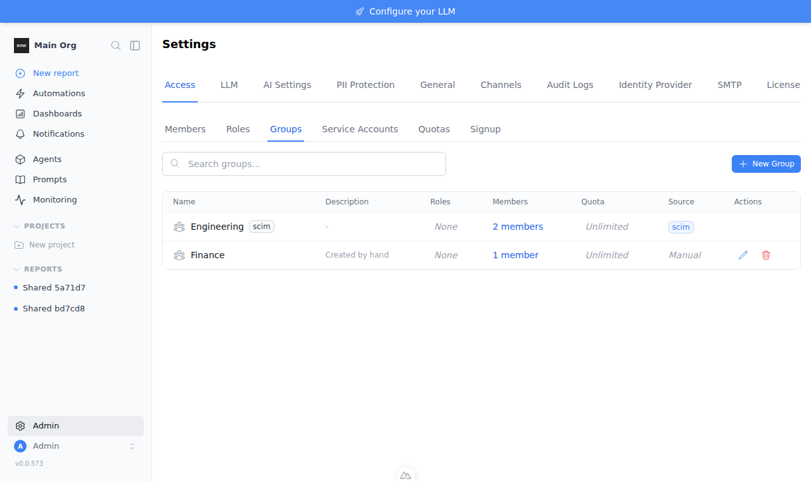
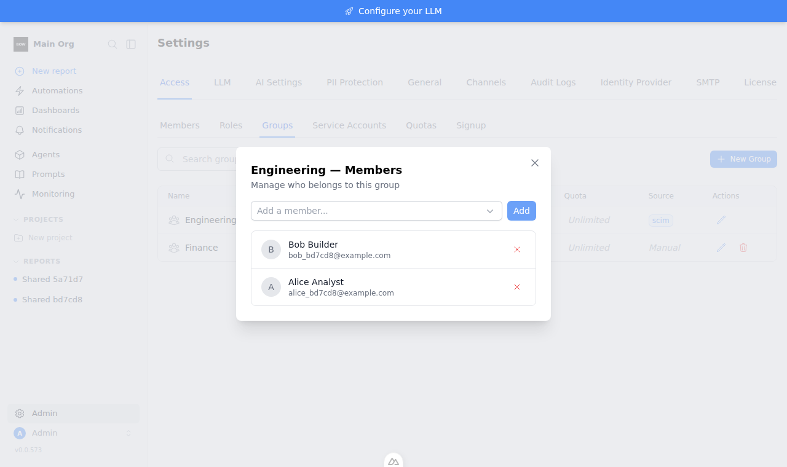
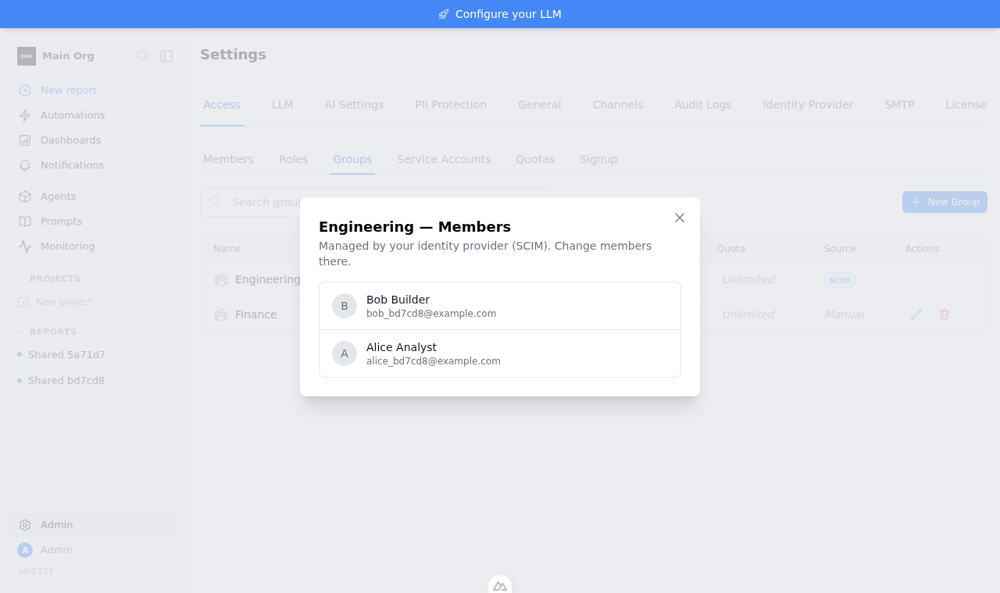
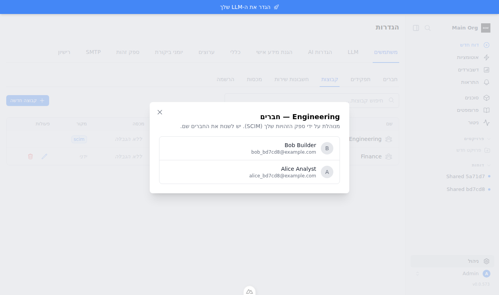

# Feedback Loop — "SCIM Groups endpoint. Only Users exists today."

An Entra ID or Okta admin who assigns **groups** to the Bag of Words enterprise
app gets nothing in BOW: `/scim/v2` serves only `/Users`, so the IdP's first
group request (`GET /Groups?excludedAttributes=members&filter=displayName eq
"…"`) is a 404 and every group fails to provision. Admins have to rebuild their
directory groups by hand, and those copies drift from the directory.

The claim validated here: after this change, a real Entra-style provisioning
engine can create, rename, re-member and delete BOW groups over SCIM. Roles
the admin assigns to those groups then grant and revoke access in step with
the directory, and nothing leaks across orgs or into groups the IdP doesn't own.

## Root cause (validated)

- `backend/app/ee/scim/routes.py` registered only `/Users` handlers. Nothing
  served `/Groups`.
- `backend/app/ee/scim/constants.py` advertised only `User` in
  `/ResourceTypes` and `/Schemas`.
- The data model was already there: `Group.external_id` / `external_provider`
  (`backend/app/models/group.py:15-16`, its comment already lists `"scim"`) and
  `GroupMembership`. No migration is needed.

## What changed

| Area | Change |
|---|---|
| `app/ee/scim/group_service.py` (new) | `ScimGroupService`: list (filter, paging, `attributes`/`excludedAttributes`), get, create, PUT, PATCH (all-or-nothing), DELETE. Only touches `external_provider="scim"` groups in the token's org. Members must already be org members. |
| `app/ee/scim/errors.py` (new) | `ScimRoute`: every failure on `/scim/v2` (auth, 404, validation) is an RFC 7644 Error body (`schemas`, `status`, `scimType`) with `application/scim+json`, and validation errors are 400 instead of 422. |
| `app/ee/scim/routes.py`, `schemas.py`, `constants.py` | `/Groups` routes, Group schemas, and Group in discovery. |
| `app/ee/scim/service.py` | `PATCH /Users` `active` accepts Entra's legacy string booleans. Before, `bool("False")` was `True`, so a deprovisioning PATCH did nothing. |
| `app/services/rbac_service.py` | The admin API refuses rename, member edits and delete on a SCIM group with 409 `group.managed_by_scim`. Roles and grants on the group stay editable. |
| `frontend/components/GroupsManager.vue` | Hides rename, add member and remove member for SCIM groups, and shows "Managed by your identity provider" in the members dialog. |
| `locales/*.json` | `errors.group.managed_by_scim` and `groupsManager.managedByScimHint` in all 10 catalogs. |

Ownership rules:
- **The SCIM surface never adopts a group it didn't create.** A displayName
  that collides with a manual, LDAP or OIDC group gets 409 `uniqueness`.
- **Group pushes never create org memberships**, so user lifecycle and the
  seat cap stay with `/Users`.
- **DELETE also removes** role assignments, resource grants and report shares
  on the group. `report_shares` has a real FK, so on Postgres the delete would
  otherwise fail.

## The Entra stand-in

`backend/tests/mocks/entra_scim_provisioner.py` is the IdP-boundary mock
(`backend/tests/AGENTS.md` rule 4). It reproduces the Entra provisioning
engine rather than replaying canned requests:

- **Test Connection:** `GET /Users?filter=userName eq "<random>"`, which must
  return 0 results.
- **Users before groups.** Each object is looked up by its matching attribute
  (`userName` = UPN, or group `displayName` with `excludedAttributes=members`).
  One hit means the target id is adopted, zero means POST, and more than one is
  a "multiple matches" failure, as in Entra.
- **Group create** uses Entra's documented body (core + `ADSCIM/2.0/Group`
  schemas, `externalId` = objectId, `meta`, no members).
- **Members** go out as `PATCH {"op":"Add"|"Remove","path":"members","value":[{"$ref":null,"value":id}]}`
  deltas. Renames are `{"op":"Replace","path":"displayName"}`. Only members
  Entra itself provisioned are sent.
- **Out of scope:** a user is soft-deleted (`PATCH active=false`) and a group
  is `DELETE`d.
- **Wire format:** capitalised ops, `application/scim+json` request bodies.
  `legacy_patch=True` sends `"False"`/`"True"` the way apps without
  `aadOptscim062020` do.
- **Response checks:** responses are validated the way Entra consumes them.
  Per-object failures are collected rather than raised (as in Entra's
  provisioning logs), and every exchange is kept in `wire_log`.

## Loop A — deterministic (pytest, no external services)

```bash
cd backend
uv sync --frozen --extra dev
export TESTING=true BOW_DATABASE_URL=sqlite:///db/app.db
uv run pytest tests/e2e/rbac/test_scim_groups.py tests/e2e/test_scim.py -q
# Postgres leg without Docker (local postgres on :5433):
TEST_DATABASE_URL=postgresql://postgres@127.0.0.1:5433/bow_test \
  uv run pytest tests/e2e/rbac/test_scim_groups.py tests/e2e/test_scim.py -q --db=external
```

`tests/e2e/rbac/test_scim_groups.py` (26 tests) has three layers.

1. **Entra engine.** One lifecycle test runs in both SCIM-compliant and legacy
   PATCH modes:
   - Entra assigns two groups. Existing BOW members are adopted rather than
     duplicated, and Carol is created.
   - The admin gives the IdP group a role, and Alice and Bob gain it
     (`whoami`).
   - A cycle with no directory changes sends **zero writes**.
   - Alice leaves the group and it is renamed: she loses the permission and Bob
     keeps it.
   - Alice rejoins and regains it.
   - Entra unassigns the group: it is DELETEd, the role assignment is gone, and
     Bob loses the permission.
   - Carol leaves scope and is soft-deleted.

   Plus:
   - A lost escrow matches the existing group instead of duplicating it.
   - A group deleted on the target is re-created.
   - An Entra group named like a hand-made group is **refused, not adopted**.
   - Legacy string booleans deactivate users.
2. **Protocol:**
   - Okta push shapes: create with members, no-path `replace`, a
     `members[value eq "…"]` remove, PUT replace, DELETE.
   - Idempotent retries.
   - PATCH atomicity.
   - Six malformed-PATCH cases, each mapped to the right `scimType`.
   - Filters: case-insensitive `displayName`, case-exact `externalId`,
     `id … and members[value eq …]`, escaped quotes; unsupported filters
     return 400 `invalidFilter`.
   - Paging covers every group exactly once.
   - Attribute selection.
   - Uniqueness on create and rename.
   - Discovery agrees with what the endpoint actually returns.
   - SCIM error bodies everywhere.
3. **Isolation:**
   - An org-A token cannot see or touch org-B groups or users.
   - The SCIM surface can't see, patch or delete manual groups.
   - The admin API can't edit a SCIM group but can still assign it roles;
     manual groups are a control case.
   - SCIM DELETE leaves no role assignments, grants or report shares behind.

**Observed before** (tests run against the original code, implementation stashed):

```
FAILED …::test_entra_provisioning_lifecycle_drives_groups_and_access[scim-compliant]
  CycleReport(users_created=1, users_matched=2, …, errors=[EntraProvisioningError(
  "GetGroup for 4f5d0601-… failed (404): {'detail': 'Not Found'}")])
… (every test fails)
26 failed in 118.05s
```

**Observed after:**

```
sqlite:   26 passed (new)   + 20 passed (existing test_scim.py)
postgres: 46 passed in 285.39s (new + existing, --db=external, Postgres 16)
```

### Mutation check (every test must be able to fail)

Each mutation reintroduces a plausible bug. In every case the suite went red:

| Mutation | Caught by |
|---|---|
| Base query ignores `external_provider` (SCIM sees manual groups) | isolation + manual-name tests |
| Member validation off (cross-org members accepted) | cross-org, create-rejection, atomicity |
| DELETE keeps report shares | delete-cleanup test |
| DELETE keeps role assignments | delete-cleanup + Entra lifecycle |
| Admin-API guard removed | admin-API test |
| SCIM error format removed | 8 error-shape tests |
| Unparsed filter treated as "no filter" | filter test |
| `bool("False")` for `active` | both legacy-mode tests |
| displayName filter case-sensitive | filter test |
| `excludedAttributes=members` ignored | attribute-selection + manual-name tests |
| Entra `Remove members` clears the whole group | Entra lifecycle + idempotency |
| Duplicate displayName allowed | manual-name, create-rejection, rename tests |
| PATCH writes before validating (non-atomic) | atomicity test |

13/13 killed.

## Loop B — live stack, real HTTP, Postgres

The real backend on Postgres with a sandbox-signed enterprise license (real
license verification, not a test fake):

```bash
cd backend
LIC=$(uv run python scripts/gen_sandbox_license.py 50)   # installs a throwaway public key; restore after
export TESTING=true ENVIRONMENT=production BOW_LICENSE_KEY="$LIC" \
       BOW_DATABASE_URL=postgresql://postgres@127.0.0.1:5433/bow_live \
       TEST_DATABASE_URL=postgresql://postgres@127.0.0.1:5433/bow_live
uv run alembic upgrade head && uv run python main.py &
uv run python ../tools/agent/verify_scim_groups_entra.py \
    --database-url postgresql://postgres@127.0.0.1:5433/bow_live --wire-log /tmp/entra-wire.json
mv app/ee/license_public_key.pem.orig app/ee/license_public_key.pem
```

`tools/agent/verify_scim_groups_entra.py` registers and logs in real users,
drives the Entra engine over HTTP, and checks three layers:
- **SCIM responses:** what Entra sees.
- **Permissions:** via `whoami`, through a role on the IdP group.
- **Stored rows:** `groups`, `group_memberships`, `role_assignments` and
  `report_shares`, read straight from the database.

**Before** (original code):

```
PASS - Entra: test connection
FAIL - cycle 1 (initial): no provisioning errors   >> [EntraProvisioningError("GetGroup for … failed (404): {'detail': 'Not Found'}"), …]
Entra could not provision the group; stopping.
```

**After** (the same result in default and `--legacy-patch` modes, and on
re-runs against the same stack):

```
PASS - Entra: test connection
PASS - cycle 1 (initial): no provisioning errors
PASS - cycle 1: existing members adopted, Carol created
PASS - cycle 1: BOW group carries the Entra name/objectId and is SCIM-owned
PASS - cycle 1: all three members landed
PASS - DB: group_memberships rows == 3
PASS - admin assigns a role to the IdP group
PASS - Alice gains manage_connections through the group
PASS - admin API refuses hand edits to the IdP group (409 group.managed_by_scim)
PASS - report shared with the IdP group
PASS - cycle 2 (no directory change): no writes
PASS - cycle 3 (Alice leaves, rename): no errors
PASS - cycle 3: rename applied
PASS - cycle 3: Alice removed, others kept
PASS - cycle 3: Alice loses manage_connections
PASS - cycle 3: Bob keeps manage_connections
PASS - cycle 4 (unassign): group deleted without errors
PASS - cycle 4: group gone from BOW
PASS - cycle 4: Bob loses manage_connections
PASS - DB: nothing points at the deleted group
PASS - cycle 5 (Carol out of scope): soft-deleted
PASS - cycle 5: Carol active=false
PASS - every SCIM response is application/scim+json
23/23 checks passed
```

The backend log had no tracebacks. The full exchange (35 requests and
responses) is in [`scim-groups-entra-wire.json`](scim-groups-entra-wire.json).

## Loop C — real Entra tenant (not run; needs credentials)

The stand-in follows Microsoft's documented request shapes, but only a real
tenant proves the last mile. To run it:

1. Expose the stack over HTTPS (for example Cloudflare Tunnel).
2. Create a non-gallery enterprise app with automatic provisioning: Tenant URL
   `https://<host>/scim/v2`, secret token a `bow_scim_…` token.
3. Assign a group. Assigning groups needs Entra ID P1/P2.
4. Use **Provision on demand**, then compare Entra's provisioning log with the
   Loop B checks.

Microsoft's SCIM Validator (scimvalidator.microsoft.com) can point at the same
URL without a tenant. Pass credentials only as environment variables.

## UI evidence

Before, the SCIM group showed rename, add-member and remove controls that the
API now refuses. After, those controls are hidden for SCIM groups (manual
groups are unchanged) and the dialog says who owns membership.

| Before | After |
|---|---|
|  |  |
|  |  |

RTL (`he`): 

## Regression notes and limits

These are pre-existing issues found while building the loop. They are outside
this change and verified live on Postgres:

- `DELETE /api/organizations/{org}/groups/{id}` on a **manual** group that has
  a report share returns **500** on Postgres (the `report_shares.group_id` FK).
  The SCIM delete path handles it; the admin path does not.
- `GET /scim/v2/Users` returns **every user** for filters it can't parse
  (`id eq …`, `displayName eq …`, `sw`). The Groups endpoint answers those with
  400 `invalidFilter`.
- Entra user PATCH paths such as `name.familyName` and
  `emails[type eq "work"].value` are accepted but ignored by `/Users`.
- Entra matches users by `userName` (the UPN). BOW stores the user's email, so
  tenants where UPN ≠ mail would not match existing BOW users.

Locale catalogs already drift from `en` on `main` (es −31 keys, he −11, the
others −176). This change adds its two keys to all 10 catalogs and doesn't
change the drift.
