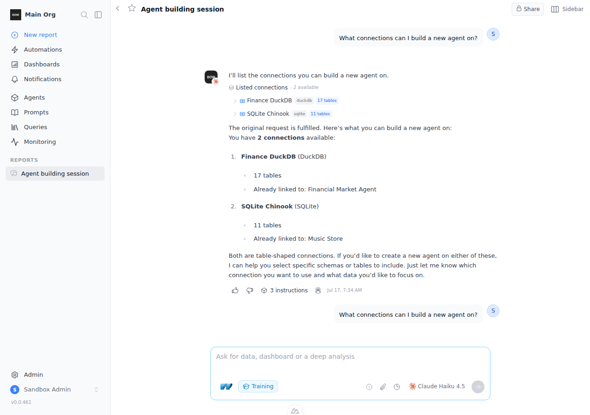
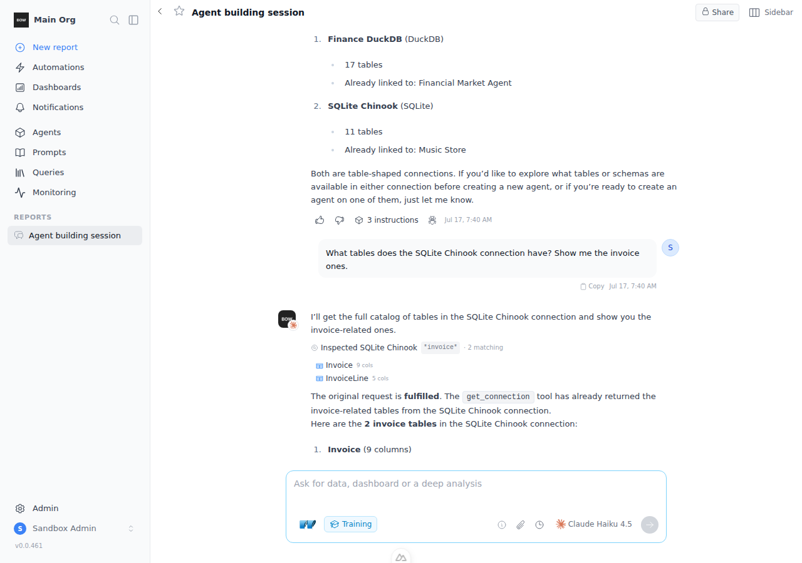
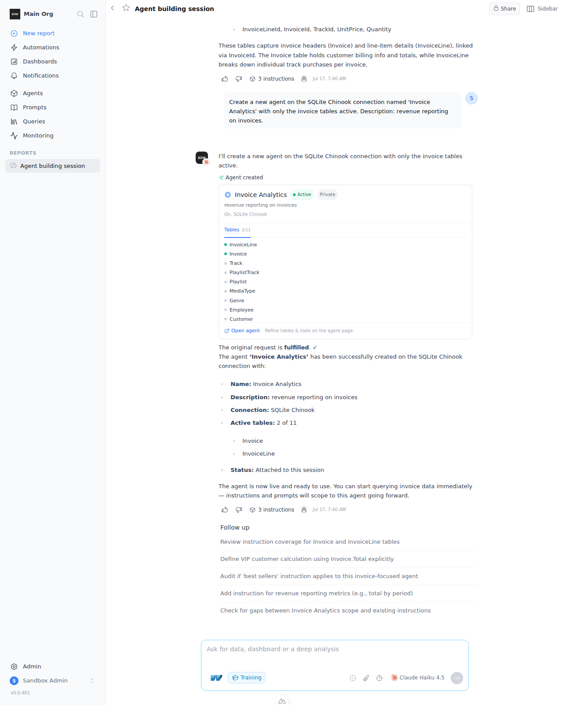
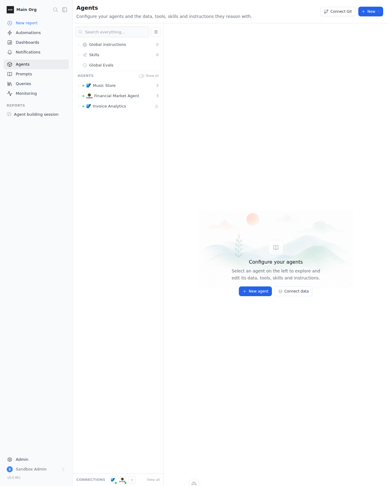
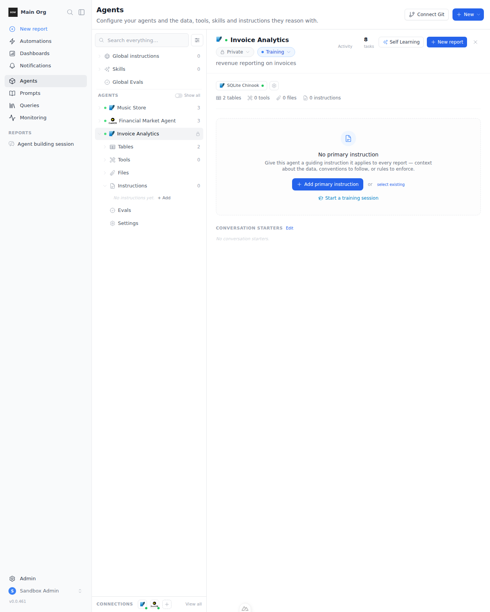

# Sandbox Feedback Loop — Training mode builds agents (list_connections / get_connection / create_agent)

Adds three **training-mode-only** AI tools so one prompt can go from "what can I
build on?" to a ready agent:

- `list_connections` — the org connections the caller can build a NEW agent on
  (create tier only: org `create_data_source` + per-connection
  `create_data_sources`), summary-only.
- `get_connection` — ONE connection's catalog *before any agent exists*: tables
  grouped by schema, tools (MCP/API), or the file scope + indexed files
  (network_dir/S3/drive), with case-insensitive **glob** filtering and
  **pagination**.
- `create_agent` — create the agent on existing connection(s) with optional
  inline selection (`schemas` / `tables` globs / `tools` globs), attach it to
  the training session, and report any unmatched selector explicitly.

Design: `docs/design/training-mode-connections-and-agent-creation.md`.

---

## Decisions baked in

1. **No credentials through the LLM.** `create_agent` only links existing
   connections (Mode 2 of `DataSourceService.create_data_source`); the inline
   connection-creation path and `POST /connections` are never exposed as tools.
2. **Permission pair enforced in the tool layer** (route decorators don't cover
   the AI tool path): org `create_data_source` AND per-connection
   `create_data_sources` (implied by connection `manage_data_sources`, org
   `manage_connections`, or full admin) — exactly what `POST /data_sources`
   requires. `list_connections`/`get_connection` are visibility-scoped by the
   same tier.
3. **Selection only ever targets the just-created agent** — there are no
   standalone table/tool mutation tools. Post-create refinement is UI
   (`TablesSelector`/`ToolsSelector` from the agent page; the tool card links
   there).
4. **Report attach on create**: the new agent joins `report.data_sources`, so
   `create_instruction`/`create_prompt` scope to it immediately (their
   `allowed_data_source_ids` guard reads the report at call time), and the
   per-session RBAC memo is invalidated so the creator's fresh `manage` grant
   is visible to later tool calls in the same run
   (`permission_resolver.invalidate_rbac_memo`).
5. **A selection that matches nothing keeps the seeded defaults** and every
   unmatched selector is returned in `unresolved` — never silently dropped,
   never an agent nuked to zero tables.

## What changed (the feature)

Tool schemas — `backend/app/ai/tools/schemas/`:
`list_connections.py`, `get_connection.py`, `create_agent.py`.

Tool implementations — `backend/app/ai/tools/implementations/`:
- `connection_catalog_common.py` — shared glob compiler (glob metachars → glob
  match; plain string → substring), registry `data_shape` lookup, file-scope
  descriptor (root/bucket + `include_globs` + `index_mode`, token-scoped for
  OneDrive/GDrive/Outlook), and the permission-tier helpers.
- `list_connections.py` — `category="research"`, `allowed_modes=["training"]`.
- `get_connection.py` — `category="research"`, `allowed_modes=["training"]`;
  tables/objects → schema-grouped names + column/row counts (columns JSON
  fetched only for the page); tools → name/description/default policy; files →
  scope + indexed file rows. Glob + `schema_name` + `page`/`page_size`.
- `create_agent.py` — `category="action"`, `allowed_modes=["training"]`.

Also: `permission_resolver.invalidate_rbac_memo` (drops the per-session memo
entry after the create grants `manage`), planner training block routing
(`prompt_builder_v3.py`), three tool cards
(`ListConnectionsTool.vue`, `GetConnectionTool.vue`, `CreateAgentTool.vue` —
agent card with status/description and Tables/Tools/Files tabs fed by
`full_schema` / `/tools` / per-connection files), registration in
`reports/[id]/index.vue`, i18n keys in all ten locale catalogs.

Gating is entirely `allowed_modes=["training"]` + the registry mode filter — no
agent_v2 change.

---

## Loop A — registry gating (no DB, no LLM)

```bash
cd backend
export BOW_DATABASE_URL="sqlite:///db/app.db"
.venv/bin/python - <<'PY'
from app.ai.registry import ToolRegistry
r = ToolRegistry()
for mode in ("training", "chat", "deep", "knowledge"):
    names = set()
    for pt in ("action", "research"):
        names |= {t["name"] for t in r.get_catalog_for_plan_type(pt, mode=mode)}
    print(mode, "->", sorted(n for n in names if n in ("list_connections", "get_connection", "create_agent")))
PY
```

**Observed (PASS):**
```
training  -> ['create_agent', 'get_connection', 'list_connections']
chat      -> []
deep      -> []
knowledge -> []
```
(`knowledge` matters: the auto-suggest harness must never create agents.)

---

## Loop B — tool behavior + create-tier RBAC (DB, no LLM)

Drives all three tools through `run_stream` against the real
`DataSourceService` and permission resolver. World: `creator` (custom role with
org `create_data_source` + a `create_data_sources` grant on `conn_main` only),
`member` (plain member), `admin` (full admin); a postgres-shaped connection
with 4 tables across 2 schemas, a second ungranted connection, an `mcp`
connection with 3 tools; a training report.

```bash
cd backend
TESTING=true BOW_DATABASE_URL="sqlite:///db/app.db" BOW_SMTP_PASSWORD=dummy \
  .venv/bin/python -m pytest tests/training/test_connection_agent_tools.py -v
```

**Asserts (all PASS — 8 passed):**
- `list_connections`: creator sees exactly the granted connection (schemas +
  counts correct); admin sees all incl. the tools-shaped one; plain member gets
  an empty list; glob `search` narrows.
- `get_connection`: schema grouping + column/row counts; `schema_name` filter;
  glob patterns (`s*s`, substring); pagination (`has_more` flips); ungranted
  connection → `permission_denied` (no metadata leak).
- `create_agent` + `schemas=["Sales"]` (case-insensitive): 2/4 tables active,
  DB truth matches, agent attached to the report, creator resolves
  `manage_instructions` on it (memo invalidation), duplicate name →
  `name_taken`.
- Permission gates: plain member → `permission_denied`; creator on an
  ungranted connection → `permission_denied`; unknown id →
  `connection_not_found`; nothing created by denied calls.
- Unmatched selection (`schemas=["nonexistent_schema"], tables=["bogus_*"]`) →
  created with seeded defaults kept, both selectors in `unresolved`.
- Tool selection on the mcp connection (`tools=["get_*","list_*"]`) → 2/3
  enabled; overlay rows show `send_message` disabled.

**Regression (unchanged):** `tests/e2e/rbac/test_rbac_data_sources.py`,
`test_rbac_training_mode.py`, `test_rbac_connections.py`,
`tests/prompts/test_prompt_training_tools.py`,
`tests/unit/test_permission_resolver.py` — all pass.

---

## Loop C — live UI + LLM (training mode, Haiku)

Full stack (`python main.py` + `yarn dev`), Anthropic provider configured from
the `ANTHROPIC_KEY` env var (never committed), chinook + stocks demos
installed, a report on the Music Store agent switched to **Training**. Driver:
three real completions.

1. *"What connections can I build a new agent on?"* → planner calls
   `list_connections` → card lists **Finance DuckDB** (17 tables) and **SQLite
   Chinook** (11 tables) with linked agents.

   

2. *"What tables does the SQLite Chinook connection have? Show me the invoice
   ones."* → `get_connection(pattern='*invoice*')` → card: "Inspected SQLite
   Chinook · 2 matching" (Invoice 9 cols, InvoiceLine 5 cols).

   

3. *"Create a new agent on the SQLite Chinook connection named 'Invoice
   Analytics' with only the invoice tables active."* → the model passed
   `tables=["Invoice","InvoiceLine"]` and the tool returned
   `{success: true, tables_total: 11, tables_active: 2, active_table_sample:
   ["Invoice","InvoiceLine"], attached_to_report: true, unresolved: []}`.
   The card shows the agent with **Active/Private** badges, the description,
   the Tables tab at **2/11** (green dots on the invoice tables), and the
   "Open agent" link.

   

4. *"Using the Invoice Analytics agent, what is the total invoice revenue?"*
   (next turn, same session) → `create_data` runs against the **newly created
   agent** and answers **$2,328.60** — the correct Chinook invoice total. This
   proves the create→attach→query lifecycle: clients for the new agent are
   built on the next run, exactly as the tool's observation states.

**DB/API truth after the run:**
```
active tables of the new agent: ['Invoice', 'InvoiceLine']   (all others inactive)
report agents: ['Music Store', 'Invoice Analytics']          (attached mid-session)
```

The new agent on the Agents page and its detail view (Private, SQLite Chinook,
2 tables / 0 tools / 0 files, description carried over):




---

## What this proves

- The three tools exist **only** in training mode (Loop A), enforce the same
  create tier as `POST /data_sources` **inside the tool layer** (Loop B), and
  a single natural-language prompt produces a correctly-scoped, session-attached
  agent through a real model end-to-end (Loop C).
- Glob + schema filtering and pagination work on the pre-create catalog view,
  including the file-scope descriptor path for file-shaped connections.
- Unmatched selections are surfaced, not silently dropped; denied calls create
  nothing.

## Regression notes

- The locale catalogs had pre-existing key drift (es/he missing ~203 keys,
  fr/sv/ar/ru/de/pt/it ~300 vs en on main); the 35 new keys were added to all
  ten catalogs and the pre-existing drift was left untouched.
- A pre-existing `_persist_completion_score_with_retry` traceback appears in
  the live-run backend log (score persistence retry, `agent_v2.py:952`);
  it reproduces without these changes and does not affect the turns.
