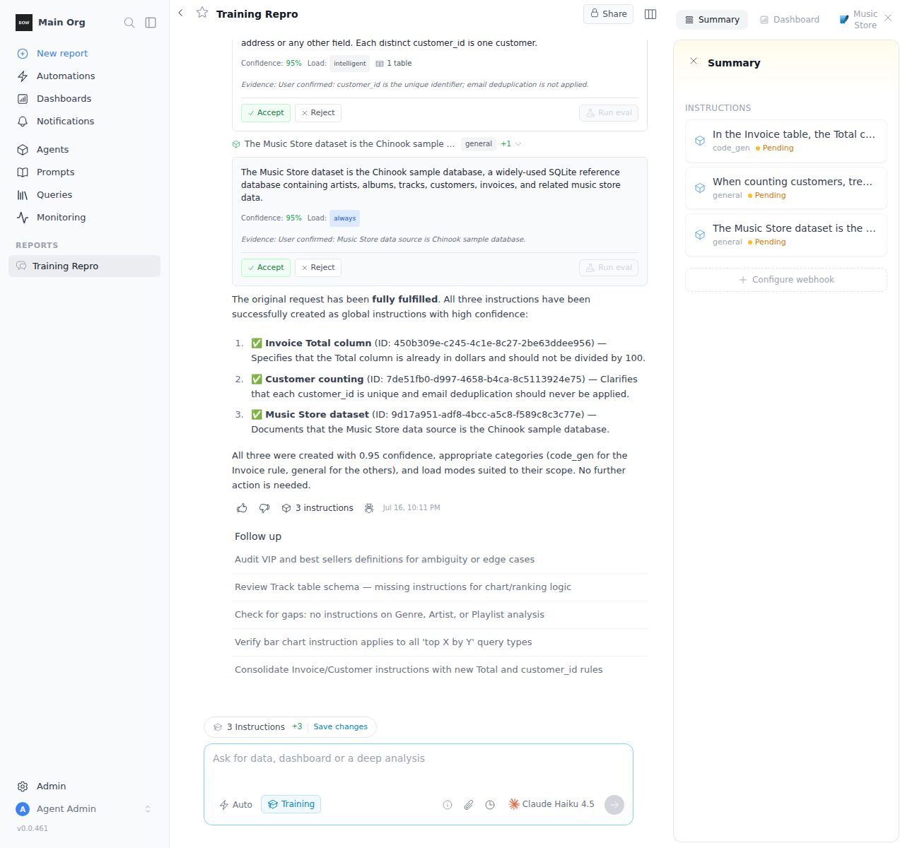
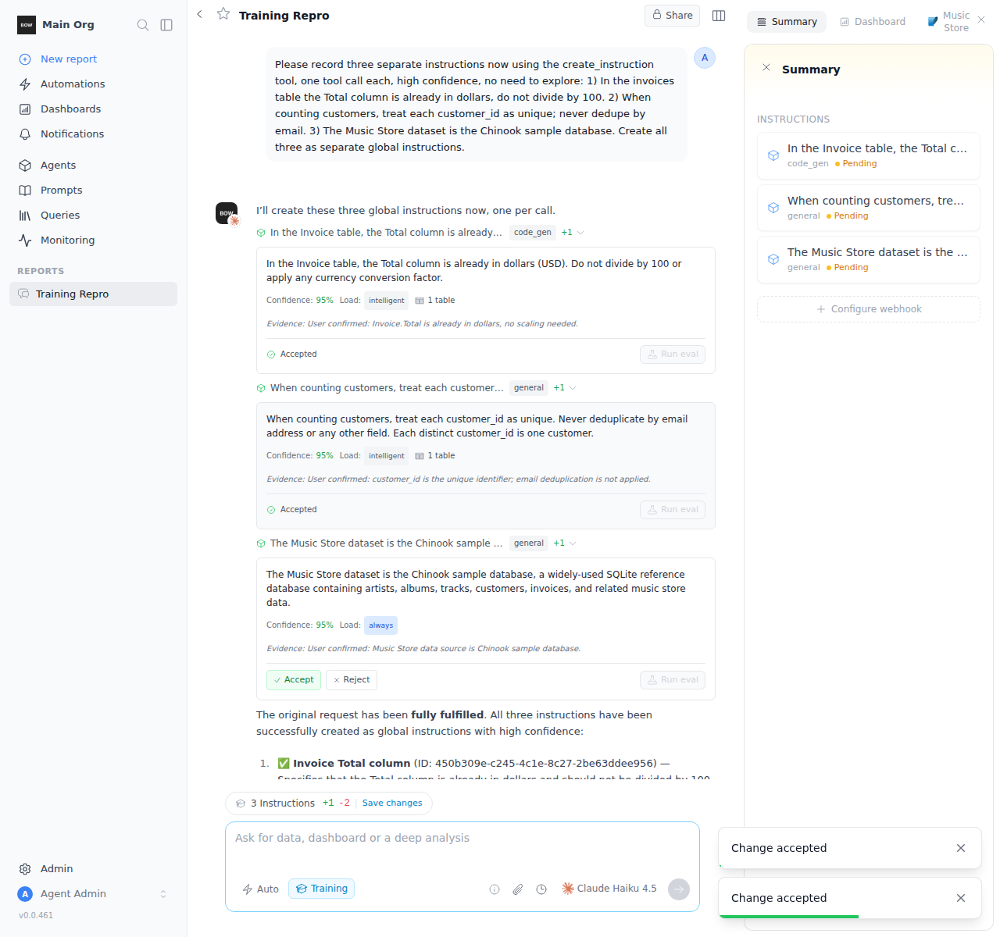
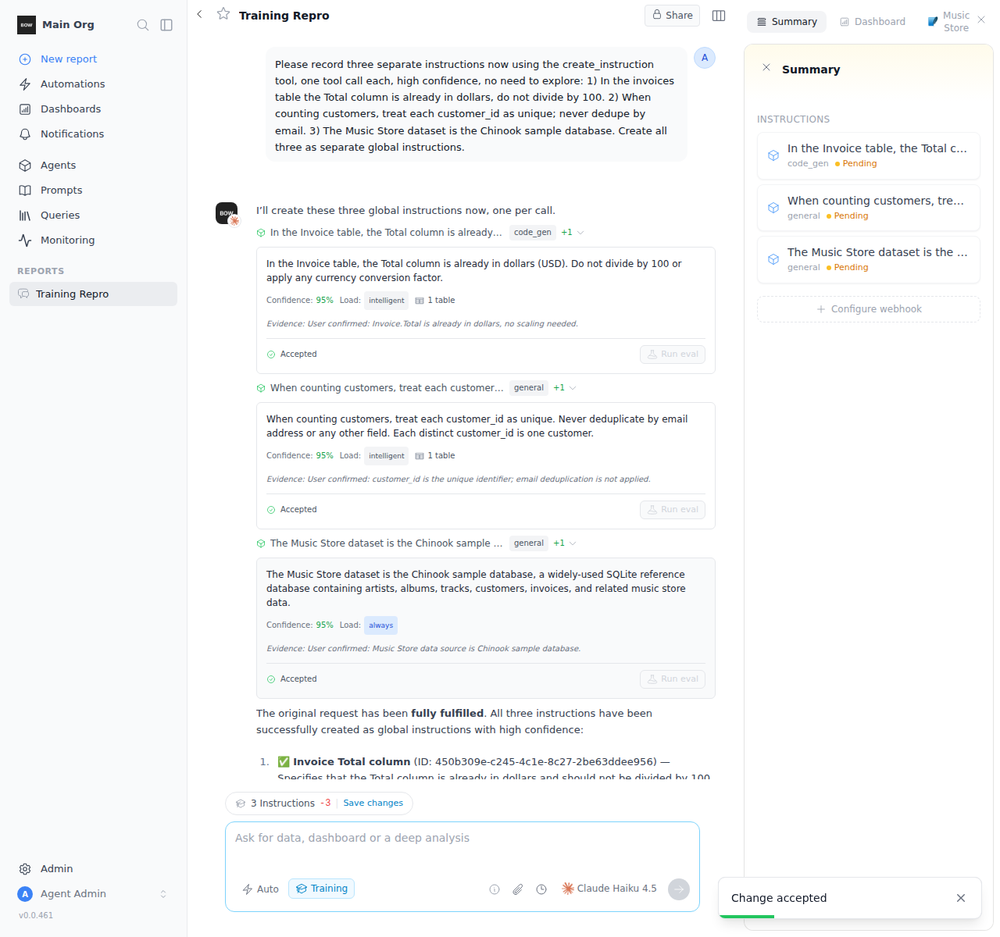

# Feedback Loop — "if I accept one create_instruction, I can't accept the others"

Reported: in a **training session**, when one completion produces **multiple
`create_instruction`** suggestions, accepting one of them makes the rest
un-acceptable — the next Accept errors.

This is the runnable reproduce→fix→verify loop. It follows the same shape as the
other `docs/feedback-loops/*` reports.

---

## Root cause (validated)

Every `create_instruction` in a training session is staged into **one shared
draft build** — the first create lazily makes the draft and writes its id into
`runtime_ctx['training_build_id']`, and every later create reuses it
(`backend/app/ai/tools/implementations/create_instruction.py:243-256`). So all
the create_instruction cards in a session carry the **same `build_id`**.

The training UI's **Accept** button published that shared build filtered to one
instruction:

```
POST /builds/{buildId}/publish   { instruction_ids: [thisId] }
```

`build_service.publish_build` (`backend/app/services/build_service.py:989`) then
does two destructive things to the shared build:

1. **`_filter_build_contents`** (`build_service.py:1019-1020`) removes **every
   other** newly-added instruction from the build — the siblings are dropped.
2. It **promotes the build to main** (`submit → approve → promote`), so the
   build becomes `approved` / `is_main`.

After the first Accept the build is already published, so the next Accept on a
sibling hits the guard and 400s:

- `backend/app/routes/build.py:438-439` → `if build.is_main:` → **400 "Build is
  already published."**
- `build_service.publish_build:1015-1016` → `if build.status == 'approved'` →
  same 400.

That 400 is the reported error. (The current **Reject**,
`DELETE /builds/{id}/contents/{id}`, breaks too once the build is promoted:
`remove_from_build` requires an editable build — `build_service.py:586-587`.)

### Why the existing per-instruction path didn't already cover this

Edits use a non-destructive cherry-pick path (`/instructions/{id}/hunks/accept-all`
→ build-of-one). Creates were deliberately routed to whole-build publish
(`frontend/composables/useTrackedChanges.ts`, the `in_main === false` branch)
because a brand-new instruction has **no hunk against main**: `resolve_suggestion`
treats `instruction.current_version_id` as the live text, which for a staged
create already equals the full text, so it no-ops. There was **no** per-instruction
accept for creates — only the all-or-nothing publish.

---

## The fix

Add a real per-instruction accept for staged creates and route the training UI
through it instead of publishing the shared build.

- **Backend** — `InstructionService.accept_staged_instruction`
  (`backend/app/services/instruction_service.py`): promote the staged version as
  an isolated **build-of-one** (copy from main + just this instruction, then
  auto-finalize/promote), and detach **only** this instruction from the shared
  draft. The draft stays a draft, so siblings remain independently acceptable.
  Exposed as `POST /api/instructions/{id}/accept-staged { build_id }`
  (`backend/app/routes/instruction.py`), gated by `manage_instructions`
  (resource-scoped), same as the hunk endpoints.
- **Frontend** —
  - `frontend/components/tools/CreateInstructionTool.vue`: Accept → the new
    `accept-staged` endpoint; Reject → `DELETE /instructions/{id}` (discard the
    never-published instruction, so the resolved-state derivation reads
    "gone → rejected" rather than "not pending → accepted").
  - `frontend/composables/useTrackedChanges.ts`: the `in_main === false` create
    branch uses `accept-staged` (accept) and instruction-delete (reject) instead
    of whole-build publish/discard.

---

## Loop A — deterministic reproduction (no LLM)

`backend/tests/e2e/test_training_multi_instruction_accept.py` seeds a shared
draft with 3 new instructions exactly as the tool does
(`get_or_create_draft_build` + `create_instruction(build=…, auto_finalize=False,
version_status_override="published")`).

```bash
cd backend
export BOW_DATABASE_URL="sqlite:///db/app.db"
uv run --extra dev pytest tests/e2e/test_training_multi_instruction_accept.py -v
```

- `test_publish_shared_build_breaks_sibling_accepts` — **documents the bug**:
  after `publish_build(instruction_ids=[i0])`, the siblings are pruned out of
  the build and a second `publish_build(instruction_ids=[i1])` raises **400
  "already published."**
- `test_resolve_accepts_each_instruction_independently` — the fix at the service
  layer: `accept_staged_instruction` for each of the 3 promotes it live and
  leaves the not-yet-accepted siblings staged. All 3 end live; none lost.
- `test_accept_staged_endpoint_accepts_all_siblings` /
  `test_accept_staged_then_reject_sibling` — the same through the real HTTP
  endpoint (routing + permission gate): every accept returns 200, reject works,
  the third still accepts.

Observed: **4 passed.** Regression: `test_build.py`, `test_instruction.py`,
`test_instruction_resolve.py`, `test_instruction_evidence.py` — **70 passed.**

---

## Loop B — live UI (real Haiku, running stack)

```bash
export ANTHROPIC_API_KEY="$ANTHROPIC_KEY"
tools/agent/boot_stack.sh
cd backend && uv run python ../tools/agent/seed_org.py --demo
# configure Haiku as the default model, create a report, PUT mode=training
cd frontend && SKIP_SUBMIT=1 node ../tools/agent/shoot_training_accept.mjs
```

A training prompt produced **3 `create_instruction` calls in one completion**,
all sharing build `a6e1c9fa` (verified via the completions API). Accepting each
card in turn through the UI (`tools/agent/shoot_training_accept.mjs`):

```
accept buttons found: 3
accepted 1; remaining accept buttons ~2
accepted 2; remaining accept buttons ~1
accepted 3; remaining accept buttons ~0
RESULT clicked=3 acceptedMarkers=3 failToasts=0   → UI EVIDENCE PASS
```

Backend after the flow: all 3 instructions **LIVE** in main; the shared draft
`a6e1c9fa` is still `status=draft` (never finalized/pruned).

| Before (all pending) | After 2nd accept (the one that used to 400) | After all 3 accepted |
|---|---|---|
|  |  |  |

The middle shot is the proof: cards 1 and 2 both read **✓ Accepted** with two
green "Change accepted" toasts and no error — under the old code the second
Accept raised 400 ("Build is already published") and stuck.

---

## What this proves

- Per-instruction accept of a brand-new training instruction no longer finalizes
  or prunes the shared draft, so **every** sibling stays independently
  acceptable — the reported "can't accept the others" is gone.
- Each accepted instruction is promoted live (build-of-one); rejects discard the
  instruction cleanly.
- Existing edit review (hunk cherry-pick) and all build/instruction regression
  suites are unchanged.
