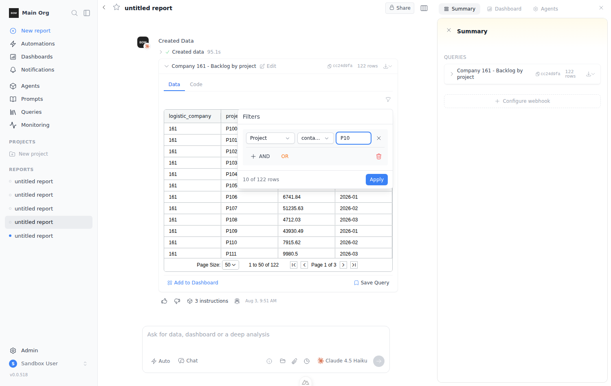
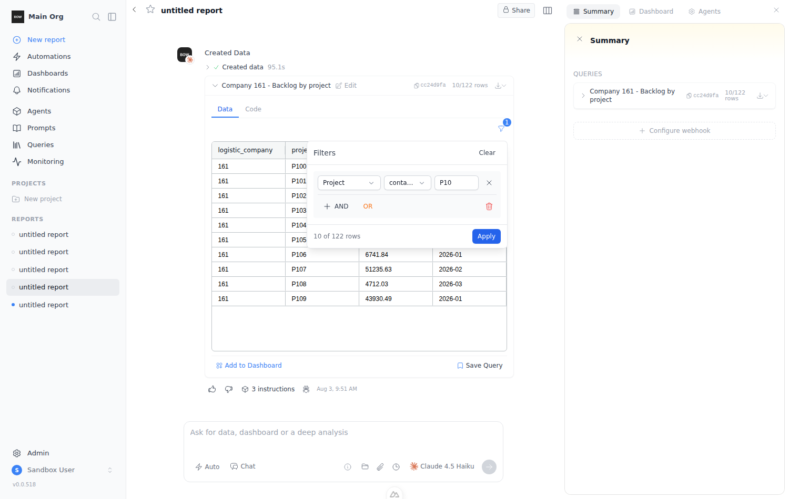
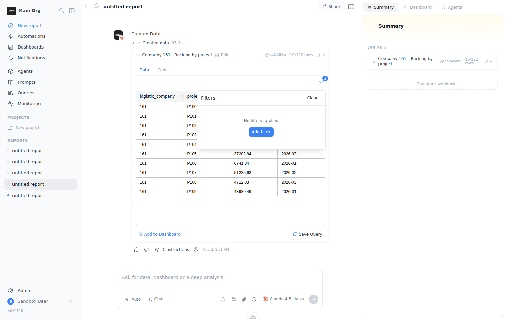

# Feedback Loop — widget filter panel: adding/removing filters doesn't work

Report: *"this component of filter works like shit — adding/removing filters doesn't
work"*, with screenshots of a chat data widget whose Filters popover says **"No
filters applied"** while the grid underneath shows **"No Rows To Show"**.

Component under test: `frontend/components/dashboard/VisualizationFilter.vue` — the
funnel popover rendered above every data widget in the chat
(`components/tools/ToolWidgetPreview.vue:118`) and on dashboard widgets
(`components/dashboard/regular/RegularWidgetView.vue:8`).

**Status: reproduced, not fixed** (per request). Root causes below are read off the
code and confirmed by the run; no source file was changed.

## Sandbox setup

```bash
# backend
cd backend && uv sync --extra dev && mkdir -p db
BOW_DATABASE_URL='sqlite:///db/app.db' uv run alembic upgrade head
BOW_DATABASE_URL='sqlite:///db/app.db' uv run python main.py   # background

# frontend
cd frontend && yarn install && yarn dev                        # background
```

Sign up through `/users/sign-up`, then (API, faster than the onboarding wizard):

```bash
JWT=<auth.token cookie>; ORG=<GET /api/organizations id>
curl -X PUT  localhost:8000/api/organization/onboarding -H "Authorization: Bearer $JWT" \
     -H "X-Organization-Id: $ORG" -H 'Content-Type: application/json' -d '{"dismissed": true}'
curl -X POST localhost:8000/api/data_sources/demos/stocks -H "Authorization: Bearer $JWT" \
     -H "X-Organization-Id: $ORG" -H 'Content-Type: application/json' -d '{}'
```

### Why the widget is seeded instead of generated

The sandbox's `$ANTHROPIC_KEY` has no credits — every agent run in this environment
fails with `anthropic quota or credit balance exhausted`, so no widget can be
produced by the LLM. The bug is purely client-side (filter state lives in the
browser), so the run seeds the same artifacts a successful `execute_sql` turn would
have written: a 122-row table widget mirroring the reporter's screenshot
(`logistic_company`, `project`, `revenue`, `month`).

Send any message from the home page to create a report (the turn fails on the credit
error, but the `user` + `system` completions it needs are written), then:

```bash
cd backend
python3 ../docs/feedback-loops/scripts/widget-filter-panel/seed_widget.py <report_id>
# inserts: widget + step(data=122 rows) + query + visualization
#          + agent_execution + tool_execution(execute_sql, success, created_widget_id,
#            created_step_id, artifact_refs_json) + completion_block(source_type='tool')
```

Two details the chat renderer requires, both of which cost a round trip to discover:

- `steps.query_id` must be set (`StepSchema.query_id` is a non-optional `str`; a NULL
  makes `GET /api/reports/{id}/completions` 500 on `ValidationError`), so a `queries`
  row is created alongside.
- `ToolWidgetPreview`'s filter row is gated on `visualizationId`
  (`components/tools/ToolWidgetPreview.vue:117`), which resolves from
  `tool_execution.artifact_refs_json.visualizations` — without a `visualizations` row
  the funnel icon never renders. Its `view` JSON must validate against `ViewSchema`
  (`TableView.columns` is `List[str]`, not a list of objects) or the serializer
  silently drops it.

## Loop A — the reproduction

Playwright, Chromium at `/opt/pw-browsers/chromium`, session reused via
`storageState`. Each step prints the popover's text and the real AG Grid row count.

```bash
npm install playwright   # launches /opt/pw-browsers/chromium, storageState from a signed-in session
REPORT_URL=http://localhost:3000/reports/<report_id> \
  node docs/feedback-loops/scripts/widget-filter-panel/repro_filter_panel.js
```

```js
// repro_filter_panel.js (abridged)
const PANEL = 'div.w-\\[380px\\]';
await clickFunnel(page);                                    // open the popover
await page.getByRole('button', { name: 'Add filter' }).click();
// column -> Project, operator -> contains, value -> "P10"
await page.getByRole('button', { name: 'Apply' }).click();
// then reopen and click the condition's X
```

Observed (`122` rows before any filter):

```
[0] grid unfiltered: 122 rows (paginated, showing 50)
[1] panel opened: Filters | No filters applied | Add filter
[2] after "Add filter": Filters | Logistic Company | equals | AND | OR | 0 of 122 rows | Apply
[3] condition filled (Project contains P10): Filters | Project | contains | ... | 10 of 122 rows | Apply
[4] BUG B - popover still open after Apply? true
[4] grid after Apply: 10 rows
[5] X buttons in panel: 1
[6] BUG A - panel after clicking X: Filters | Clear | No filters applied | Add filter
[6] BUG A - Apply button still present? false
[6] BUG A - grid still filtered: 10 rows
[7] grid after closing the panel: 10 rows
[8] panel on reopen (diverged from the grid): Filters | Clear | No filters applied | Add filter
[9] Clear present: 1
[9] grid after Clear: 122 rows (paginated, showing 50)
```





The third screenshot is the reporter's first screenshot: *"No filters applied /
Add filter"* over a grid that is still filtered, chip badge still showing `1`.

## What actually breaks

### BUG A — removing the last condition can never be committed (the headline bug)

`removeCondition()` / `removeGroup()` (`VisualizationFilter.vue:485-494`) mutate only
the local working copy `filterGroups`; the shared state (`filters`, broadcast via the
`filter:updated` window event) is untouched. The commit happens in `applyFilters()` —
but the whole footer, Apply included, is gated on
`v-if="filterGroups.length > 0"` (`VisualizationFilter.vue:214`). Removing the last
condition empties `filterGroups`, so the Apply button unmounts in the same tick and
the removal is unreachable. The grid stays filtered, the chip keeps its count, and
reopening the panel shows "No filters applied" over filtered data.

Removing one of *two* conditions works, because the footer survives:

```
panel after removing 2nd condition: Filters | Clear | Project | contains | AND | OR | Apply
Apply available: 1
```

Only **Clear** (`clearFilters()`, line 534) actually calls `setFilters` and restores
the 122 rows — it is the sole escape hatch, and it is only rendered once something is
already applied.

`frontend/components/dashboard/FilterBuilder.vue` (the report/dashboard-level panel)
has the identical shape — footer gate at line 215, `removeCondition` at 661 mutating
only the working copy — so the same dead end exists there.

### BUG B — Apply doesn't close the popover

`applyFilters()` ends with `isOpen.value = false` (`VisualizationFilter.vue:530`), but
the popover stays open after Apply (`[4] ... still open? true`). `UPopover` is driven
with `v-model="isOpen"` + `mode="click"` (line 2); the programmatic close doesn't take.
The user's next click on the funnel then reads as "toggle closed" instead of
"reopen", which is why the panel feels stuck.

### BUG C — a new condition blanks the table before it's filled in

`addGroup()` / `addCondition()` seed `{ operator: 'equals', value: '' }`
(lines 455-483). `equals ''` matches nothing, so the preview drops to
`0 of 122 rows` the instant "Add filter" or "+ AND" is clicked (step `[2]` above),
and applying at that point empties the grid. Combined with BUG B (panel doesn't
close) this is the reporter's second screenshot: a condition row next to
`0 of 122 rows`.

Additionally, `syncFilterGroupsFromShared()` runs on every open (`watch(isOpen)`,
line 552), so any edit that wasn't applied is discarded when the panel is reopened.

## Layer checks

- **HTTP**: no `/api/` request is involved in any of this — filter state never leaves
  the browser (`setFilters` only dispatches the `filter:updated` window event).
- **DOM/grid**: row counts above are AG Grid's own pagination text / rendered
  `.ag-row` count, not the panel's self-reported number, so the divergence between
  "No filters applied" and 10 visible rows is real, not a label bug.
- **Both surfaces**: the chat preview (`ToolWidgetPreview`) and dashboard widgets
  (`RegularWidgetView`) mount the same component with the same props shape, so the
  behavior is shared.

## Not fixed

Left as-is per the request. The minimal fix shape, for when it's picked up: make
removal commit through the same path as Clear (call `setFilters` from
`removeCondition`/`removeGroup`, or keep the footer mounted whenever
`filterGroups.length > 0 || hasActiveFilters`), stop seeding conditions with an empty
`value` (or treat an empty value as "no-op" in `evaluateCondition`), and close the
popover through the component's own close API instead of assigning to `isOpen`.
