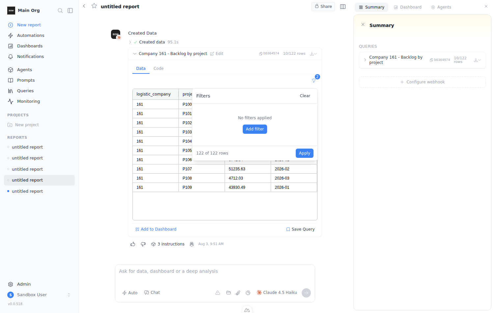
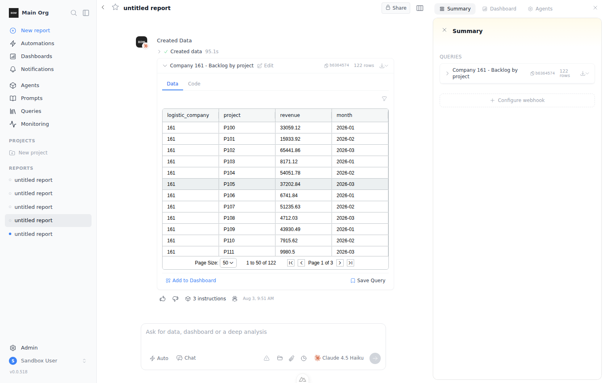

# Feedback Loop — widget filter panel: adding/removing filters doesn't work

Report: *"this component of filter works like shit — adding/removing filters doesn't
work"*, with screenshots of a chat data widget whose Filters popover says **"No
filters applied"** while the grid underneath shows **"No Rows To Show"**.

Component: `frontend/components/dashboard/VisualizationFilter.vue` — the funnel
popover above every data widget in the chat (`components/tools/ToolWidgetPreview.vue:117`).

Scope note: the legacy grid dashboard (`DashboardComponent` → `Toolbar` →
`FilterBuilder.vue`) carries the same defects, but that layout is deprecated —
dashboards are artifact-only now — so it was deliberately left untouched.

## Sandbox setup

```bash
# backend
cd backend && uv sync --extra dev && mkdir -p db
BOW_DATABASE_URL='sqlite:///db/app.db' uv run alembic upgrade head
BOW_DATABASE_URL='sqlite:///db/app.db' uv run python main.py   # background

# frontend
cd frontend && yarn install && yarn dev                        # background
```

Sign up through `/users/sign-up`, then (API, faster than the onboarding wizard):

```bash
JWT=<auth.token cookie>; ORG=<GET /api/organizations id>
curl -X PUT  localhost:8000/api/organization/onboarding -H "Authorization: Bearer $JWT" \
     -H "X-Organization-Id: $ORG" -H 'Content-Type: application/json' -d '{"dismissed": true}'
curl -X POST localhost:8000/api/data_sources/demos/stocks -H "Authorization: Bearer $JWT" \
     -H "X-Organization-Id: $ORG" -H 'Content-Type: application/json' -d '{}'
```

### Why the widget is seeded instead of generated

The sandbox's `$ANTHROPIC_KEY` has no credits — every agent run in this environment
fails with `anthropic quota or credit balance exhausted`, so no widget can be
produced by the LLM. The bug is purely client-side (filter state lives in the
browser), so the run seeds the same artifacts a successful `execute_sql` turn would
have written: a 122-row table mirroring the reporter's screenshot
(`logistic_company`, `project`, `revenue`, `month`).

Send any message from the home page to create a report (the turn fails on the credit
error, but the `user` + `system` completions it needs are written), then:

```bash
cd backend
python3 ../docs/feedback-loops/scripts/widget-filter-panel/seed_widget.py <report_id>
# inserts: widget + step(data=122 rows) + query + visualization
#          + agent_execution + tool_execution(execute_sql, success, created_widget_id,
#            created_step_id, artifact_refs_json) + completion_block(source_type='tool')
```

Two details the chat renderer requires, both of which cost a round trip to discover:

- `steps.query_id` must be set (`StepSchema.query_id` is a non-optional `str`; a NULL
  makes `GET /api/reports/{id}/completions` 500 on `ValidationError`), so a `queries`
  row is created alongside.
- `ToolWidgetPreview`'s filter row is gated on `visualizationId`
  (`components/tools/ToolWidgetPreview.vue:117`), which resolves from
  `tool_execution.artifact_refs_json.visualizations` — without a `visualizations` row
  the funnel icon never renders. Its `view` JSON must validate against `ViewSchema`
  (`TableView.columns` is `List[str]`, not a list of objects) or the serializer
  silently drops it.

Do **not** also seed `dashboard_layout_versions.blocks`: that mounts the deprecated
grid dashboard in the same page, and its filter plumbing fights the chat widget over
the shared `filter:updated` event (observed: the chat grid stops filtering entirely).

## Loop A — reproduction (pre-fix)

```bash
npm install playwright   # launches /opt/pw-browsers/chromium, storageState from a signed-in session
REPORT_URL=http://localhost:3000/reports/<report_id> \
  node docs/feedback-loops/scripts/widget-filter-panel/repro_filter_panel.js
```

Each step prints the popover's text and the real AG Grid row count. Observed:

```
[0] grid unfiltered: 122 rows (paginated, showing 50)
[1] panel opened: Filters | No filters applied | Add filter
[2] after "Add filter": Filters | Logistic Company | equals | AND | OR | 0 of 122 rows | Apply
[3] condition filled (Project contains P10): Filters | Project | contains | ... | 10 of 122 rows | Apply
[4] BUG B - popover still open after Apply? true
[4] grid after Apply: 10 rows
[5] X buttons in panel: 1
[6] BUG A - panel after clicking X: Filters | Clear | No filters applied | Add filter
[6] BUG A - Apply button still present? false
[6] BUG A - grid still filtered: 10 rows
[7] grid after closing the panel: 10 rows
[8] panel on reopen (diverged from the grid): Filters | Clear | No filters applied | Add filter
[9] Clear present: 1
[9] grid after Clear: 122 rows (paginated, showing 50)
```


The third screenshot is the reporter's first screenshot: *"No filters applied /
Add filter"* over a grid that is still filtered, chip badge still showing `1`.

## Root causes

### BUG A — removing the last condition could never be committed (the headline bug)

`removeCondition()` / `removeGroup()` mutate only the local working copy
`filterGroups`; the shared state (`filters`, broadcast via the `filter:updated` window
event) is untouched. The commit happens in `applyFilters()` — but the whole footer,
Apply included, was gated on `v-if="filterGroups.length > 0"`. Removing the last
condition emptied `filterGroups`, so the Apply button unmounted in the same tick and
the removal was unreachable. The grid stayed filtered, the chip kept its count, and
reopening the panel showed "No filters applied" over filtered data. Removing one of
*two* conditions worked, because the footer survived. Only **Clear** called
`setFilters`, and it only renders once something is already applied.

### BUG B — Apply didn't close the popover

`UPopover`'s model prop is **`open`**, not `modelValue`, so `v-model="isOpen"` bound a
prop the component ignores: `isOpen` was never updated by the popover and assigning
`isOpen.value = false` in `applyFilters()` did nothing. The same dead binding silenced
`watch(isOpen)`, so the sync-from-shared-state on open never ran either.

### BUG C — a new condition blanked the table before it was filled in

`addGroup()` / `addCondition()` seed `{ operator: 'equals', value: '' }`. `equals ''`
matches nothing, so the preview dropped to `0 of 122 rows` the instant "Add filter" or
"+ AND" was clicked, and applying at that point emptied the grid. Combined with BUG B
(panel doesn't close), this is the reporter's second screenshot.

### BUG D — found by the verification run, not by the repro

Fixing BUG B made `watch(isOpen)` fire for the first time, which exposed a latent bug
in `syncFilterGroupsFromShared()`: shared state stores columns as `vizId:columnName`,
while the working copy (and `columnOptions`) use the bare name. The sync copied the
prefixed key straight in, so a reopened panel showed an empty **Column** select and
the condition matched nothing (`0 of 122`) even though it had been applied correctly.

## The fix

`frontend/components/dashboard/VisualizationFilter.vue`:
- `v-model:open="isOpen"` on `UPopover` — Apply now closes the panel, and the panel
  syncs from shared state on open.
- Footer gate is `filterGroups.length > 0 || hasActiveFilters`, so Apply stays
  reachable when the working copy is emptied and the removal can be committed.
- `syncFilterGroupsFromShared()` strips the `vizId:` prefix on the way in — the mirror
  of what `applyFilters()` adds on the way out.

`frontend/composables/useSharedFilters.ts`:
- New `isIncompleteCondition()`; `evaluateCondition()` treats a half-written condition
  (blank value, or a `between` missing a bound) as a no-op instead of matching nothing.

## Loop A — verification (post-fix)

```bash
REPORT_URL=http://localhost:3000/reports/<report_id> \
  node docs/feedback-loops/scripts/widget-filter-panel/verify_filter_panel.js
```

```
grid unfiltered: 122
[PASS] BUG C: a freshly added empty condition does not zero the preview — ... | 122 of 122 rows | Apply
[PASS] BUG B: popover closes on Apply
[PASS] filter applied to grid — 10 rows
[PASS] reopen shows the applied condition — Filters | Clear | Project | contains | ... | 10 of 122 rows
[PASS] BUG C: "+ AND" keeps the preview at the current match count — ... | 10 of 122 rows | Apply
[PASS] applying with a half-written 2nd condition keeps the rows — 10 rows
[PASS] one condition left after removing the empty one — 1 left
[PASS] BUG A: Apply is still reachable after removing the last condition — ... | 122 of 122 rows | Apply
[PASS] BUG A: removal is committed — grid back to all rows — 122 rows
[PASS] popover closed after committing the removal
[PASS] panel agrees with the grid (no stale "Clear") — Filters | No filters applied | Add filter
[PASS] re-applied after clearing — 10 rows
[PASS] Clear still resets the grid — 122 rows

ALL CHECKS PASSED
```




Also green: `frontend/tests/unit/*.mjs` (3 files) and `cd frontend && yarn build`.

## Layer checks

- **HTTP**: no `/api/` request is involved — filter state never leaves the browser
  (`setFilters` only dispatches the `filter:updated` window event).
- **DOM/grid**: every row count above is AG Grid's own pagination text / rendered
  `.ag-row` count, not the panel's self-reported number, so "panel says X, grid shows
  Y" divergence is measured, not inferred.
