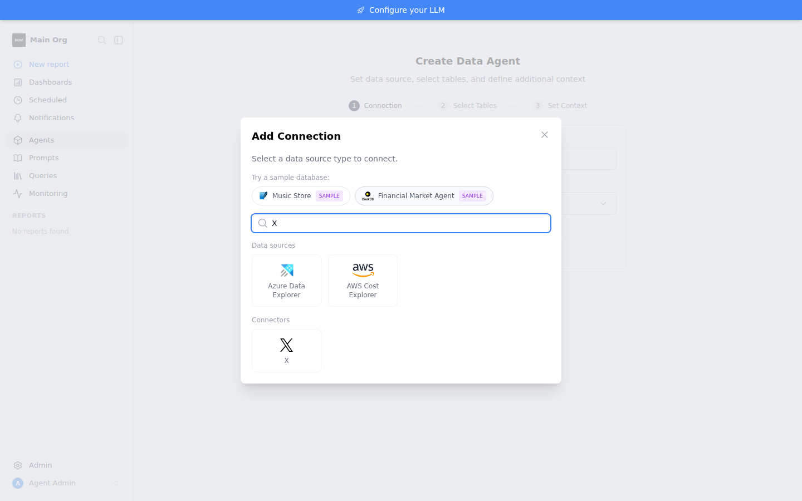
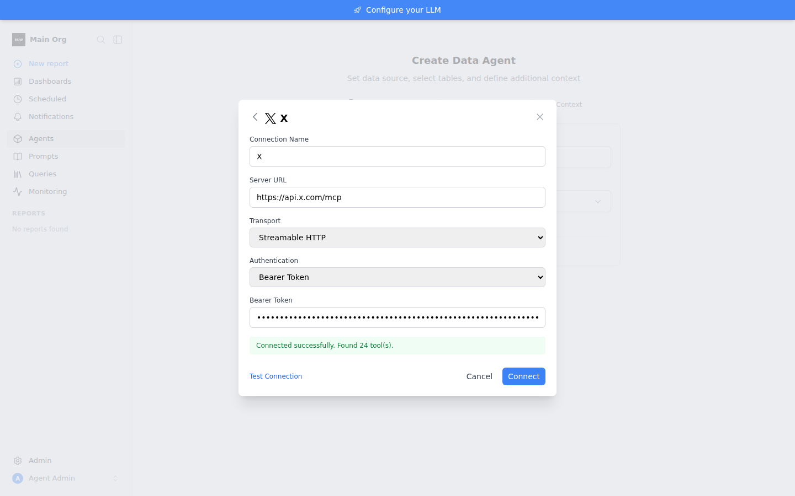
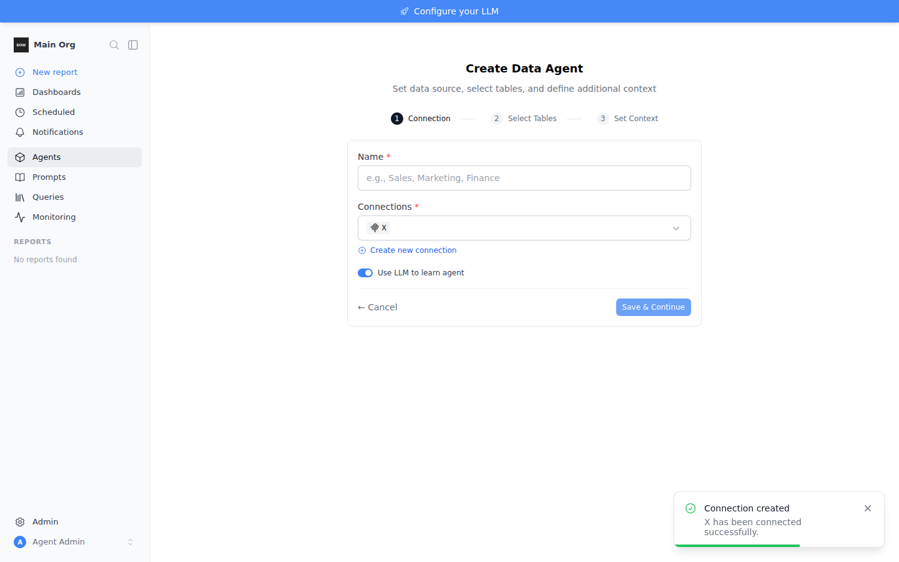

# Feedback Loop — X (Twitter) MCP connector preset

Adds X's first-party MCP server (`https://api.x.com/mcp`) as a one-click
catalog tile, connected with an app-only bearer token from the X Developer
Portal. This doc is the runnable loop that validates the preset in a fresh
sandbox: registry entry → catalog API → Add Connection tile → bearer form →
live tool discovery (24 tools) → tool-call path.

## What was added (validated)

| Piece | File |
|---|---|
| Preset entry (`key="x"`, `auth="bearer"`) | `backend/app/schemas/data_source_registry.py` (`MCP_PRESETS`) |
| Brand icon + key→file mapping | `frontend/public/data_sources_icons/x.svg`, `frontend/components/DataSourceIcon.vue` (`CONNECTOR_ICON_FILE`) |
| Regression test | `backend/tests/unit/test_mcp_presets.py::test_x_preset_is_bearer` |

No new backend plumbing: the preset is a named instance of the existing `mcp`
type. The tile prefills `MCPConnectionForm` with `auth_type="bearer"`
(`frontend/components/AddConnectionModal.vue` — `selectCatalogEntry` maps any
non-OAuth catalog auth to the bearer form), and `_conn_connector_key`
(`backend/app/services/data_source_service.py`) resolves the brand icon by
matching `config.server_url` against the presets, so no `catalog_key` needs to
be stored.

Auth choice: X's MCP server does **not** support Dynamic Client Registration
(verified by live probe, 2026-07 — `initialize` works with a static bearer;
there is no RFC 9728 protected-resource metadata advertising an AS that allows
DCR). Per-user OAuth would need an admin-registered X app (`oauth_app`), which
the `mcp` type already supports if wanted later. App-only bearer is read-only:
`x-access-level: read` on responses; the 6 bookmark tools, `get_users_me`, and
`get_users_timeline` return X's 403 "Unsupported Authentication" at call time.
The other 16 public-data tools (posts, search, users, trends, news) work.

## Loop A — deterministic (no external services)

```bash
cd backend
pip install uv && uv sync --frozen --extra dev
export BOW_DATABASE_URL="sqlite:///db/app.db" && mkdir -p db
uv run pytest tests/unit/test_mcp_presets.py -q
```

Observed:

```
5 passed, 207 warnings in 10.43s
```

`test_x_preset_is_bearer` pins the contract: `auth="bearer"`,
`server_url="https://api.x.com/mcp"`, `transport="streamable_http"`. On code
without the preset it fails with `AttributeError: 'NoneType' object has no
attribute 'auth'` (`mcp_preset("x")` returns None).

## Loop B — live confirmation (real bearer token)

Needs an X developer app's bearer token in `X_BEARER_TOKEN` (never commit or
echo it). Full stack:

```bash
tools/agent/boot_stack.sh
cd backend && uv run python ../tools/agent/seed_org.py
```

1. **Catalog API** — `GET /api/connectors/catalog` returns the `x` entry
   (`auth: "bearer"`, `server_url: "https://api.x.com/mcp"`).
2. **Test-params** — `POST /api/connections/test-params` with
   `{type: "mcp", config: {server_url: "https://api.x.com/mcp", transport:
   "streamable_http", auth_type: "bearer"}, credentials: {token: $X_BEARER_TOKEN}}`
   → observed `{"success":true,"message":"Connected successfully. Found 24
   tool(s).","table_count":24}`.
3. **UI flow** (Playwright, chromium at `/opt/pw-browsers/chromium`): sign in →
   `/agents/new` → Add Connection → search "X" → tile renders with the X brand
   icon under **Connectors** → prefilled bearer form → paste token (masked
   input) → *Test Connection* → **"Connected successfully. Found 24 tool(s)."**
   → *Connect* → toast **"X has been connected successfully"**; the connection
   persists with `tool_count: 24` and re-submitting the same server URL is
   rejected with `409 Conflict` (duplicate guard).
4. **Runtime call path** — the same client agents use at query time:

   ```python
   from app.data_sources.clients.mcp_client import McpClient
   c = McpClient(server_url="https://api.x.com/mcp",
                 transport="streamable_http", token=os.environ["X_BEARER_TOKEN"])
   c.test_connection()  # {'success': True, ... '24 tool(s) available.'}
   c.call_tool("get_users_by_username", {"username": "XDevelopers"})
   ```

   Observed: the call reaches X and returns a clean structured error
   `{'success': False, 'error': 'credits depleted', ...}` — the test app has no
   X API credits (X's v2 API is pay-per-use), which is an account billing
   state, not a code path failure. With a funded app the same call returns the
   user object.

| Catalog tile | Test Connection | Connected |
|---|---|---|
|  |  |  |

## What this proves / notes

- The preset flows through catalog → tile → form → create → tool discovery
  with zero new plumbing; 24 tools are discovered and persisted via
  `refresh-tools`.
- `GET /api/connections` returns `connector_key: null` for **all** presets
  (Monday included) — `ConnectionSchema` has no such field; the brand key is
  derived on the data-source-shaped responses. Pre-existing behavior, not a
  regression.
- Admins need a funded X developer app (API credits) or every tool call
  returns X's 402 `credits-depleted`; the app tier also gates full-archive
  search.
