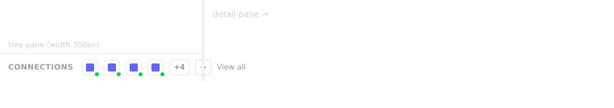
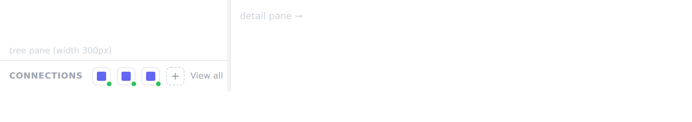

# Sandbox Feedback Loop — /agents connections footer: "View all" overflows the tree pane

Reproduces the reported bug: on **`/agents`**, once an org has enough
connections, the connections footer at the **bottom of the tree pane** overflows
horizontally and the **"View all" link spills past the pane's right edge** into
the detail pane.

This doc is the runnable feedback loop. **Investigation only — no fix applied.**

---

## The symptom (reproduced)

At the default tree-pane width (**300px**), the footer row already overflows with
**4 connections**, and overflows harder once the **`+N` chip** appears at
**5+ connections**. "View all" (the last child, pushed by `ms-auto`) ends up
outside the pane:



Contrast — **3 connections** at the same 300px width fits fine:



---

## Where it lives

`frontend/components/KnowledgeExplorer.vue:219-242` — rendered by
`frontend/pages/agents/index.vue` via `<KnowledgeExplorer />`.

```
<!-- Connections footer -->
<div class="border-t ... px-3 py-2 flex items-center gap-2">   <!-- ← no flex-wrap, no min-w-0, no overflow -->
  <span ... me-1>Connections</span>                            <!-- label, single word, won't shrink -->
  <UTooltip v-for="c in connections.slice(0, 4)">…icon…</UTooltip>   <!-- up to 4 fixed w-6 buttons -->
  <UTooltip v-if="connections.length > 4">+{{ n-4 }}</UTooltip>      <!-- the +N chip (5+) -->
  <UTooltip v-if="…">…new (+)…</UTooltip>
  <button class="ms-auto …">View all</button>                  <!-- pushed to the end -->
</div>
```

The parent tree pane is fixed/resizable:
`aside … :style="{ width: treeWidth + 'px' }"`, `treeWidth = ref(300)`,
`clampTreeWidth = min(600, max(220, w))` (`KnowledgeExplorer.vue:39, 1344-1345`).

### Root cause

The footer is a single-line flex row (`flex items-center gap-2`) with **no
`flex-wrap`, no `min-w-0`, and no overflow handling**. Its children have a fixed
intrinsic width that does **not** shrink to fit:

- the **"Connections"** label is one word → can't wrap/shrink;
- each connection icon is a **`w-6` button wrapped in `<UTooltip>`**
  (Nuxt UI v2 renders a `relative inline-flex` wrapper), so it holds ~24px;
- the `+N` chip and the dashed "new" button add more fixed width.

Summed against the **300px** default pane (minus `px-3` padding), the row's
content is wider than the pane. Because there's no wrap/overflow rule, the
overflow simply extends past the pane's right border, and `ms-auto` (which needs
free space to push "View all" right) collapses — so **"View all" lands outside
the pane**, over the detail section. Widening the pane past the content width
(~460px) clears it, confirming it's purely a width-vs-content layout problem.

Note the icon count is capped at 4 (`connections.slice(0, 4)`), so the overflow
is a **fixed step**, not proportional to connection count — every org with ≥4
connections at the default width sees it, and it looks identical at 5, 8, or 12.

---

## The loop

Isolated, offline harness under `sandbox-repro/agents-connections-overflow/`
(the footer markup copied verbatim, `<UTooltip>` modelled as its
`relative inline-flex` wrapper, driven by the real Tailwind engine). `?w=` = tree
width, `?n=` = `connections.length`.

```bash
cd sandbox-repro/agents-connections-overflow
npm install playwright                          # browsers pre-installed in sandbox
curl -sL https://cdn.tailwindcss.com -o tailwind.js   # headless browser has no proxy; load locally
CHROME_BIN=/opt/pw-browsers/chromium-1194/chrome-linux/chrome node shot.mjs
```

`shot.mjs` measures the footer's horizontal overflow and how far "View all"'s
right edge lands past the pane's right edge (`viewAllSpill`, +ve = outside).

### Observed

| pane width | connections | footer overflow | View all spill past pane edge | result |
|---|---|---|---|---|
| 300 (default) | 3 | 0 px | −10 px (inside) | ✅ fits |
| 300 (default) | **4** | **23 px** | **+22 px (outside)** | ❌ overflow begins |
| 300 (default) | **5** (first `+N`) | **61 px** | **+60 px** | ❌ |
| 300 (default) | 8 | 61 px | +60 px | ❌ (same as 5) |
| 300 (default) | 12 | 61 px | +60 px | ❌ (same as 5) |
| **220 (min)** | 8 | **141 px** | **+140 px** | ❌ worst |
| 460 (wide) | 8 | 0 px | −13 px (inside) | ✅ fits |

**Threshold:** overflow starts at **4 connections** at the default 300px width and
is constant from 5 up (icons capped at 4 + one `+N` chip). Narrower pane → worse;
wide pane → gone.

---

## Fidelity / caveats

- This is an **isolated-markup** repro, not the full Nuxt app: it reproduces the
  exact footer subtree with the real Tailwind engine and the Nuxt UI `UTooltip`
  wrapper, but does not boot the backend/auth/seed path.
- It assumes the project's `tailwind.config` does not override the core spacing
  scale for the handful of utilities involved (`gap-2`, `w-6`, `px-3`, `h-6`,
  `px-1.5`, `text-[11px]`, `me-1`) — standard values the project uses unchanged.
- Exact pixel spill will vary slightly with the real DataSourceIcon assets and
  font metrics, but the **overflow direction and threshold** are structural.

---

## Candidate fixes (NOT implemented — for the "decide what to do" step)

Options, roughly increasing effort:

1. **Let the row wrap** — add `flex-wrap` to the footer so overflowing chips drop
   to a second line. Cheapest; changes footer height.
2. **Make the strip horizontally scrollable / clipped** — `min-w-0 overflow-x-auto`
   (or `overflow-hidden`) on the icon group, keeping label + "View all" pinned.
3. **Pin "View all" and let only the icons overflow-clip** — wrap the icon
   cluster in its own `min-w-0 flex-1 overflow-hidden` container so "View all"
   (and/or the `+N` chip) always stays in view; icons truncate instead.
4. **Show fewer icons on narrow panes** — reduce `slice(0, 4)` responsively, or
   drop per-icon buttons entirely below some width and rely on the `+N` / "View
   all" entry points.

Recommendation to discuss: (3) keeps the two affordances that matter (the `+N`
count and "View all", both of which open the connections modal) always visible,
and is the smallest change that fixes the reported symptom directly.

## Artifacts

- `sandbox-repro/agents-connections-overflow/repro.html` — footer harness
- `sandbox-repro/agents-connections-overflow/shot.mjs` — screenshot + measurement driver
- `sandbox-repro/agents-connections-overflow/*.png` — captured evidence
